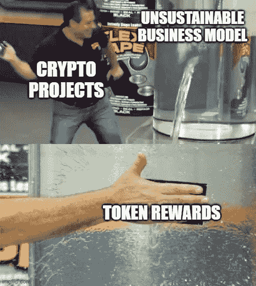
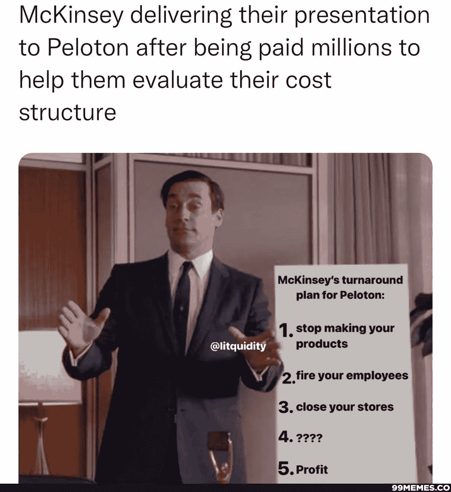
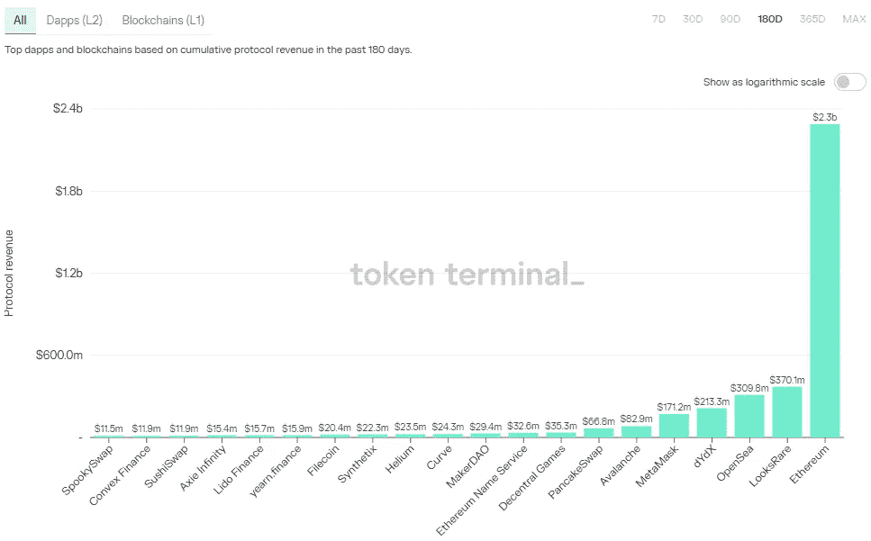
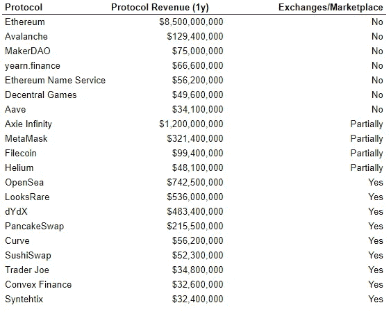
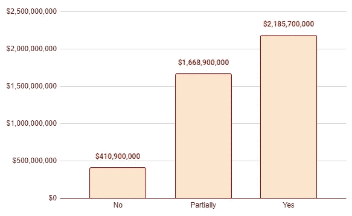
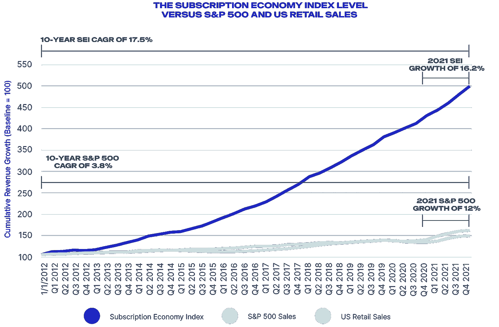

# 不可持续的加密商业模式

> 原文：<https://medium.com/coinmonks/unsustainable-crypto-business-models-be0ca9782f4c?source=collection_archive---------18----------------------->

是的，这项技术很酷，但是你应该围绕它建立一项业务吗？

免责声明，NFA，所有这些合法的东西:本出版物及其附属机构上呈现的所有信息严格地仅用于教育目的。它不应被解释或视为财务、法律、投资或任何其他形式的建议。

嗨，伙计们，

尽管 ETH 创造了巨大的 FOMO，在一周内上涨了约 50%,但过去一周的加密市场有些不稳定。他们说合并叙事与价格运动一致，但谁知道我们的宏观神会做出什么决定。在一个完全不相关的问题上，我们计划在接下来的几周内推出一个单独的每周快速阅读问题，为我们的读者提供更多的价值——再次感谢你们成为我的早期支持者。细节还没有最终确定，但是我们将涵盖本周的重要图表，并展示协议和 Dao 的战略思想。

我的目标保持不变:**让这份出版物成为 crypto** 中最独特、信息量最大、最可靠的信息源，同时作为我的大脑转储平台。如果你想实时交谈或交换想法，请随时通过 [**Twitter**](https://twitter.com/ManoppoMarco) 与我联系。

 [## 马可·马诺波沉思的实用主义

### 秘密，商业和生活的思考--实质胜于炒作。点击阅读马可·马诺波的《沉思的实用主义》

pensivepragmatism.substack.com](https://pensivepragmatism.substack.com/) 

# 不可持续的加密商业模式

在一个只涨不跌的市场中，市场参与者往往不太关心公司商业模式的可持续性和防御性。评估一家公司估值的新方法和无中生有的叙述被巧妙地炮制出来，以证明价格上涨的合理性。没有人想成为扫兴的人。

当价格继续上涨时，基于浏览器的虚拟世界网络游戏被称为下一代游戏，它使用户能够拥有游戏的一部分，虚拟房地产地块的售价高达数百万美元。从玩到赚通常有缺陷的机制设计被视为游戏和工作的未来，这一概念的激进支持者认为，游戏玩家最终会优先考虑赚的部分，而不是首先专注于建立一个令人敬畏的游戏体验。

新的 DeFi 原语通过降低最终用户费用和保护他们免受 MEV 套利者的影响来提高市场效率，被视为值得 9 位数估值的创新想法。不要误会我的意思，这些都是经过数月(甚至数年)的研究工作得出的很酷的功能，但考虑到潜在的商业模式，也许这并不能证明估值的合理性。

当价格下降时，即使是最狂热的支持者和社区成员也会开始质疑这些协议实际上是如何赚钱的，以及它们的商业模式实际上是否有意义。在这篇文章中，我们提出了一些关于加密协议如何探索可持续赚钱的方法的想法。记住，它是一个好产品，还是仅仅是一个公共产品？

**以下是快速外卖:**

*   创始人需要拓展他们的商业头脑，学习非加密业务。
*   了解哪种商业模式是逐底竞争，哪种是长期可持续的。
*   有一些难以解决的重要问题需要深入的研究工作，这可能永远不会成为好的业务。
*   crypto 的开源、可派生和去中心化的特性使得在一个可复制的机制上预测你的业务模型具有挑战性。
*   出售代币来获取收入可能会有争议，但这是目前的工作模式之一。

## 协议是生意吗？

首先，协议是生意吗？—不管你怎么想(我写了一整篇文章)，现实是这些加密项目的创始人和团队成员需要支付租金。虽然风险投资的资金可能能够补贴一位 21 岁的 crypto 创始人的生活方式，他出租了一个游艇派对作为几年的“网络”手段，但这些项目最终需要自己赚钱才能生存(甚至不能繁荣)，特别是在宏观经济进入收缩期的时候。哦，游艇的事情是一个真实的故事。

长期以来，我一直鼓吹权力下放的概念和创收的需要在某种程度上是相互对立的。既要保持良好的分权水平，又要以有效的方式运营以实现利润最大化，这并不容易。这种争论通常会回到权力下放的风气上来，实际上并没有太多的商业意义，尤其是如果你在过程中过早地进行了权力下放。一旦达到一定的采用水平，一个更加成熟的协议/网络肯定可以做到这一点— **在知道何时转向更分散的结构和何时最大化增长之间找到正确的平衡是至关重要的**。

## 提高你的商业敏锐度

Twitter 上的人们喜欢嘲笑麦肯锡这样的管理顾问，因为他们在撰写报告和推荐策略时收取过高的费用，而没有承担任何真正的责任。虽然顾问可能不是最好的经营者，但这些人在任职期间通过了解多个不同的行业，通常具有良好的商业头脑。

我想给有抱负的加密创始人的第一条建议(如果我首先值得给出一条建议的话)是**学习非加密业务是如何运作的**。

发达国家受过高等教育的个人通常专注于服务第一的业务，无论是金融市场、咨询还是软件。在新兴市场，你那些被误导的老派亚洲父母会说，这些不是“真正的”生意，因为你不能直接接触你卖的商品。

撇开琐碎不谈，重点是:加密创始人需要更多地考虑**他们正在构建的东西将如何赚钱**——除非你意识到你正在为技术的改进而工作，或者你足够精明地说服风投支付你的租金，同时满足你对知识的渴望。

当然，密码学中有一些难以解决的重要问题需要深入研究。然而，当你筹集资金来解决这些问题时，最好有一条盈利的道路。无可否认，这在 web 3.0 中更加困难，因为大多数协议都是开源和可分叉的，消除了大多数 web 2.0 初创公司拥有的 IP 防御护城河。创始人还面临着经验丰富的经营者带着大笔资金进入这个领域，并垂直整合到你正在建立的业务中的风险；还记得苹果进入 BNPL 吗？—更糟糕的是，区块链雷亚尔没有反垄断法。

唉，所有这些导致了一个自然的进程，我们需要不断地尝试新的商业模式来为 crypto 工作。因此，我们看到的大多数成功的加密公司都是市场。**这些公司在淘金热期间出售铲子。**

## 寻租商业模式

哦，讽刺的是。加密被认为是一种新的创新技术，它消除了集权，将权力还给人民，并为所有相关方创造了一个更加公平的竞争环境。但与此同时，最大、最成功的公司是交易所/市场，它们之所以成功，是因为它们实施了寻租商业模式。CEXs、DEXs 和 NFT 市场是该领域的巨头，这理所当然地促使评论家认为 crypto 的整个用例是基于投机的。

一个小提示。我们不会在这种背景下讨论比特币和第一层资产，因为它们要么是数字货币，要么是区块链网络，需要完全不同的思维框架——这也不一定构成商业模式。比特币的“商业模式”是其作为黄金替代品的叙事。L1 资产的“商业模式”是天然气费和通过。

Source: [Token Terminal](https://tokenterminal.com/terminal/metrics/protocol-revenue)

*   在上面列出的 20 个协议中，9 个被认为是市场，7 个被认为是部分市场。

*   除以太坊外，过去一年协议收入的大部分来自具有寻租商业模式的协议。

*我们明白你的意思，那么我们可以开始探索新的加密商业模式的其他方法是什么？*

## 经常性收入

在过去五年中，经常性收入模式是公开交易股票的最大商业估值乘数之一。现金流来源主要基于订阅的公司不仅创造了更可持续的消费者群体，还拥有更可预测的未来现金流。这增强了投资者阶层的信心，并与终端消费者建立了长期关系。

让我们来看几个例子:

1.  **亚马逊 Prime**

[82%的美国家庭](https://www.digitalcommerce360.com/2019/07/11/82-of-us-households-have-a-amazon-prime-membership/)拥有亚马逊 Prime 会员。因此，亚马逊可以垂直整合，成为这些家庭中的主导实体。从 Alexa 智能扬声器到智能家居技术，现在甚至还有一种医疗产品。这家公司实际上已经成为你日常生活中可能需要的所有东西的首选市场。

想象一下，你患有轻度中风(我知道这是病态)，你通过 Alexa 智能扬声器呼救，你的环形智能锁自动打开你的前门，一名医疗调度人员迅速冲进你的房子(这项服务现在不存在，但让我们发挥创意吧)。

**2。苹果 One**

[截至 Q2 2022 年，共有 8.25 亿用户。那是 100 亿美元以上。世界上最富裕的经济阶层愿意为一部利润率相当于奢侈品牌的手机支付 1000 亿美元。](https://9to5mac.com/2022/04/28/apple-services-subscribers-grow-25-to-new-high-of-825-million/#:~:text=Luckily%20for%20the%20company%2C%20its,second%20fiscal%20quarter%20of%202022.)

然而，由于技术限制和产品种类的缺乏，经常性收入模式在很大程度上没有在加密领域实施，因为大多数盈利的加密公司都是通过与市场相关的费用赚钱，这不一定适合订阅模式。罗宾汉已经尝试了金色罗宾汉，比特币基地目前正在尝试比特币基地 One 测试版，但是两者都没有得到消费者的积极响应。

也就是说，构建模块开始出现，我们看到更多的项目解决不同的问题，最终将实现更无缝的可编程现金流，包括订阅。**结合在一起，我们可以看到下面的堆栈将如何最终诞生能够集成基于订阅的商业模式的杀手级分散应用**。

*   [萨布利耶](https://sablier.finance/)和[超流体](https://www.superfluid.finance/home)启用加密支付流。
*   Aave 引入了[镜头协议](https://lens.xyz/)，一个分散的社交媒体栈。
*   以太坊命名服务提供了 web 3.0 身份的清晰性。
*   [Mirror](https://twitter.com/viamirror/status/1551976045997432836) 引入了 web 3.0 订阅和通知系统。
*   Web 3.0 [消息传递](https://twitter.com/saydialect)正在构建中。

## 出售代币获取收入

光是键入标题就感觉像是加密领域的大罪。该行业对可能意外将代币归类为股票的术语极其敏感。也就是说，销售代币并将其作为运营支出的收入在该领域并不罕见。事实上，曾经是市值最高的三大加密资产之一的 XRP[已经多次这样做了](https://cointelegraph.com/news/ripple-reports-double-revenue-from-xrp-token-sales-in-third-quarter-of-2018)。

> *快进到 2022 年，模式已经转变。一家“赞助”公司建立了该协议，并拥有一定比例的令牌供应。通过适当的设计，所述协议的令牌组学实际上为令牌持有者积累价值(通常是某种费用共享机制)，在此过程中为协议和公司产生收入。该公司然后出售这些代币作为收入，以继续其经营。随着时间的推移和适当的采用，您可以通过实现治理流程甚至成熟的 DAO 来管理所述协议的资金(和收入),从而增加复杂性，这通常主要由最初的团队成员控制。*

我不认为这个模型本身是错误的，但它需要原始团队成员的大量信任，然后协议才能达到成熟的状态并拥有正常运行的 DAO(甚至有这样的东西吗？哈。那是另一个帖子)

## 有什么大想法？

在牛市期间，很容易在没有仔细考虑商业模式的可持续性和可辩护性的情况下，出售包装在令人信服的叙述中的伟大想法。这种情况发生在 web 2.0 技术创业公司(优步，有人知道吗？)以及 crypto。在 crypto 中，由于令牌的存在，这可能会进一步混淆，这可能会造成对项目实际健康状况和赚钱能力的错误理解。

*This is … a brave take by Tascha, although please give it more thoughts next time.*

虽然建设者和创始人可能正在研究酷的和创新的新技术，但重要的是要意识到 crypto 是开源的，你在知识产权方面没有任何真正的防御能力。了解第一手资料将使创始人能够仔细规划他们的战略，并对他们计划建立的企业更加深思熟虑。如果你的目标是赚钱，就不要陷入建立公益的陷阱。

作为一个行业，我们需要做得更好，不断地为项目集思广益以赚钱，而不是诉诸掠夺性的伪庞氏经济学阴谋，这些阴谋依赖于吸引新用户并倾销他们来产生收入。我并不自称拥有所有的答案，但是解决问题的第一步是承认有一个。

## 搬起石头砸自己的脚

我工作的公司 Digital Asset Research 与数字资产风险专家 Cloudwall 达成了战略合作伙伴关系**，为机构客户提供投资组合风险管理资源。**

**抛开宣传材料不谈，我的第一份全职工作是在 2019 年上一次熊市期间在一家加密对冲基金工作。长话短说，基金失去了大量的 AUM，我知道我需要找到另一份工作。从那以后，每当我收到招聘人员关于在基金工作的信息时，我总会问一些关于其 AUM 和风险管理策略的详细问题。作为一名应届毕业生，亲身经历让我看到了风险管理和最佳实践在管理基金时的重要性。快进到 2022 年，没有人会预测到 3AC 会搬起石头砸自己的脚。投资管理的本质是对风险的管理，而不是对回报的管理。 —本杰明·格拉哈姆**

**几个月前，[@ the defedge](https://twitter.com/thedefiedge)在 Twitter 上找到了我，我现在是他的时事通讯的撰稿人。我们每周用不到 5 分钟的时间[报道](https://www.thedefiedge.com/)加密领域的最新趋势、知识和框架。**

**直到下一次，**

**马尔科·m。**

** [## 马可·马诺波沉思的实用主义

### 秘密，商业和生活的思考--实质胜于炒作。点击阅读马可·马诺波的《沉思的实用主义》

pensivepragmatism.substack.com](https://pensivepragmatism.substack.com/) 

> 交易新手？尝试[加密交易机器人](/coinmonks/crypto-trading-bot-c2ffce8acb2a)或[复制交易](/coinmonks/top-10-crypto-copy-trading-platforms-for-beginners-d0c37c7d698c)**