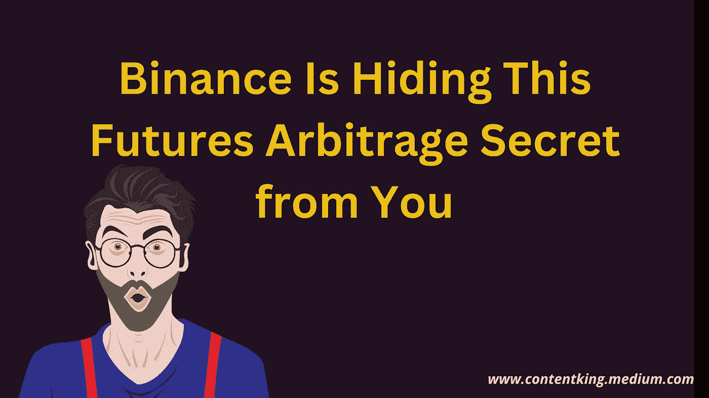
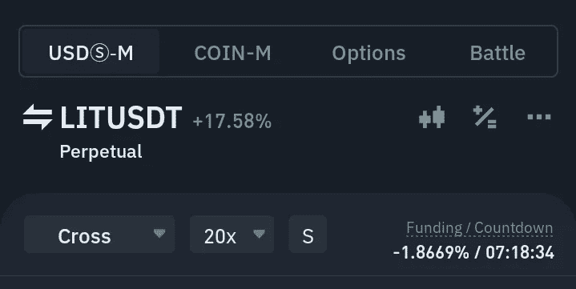
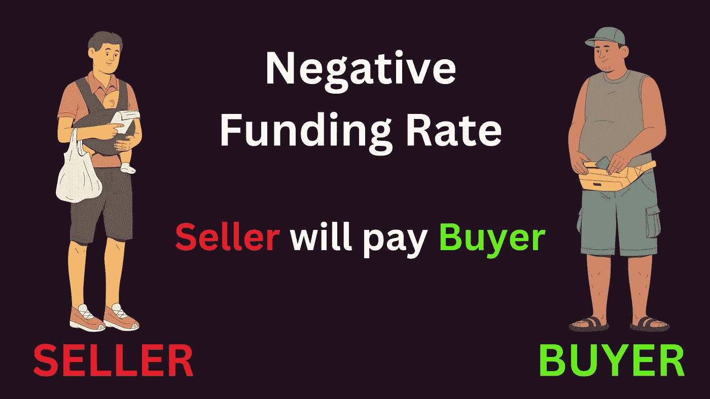
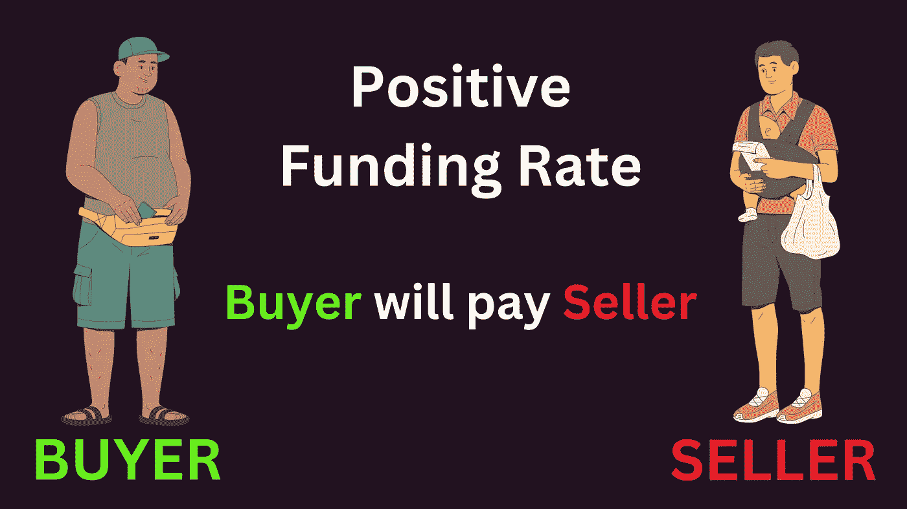
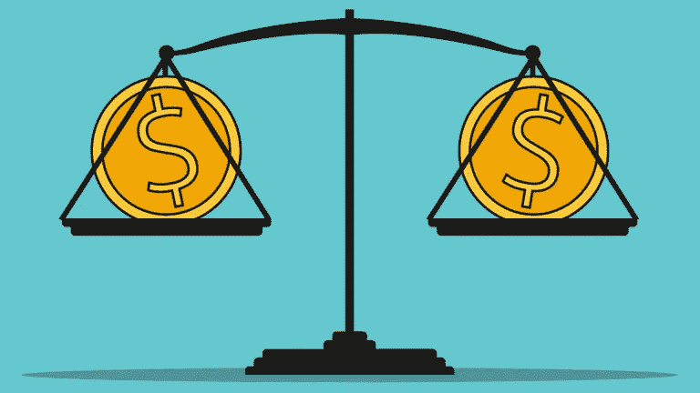

# 期货市场不为人知的加密货币套利交易秘密

> 原文：<https://medium.com/coinmonks/untold-secret-of-cryptocurrency-arbitrage-in-futures-market-be054957fb32?source=collection_archive---------0----------------------->

你可以自由地保存这篇文章或复制一个重要的部分并保存在你的文件中。

哈哈，许多参加会议并记下要点的人几乎永远不会打开笔记。我知道你也在其中。

**Designed By Me:)**

# 现在，我们来谈谈币安的期货套利交易。

套利简单来说就是不同市场的商品和服务的价格差。

> 如果你以前从奈拉套利中获利，这是一个熟悉的术语。

例如，如果可乐在拉各斯卖 1 美元，但消费者在伦敦以 5 美元/瓶的价格购买，这对交易者来说是一个套利机会。从拉各斯市场购买，然后在伦敦出售。

**融资利率**是在期货市场支付的利息。它要么是积极的，要么是消极的。

之所以要支付资金费，是因为现货和期货市场往往存在价格差异。密码交易所使用资金来维持平衡。通常，这有助于在一段时间后缩小差距。

意味着价格差距不可能永远存在。你明白吗？

**I took this screenshot on the 4th of October 2022**

在上图中，LITUSDT 在现货市场的交易价格为 0.86 美元，在期货市场的交易价格为 0.77 美元，这提供了一个套利机会。但在本文中，我更倾向于用比特币作为例子，因为大家都很熟悉它。

**例子**
当比特币在现货市场交易价格为 22k 美元，但在期货市场交易价格为 21k 美元。

**Designed By Me:)**

这是一个套利机会。会有负的资助率，你可以在 LIT 币的截图中看到。

对于负资金，空头将支付多头。明白了吗？

**再比如。**

如果比特币在现货市场交易价格为 20k 美元，在期货市场交易价格为 22k 美元。

**Designed By Me:)**

资金费用将是正的。它可能是每 8 小时 3%，直到价格差距被填补。

所以你可以看到，融资利率或融资费是 ***套利机会*** 的一个花里胡哨的名字，但你直到今天早上才知道。我现在应该得到你 50 次掌声:)

我能看出你在想什么。你就像阿比博拉，请不要在这里浪费我的时间，直接去钱在哪里。我追求的是金钱，而不是故事😄

亲爱的朋友，请耐心等待，让我从第一个原理来解释加密期货套利交易。

别怪我，我在工科学校就是这么被教育的。

对于负融资利率来说，这是冒险的。除非你是专业交易者，否则我不会建议你去占便宜。

如果你尝试了，市场可能会马上用核武器攻击你。

人们可能会有相反的观点，但这并不意味着我不应该警告你。你可以从负资金中赚钱，但要非常小心。

对于一个积极的资金利率，即使是一个高中生也可以从中赚钱。

等等，我用一个实际的例子解释一下。

当龙在做空的时候，意味着比特币在现货市场便宜，在期货市场贵。

当你在币安或任何密码交易所看到这个机会时，你应该怎么做？

[**Source**](https://tenor.com/search/opportunity-gifs)

假设你想用 2 万美元进行套利交易。

你会去现货市场用 15k 美元的钱买比特币。然后，你迅速进入期货市场，用剩余的 5000 美元以 3 倍杠杆做空比特币。

这意味着你的现货钱包里有价值 15000 美元的比特币，期货里有价值 15000 美元的比特币合约。等式现在是平衡的，所以没有亏损的恐惧，因为两者同时被适当对冲。

明白了吗？

[**Source**](https://www.thestreet.com/investing/funds/mutual-funds/what-is-a-balanced-fund)

现在双方的头寸都已适当对冲。

因为多头会做空，所以你在期货市场上有一个未平仓的空头头寸。

根据你交易的交易所，你每 8 小时持有一个空头头寸，将获得 3%的利息。

如果这个套利交易持续 24 小时，你可以从你的空头头寸中获得 9%的额外收益。

在某些情况下，套利可能会持续 3 天，特别是对于市值低于 1 亿美元的替代硬币。

比方说，在价格差距缩小之前，你最终获得了 12%的利息。

缺口一平仓，就去现货市场卖出你的比特币，平仓期货市场的空头头寸。你需要密切关注市场，不要在做这件事的时候去度假。

既然你在期货市场赚了 5000 美元的 12%,

通过这次套利机会，你成功地将你的钱增加了 600 美元。

如果你一个月做两次同样的结果，那就是 1200 美元的额外收入。我希望你明白这一点。如果您有任何问题，请在评论框中问我。

# 关于作者

**Ojeniyi Ayobami Abimbola** 自 2015 年以来一直从事加密货币交易，他是区块链的内容创作者和 Cryptoniche 的加密教练。你可以通过[https://t.me/cryptoniche_hangout](https://t.me/cryptoniche_hangout)与他联系

**Tubebuddy 附属链接:**[https://www.tubebuddy.com/abimbola](https://www.tubebuddy.com/abimbola)

注意:如果你注册了附属链接，我会从中获得一小笔佣金，这也是从经济上支持这个博客的一种方式。

**或者加入隐壁龛电报频道:**[https://t.me/cryptoniche_hangouts](https://t.me/cryptoniche_hangouts)

**在推特上和他连线:**[https://mobile.twitter.com/ojeniyi_ayobami](https://mobile.twitter.com/ojeniyi_ayobami)

要不要终身被动收入？在这里看他上一篇文章 [**！！！**](https://contentking.medium.com/this-undoubtly-the-best-way-to-earn-passive-income-through-cryptocurrency-7ce547cedbe)

我有一个免费的礼物给你:“如何在年底前成为密码百万富翁。” [**点击这里下载吧。**](https://ojeniyiayobami.crd.co/)

几十个为你制作的加密内容， [**现在就订阅**](https://www.youtube.com/c/CryptoNiche/videos)

> 交易新手？尝试[加密交易机器人](/coinmonks/crypto-trading-bot-c2ffce8acb2a)或[复制交易](/coinmonks/top-10-crypto-copy-trading-platforms-for-beginners-d0c37c7d698c)