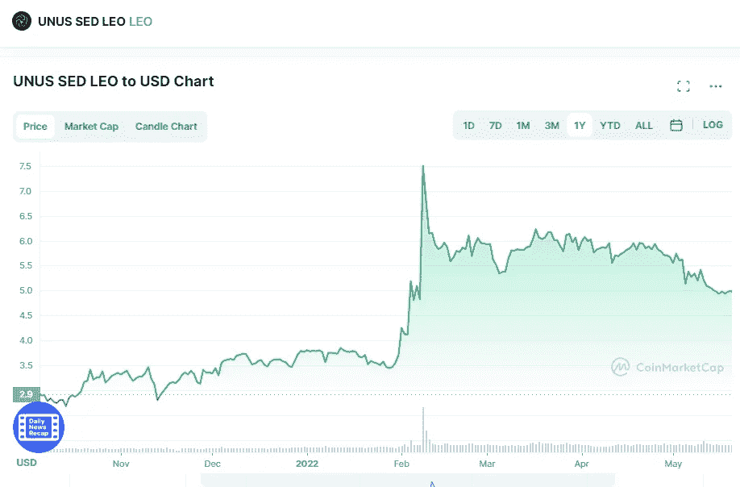

# 2022 年美国 SED LEO(LEO)加密货币价格预测

> 原文：<https://medium.com/coinmonks/unus-sed-leo-leo-cryptocurrency-price-prediction-2022-509bf0cd170d?source=collection_archive---------16----------------------->

Source photo [UNUS SED LEO price today, LEO to USD live, marketcap and chart | CoinMarketCap](https://coinmarketcap.com/currencies/unus-sed-leo/)

# 狮子座是什么？

iFinex 是加密货币交易业务 Bifinex 的母公司，LEO 是该公司的原生加密货币。顾名思义，它是一种可偿还的货币。今年 5 月，加密货币正式推出。Tether 的 stablecoin，UNUS SED LEO，被 Bitfinex 以 10 亿美元私下拍卖。