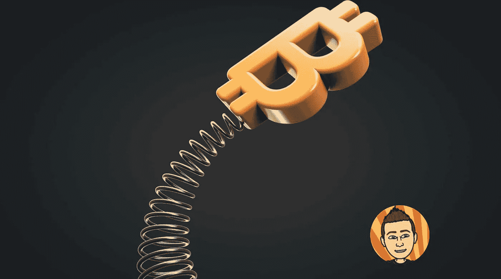

# 上涨或下跌，你需要这样思考比特币

> 原文：<https://medium.com/coinmonks/up-or-down-you-need-to-think-about-bitcoin-like-this-1b65a9f5cbff?source=collection_archive---------14----------------------->

比特币市场似乎可以去任何地方。为了极度的痛苦而继续向下，或者向上跳。在过去的半年里，我们看到一个又一个黑天鹅事件出现。这迫使比特币的价格进一步下跌，超出了我们许多人的想象。过去几个月一直徘徊在 2 万美元左右，但现在由于 FTX 引起的市场动荡，现在…