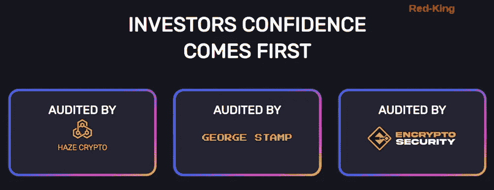

# 每周更新一次投资机会

> 原文：<https://medium.com/coinmonks/update-on-demountain-investing-opportunities-once-a-week-d97654d7e8b5?source=collection_archive---------7----------------------->

## 待定 KYC 和首款套利交易机器人

最近我写了关于拆卸的文章，特别是他们项目的 BNB 方面。他们也[有一个 Matic 选项](https://redkingcrypto.com/demountainmatic)。

如果你错过了，你可以在这里阅读我的完整评论:

 [## 拆卸提供 BNB 和 Matic 打桩(此处有 1.5%的加成)

### 选择你的赌注持续时间。项目经过三重审核

medium.com](/@Red-King/demountain-offers-bnb-and-matic-staking-1-5-bonus-here-4c6bea04726c) 

# 不要错过本周的机会

**本周五是 BNB** 的第三个拍卖周。

第 1 周有 300 万个令牌的份额要分，上周份额减少了 3%，并将继续以相同的百分比每周减少。例如，第 6 周只有 250 万。

**这里有一条来自该项目的所有者之一的简短消息:**

*“我想与大家分享我们为改进之前成功的拍卖股权协议(如(贪婪& T2X 等)背后的游戏理论所做的工作，将它推向更高的高度。*

*在过去的一个月里，我们花时间研究了这些协议的优缺点，以便我们能够向太空提供最终的拍卖平台，而* ***这导致了第一个每周一次的拍卖协议，随着时间的推移，我们获得了稳定的红利。***

已经证明要用第一周的成绩来印 BNB。第 1 周证明的现实/合理股息。

借贷现在已经被激活，我们预计这将在未来几周内增加，5%的贷款税中的 4%将用于回购 BNB 资金池，代币将被烧掉，这反过来为投资者创造了巨大的利益。

*早到是最大限度发挥未来潜力的关键，我们已经有了多个工具，随着我们的发展，我们还会带来更多。*

由于我们把投资者的信心放在第一位， ***拆除 BNB 是双重审计*** *首先由乔治斯坦普团队给予我们 100%的团队信任，其次由 EnCrypto 安全评级为 A 级项目。* ***待定 KYC 同 Anonydoxx。***

此外，我想补充一个剧透，告诉大家我们在过去几天里都做了些什么； ***我们的团队目前正在研发首款套利交易机器人*** *，在投入使用前将进行大量测试，为套利交易带来更多价值。*

总而言之，这听起来对该计划非常有利。上周，我设法获得了第一笔存款，并对该平台感到乐观。

你可以在这里看到 [BNB 版本](https://redkingcrypto.com/demountainbnb)和[多边形版本](https://redkingcrypto.com/demountainmatic)。

***记住在投资 defi*** *时只使用风险资本——你能“承受”损失的钱。换句话说，如果项目失败，你失去了投资，可能会有点痛，但不会让你破产，也不会让你承受严重的财务压力。*

# 其他需要注意的事项:

*   *我最近最好的两笔投资分别是**和 [***财富山***](https://redkingcrypto.com/wealthmtn)*
*   *你可以在这里 [**加入我的电报群**](https://t.me/redkingcrypto) ，在这里 [**推特和我联系**](https://twitter.com/RedKingDefi) 还有我的新 [**YouTube 这里**](https://www.youtube.com/channel/UCtJMEcrr-PKYy6h_LgxSAtg) 。*
*   *这里可以 [**看到我所有的文章。**](/@Red-King/)*
*   *我不是财务顾问。这不是一个财务建议，无论你在我的文章中读到什么，都完全是出于教育目的。*
*   *这些 defi 项目都是高风险高回报，只用风险资本，小心谨慎。*
*   *这篇文章包含附属链接。*
*   *大多数这些赌注 dApps 使用锁定赌注，这意味着你不能拿出你的原始投资。*

# *觉得这有帮助吗？*

*我希望这篇文章对你有所帮助。如果你喜欢这个故事，请给它一些掌声(最多 50 个)并在下面留下评论！这对我真的很有帮助。*

* [## DinoBUSD 每天支付 5 %-红王加密#短裤

### DinoBUSD 每天给你 5%的投资回报。我个人投资了这个项目。你赚了…

youtube.com](https://youtube.com/shorts/hXoQOBh4oU8) 

我的文章没有通过媒介获得报酬。

[关注我在**中**](/@Red-King) 如果你想了解更多关于**加密货币，被动收入，玩赚游戏和产量农业。**

**免责声明:** *这不是财务建议，本文中的信息仅用于教育目的。永远不要投资你输不起的东西。我否认任何根据我文章中讨论的信息、想法或策略行事的人所承担的任何责任或损失。自己做研究。*

> 加入 Coinmonks [电报频道](https://t.me/coincodecap)和 [Youtube 频道](https://www.youtube.com/c/coinmonks/videos)了解加密交易和投资

# 另外，阅读

*   [AscendEx 保证金交易](https://coincodecap.com/ascendex-margin-trading) | [Bitfinex 赌注](https://coincodecap.com/bitfinex-staking) | [bitFlyer 审核](https://coincodecap.com/bitflyer-review)
*   [麻雀交换评论](https://coincodecap.com/sparrow-exchange-review) | [纳什交换评论](https://coincodecap.com/nash-exchange-review)
*   [支持卡审核](https://coincodecap.com/uphold-card-review) | [信任钱包 vs 元掩码](https://coincodecap.com/trust-wallet-vs-metamask)
*   [TraderWagon 回顾](https://coincodecap.com/traderwagon-review) | [北海巨妖 vs 双子星 vs BitYard](https://coincodecap.com/kraken-vs-gemini-vs-bityard)
*   [Exness 评测](https://coincodecap.com/exness-review)|[moon xbt Vs bit get Vs Bingbon](https://coincodecap.com/bingbon-vs-bitget-vs-moonxbt)*