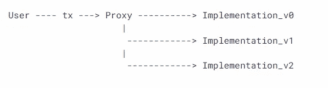

# 可升级智能合同

> 原文：<https://medium.com/coinmonks/upgradable-smart-contracts-bb9d0218115f?source=collection_archive---------6----------------------->

最近，我完成了以太挑战`Puzzle Wallet`和`MotorBike`，它们为可升级的合同实现了两种不同的代理模式。我想深入了解一下，更多地了解它们各自的优缺点。因此这篇文章记录了我的学习。

## 智能合约不是不可变的吗？

我认为，智能合约一旦部署就不能修改，因为它违背了区块链的不变性和去中心化的目的，但是它们可以升级以添加新的功能或修复现有的漏洞，同时保留合约的地址、状态和平衡。

## 如何执行升级？

有三个简单的步骤

1.  部署实现契约——包含逻辑的契约
2.  部署`ProxyAdmin`合同(我们代理的管理员)。
3.  部署代理契约并运行任何初始化函数。

Proxy and Implementation Contract

## 技术细节

***实现*** 契约包含了这个逻辑。一个 ***代理*** 是一个简单的契约，它只是*将所有调用委托给*一个实现契约。代理保存状态，而实现契约提供代码。

升级包括以下步骤:

1.  部署新的实施合同。
2.  向代理发送一个事务，代理将其实现地址更新为新地址。

## 要记住的要点

1.  可升级合同不能有`constructor`。为了帮助你运行初始化代码，[**OpenZeppelin Contracts**](https://docs.openzeppelin.com/contracts/4.x/)提供了`[Initializable](https://docs.openzeppelin.com/learn/upgrading-smart-contracts#contracts::api/proxy.adoc#Initializable)`基础契约，允许你标记一个方法，确保它只能运行一次。

2.我们不能改变那份合同的储存布局。这意味着，如果你已经在契约中声明了一个状态变量，你不能删除它，改变它的类型，或者在它之前声明另一个变量，但是你可以在最后引入一个新的状态变量。

3.将它的构造函数改为一个常规函数，通常命名为`initialize`，在这里运行所有的设置逻辑。

4.攻击者可以接管未初始化的实现协定，这可能会影响代理。

## 存储冲突

应该严格遵循变量的顺序。假设我们已经声明了三个变量`uint256`、`address`和`bool`。那么实施合同应该遵循同样的顺序`uint256`、`address`、`bool`。否则，这可能会导致未知的问题，在某些情况下，黑客接管代理合同。

## 功能冲突

可能有这样的情况，其中来自代理和实现契约的函数的`abi.encodePacked`结果是相同的。为了解决这个问题，*透明代理模式(TPP)* 确保用户不能调用代理函数，代理管理员也不能调用用户的函数。因此，防止了任何碰撞。

## 透明代理模式(TPP)和通用可升级代理标准(UUPS)

透明代理在代理契约中需要额外的逻辑来管理所有的升级功能，以及识别调用者是否是管理地址的能力。TPP 不如 UUPS 省油。

在代理上调用`upgradeToAndCall()`委托给实现上的同一个函数。当`upgradeToAndCall()`在实现上执行时(在代理的上下文中)，它改变代理中存储的实现地址*。这是可行的，因为 UUPS 实现可以访问代理的所有存储；它们可以覆盖代理契约的存储槽，其中代理存储实现的地址。*

此外，在 UUPS 的情况下，用户可以在任何时间点定制或更新所有者，而在 TPP 中，代理管理员是唯一有权更新的人。

感谢阅读！

> 交易新手？尝试[加密交易机器人](/coinmonks/crypto-trading-bot-c2ffce8acb2a)或[复制交易](/coinmonks/top-10-crypto-copy-trading-platforms-for-beginners-d0c37c7d698c)