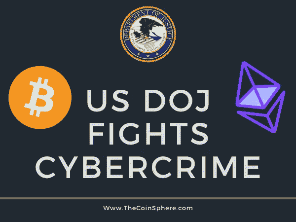

# 美国司法部打击加密货币犯罪

> 原文：<https://medium.com/coinmonks/us-department-of-justice-fights-cryptocurrency-crime-58efef2c7bd3?source=collection_archive---------37----------------------->

[For the best Crypto News in the world, visit TheCoinSphere.com](http://thecoinsphere.com/)

A 根据多个消息来源，与加密货币相关的网络犯罪利润的粗略估计超过 20 亿美元。

无论是更个性化的黑客攻击，像朝鲜这样的对手创建幌子公司并窃取所有投资者的资金，还是你简单的 NFT 小把戏，美国已经决定打击加密网络犯罪…