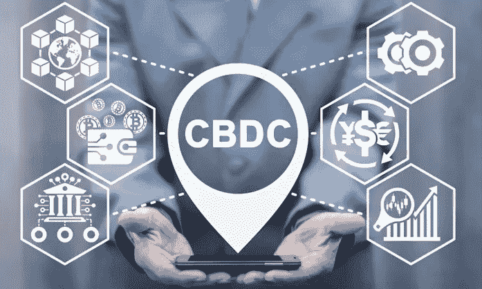

# 美国数字美元 CBDC 测试在这里！发生了什么事？联邦现付款

> 原文：<https://medium.com/coinmonks/us-digital-dollar-cbdc-tests-are-here-what-happened-fednow-payment-62073a226f77?source=collection_archive---------0----------------------->

## 加密报告

## 2023 年有很多项目正在启动。

上个月，数字美元项目和美国存托和清算公司(T1)或 T2 DTCC(T3)测试了使用 T4 中央银行数字货币(T5)或 CBDC(T7)的股票交易，特别是数字美元。