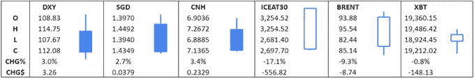
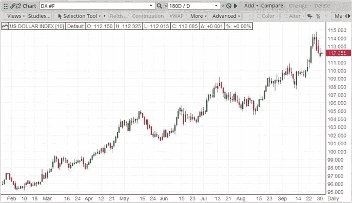
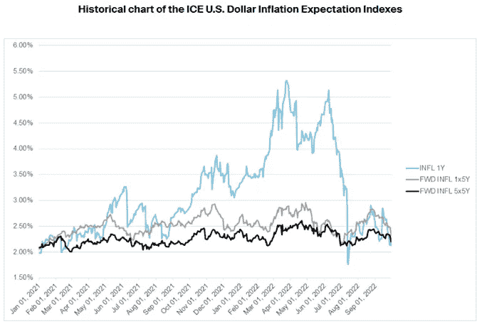

# 美元| 2022 年 10 月 TRADDICTIV 月度报告

> 原文：<https://medium.com/coinmonks/us-dollar-october-2022-monthly-report-by-traddictiv-6e3e12cf8d68?source=collection_archive---------29----------------------->

Source: ICE Connect, ~30 Days

**美元-**

9 月份，美元指数(USDX)飙升至 114.75，创下 20 年新高，连续第四个交易日收高。USDX 本月收于 112.08 点，涨幅为 2.99%。

*   9 月 2 日公布的非农就业数据显示，8 月份新增就业岗位 315，000 个，超过预期的 300，000 个，尽管较 8 月份数据有所下降，8 月份数据修正后为 526，000 个(从 528，000 个向下修正)。USDX 收于 109.51 点，当日下跌 0.08%。
*   9 月 13 日发布的所有项目的消费者价格指数(CPI)数据连续第二个月放缓，截至 8 月份的 12 个月通胀数据为 8.3%，低于前一个月的 8.5%，因为能源价格继续下降。核心通胀率(所有项目减去食品和能源)在过去 12 个月中以 6.3%的速度增长，高于 6 月和 7 月的 5.9%，摆脱了六个月的低点。USDX 收盘报 109.81 点，涨幅为 1.48%。
*   美联储在 9 月 21 日举行的会议上加息 75 个基点，并暗示在未来的会议上可能会进一步加息。USDX 以 110.35 点收盘，涨幅为 0.41%。

**日线趋势:上涨**

***指标权重:***

***欧元 57.6% |日元 13.6% |英镑 11.9% |加元 9.1% | SEK 4.2% |瑞士法郎 3.6%***

Source: ICE Connect

在 9 月初的美元指数交易中，多头牢牢控制着局面。随着 8 月份 ISM 制造业采购经理人指数(PMI)数据的公布，这一牛市行情得以延续。公布的数据显示，制造业产出与 7 月份公布的 52.8 保持一致。发布的数据高于 52.0 的市场预期，阻止了此前观察到的稳步下降，尽管仍指向制造业增长的低水平。美元指数当天收于 109.68，涨幅为 0.78%。

在 9 月 2 日的亚洲和欧洲市场交易中，由于空头控制了市场，美元指数失去了上涨的动力，市场下跌。非农就业数据没有带来多少安慰，在小幅提振后，美元指数稳步下跌。公布的数据显示，8 月份新增就业岗位 31.5 万个，刚刚超出市场预期的 30 万个。尽管 7 月份的数据大幅下降，但修正后的增幅为 52.6 万(从 52.8 万向下修正)，创下自 2021 年 4 月以来的最低月度增幅。公布的数据还显示，失业率意外上升至 3.7%，尽管这主要是由于劳动力参与率的上升。工资继续上涨，尽管略低于预期，8 月份平均时薪增长 0.3%，同比增长 5.2%。

在美国市场的大部分时间里，美元指数一直走低，直到到达 108.97-108.73 的一个小支撑区域，市场反弹并收复了部分早些时候的失地。美元指数收盘下跌 0.08%，至 109.51。

截至 9 月 2 日，美元指数收盘上涨 0.65%。

9 月 5 日，当美元指数上涨到 110.26 的高点时，多头出现并控制了市场。卖家回来了，空头推动市场下跌，当天收于 109.51 点，相当于周五的收盘价，当天跌幅为 0.29%。

9 月 6 日早盘，由于经济数据即将公布，市场横盘整理。随着 8 月份 ISM 服务业采购经理人指数的公布，多头卷土重来。数据显示，服务业经济活动连续第 27 个月扩张，8 月份为 56.9，高于市场预期的 55.1，高于上月的 56.7。

受此消息影响，市场上涨，美元指数在美国交易时段的大部分时间里保持上涨。当美元指数达到 110.55 的高点时，市场遇到了一些阻力，并略有回落。美元指数当天收于 110.20，涨幅为 0.55%。

9 月 7 日，美元指数在亚洲、欧洲和美国早盘交易中横盘整理。一天当中，美联储的许多成员都发表了讲话，美联储的褐皮书也即将发布，所有这些都给市场带来了沉重的压力。在一次讲话中，美联储副主席莱尔·布雷纳德回避了美联储需要进一步加息的问题，尽管有迹象显示通胀正在放缓，但只要有必要，美联储就需要加息，以恢复价格稳定。美联储将寻求几个月的低月度通胀数据，以确信它将向 2%的目标迈进。

美联储褐皮书后来报告称，美联储预计美国经济将在未来 6-12 个月内走软，因为美国经济在“轻微至温和”增长之间保持平衡。这打击了美元多头的精神，美元指数开始下跌，收于 109.83，跌幅为 0.44%。

9 月 8 日，美元指数经历了一个涨跌互现的交易日，多头和空头全天都在控制着美元指数。美联储主席鲍威尔重申了美联储的立场，即他们目前正在采取措施解决和控制通货膨胀。这反映在当天市场的走势上。美元指数收于 109.71，小幅上涨 0.02%。

在本周的最后一天交易中，美元指数空头接管并推动市场下跌，直到美元指数达到每日布林线的中点，买家正在等待。在美元指数跌至 108.35 的低点后，多头推高了市场，尽管没有足够的动力来收复早些时候的所有失地，但多头收复了一些失地。美元指数当天收于 109.00，跌幅为 0.50%。

美元指数 9 月交易的第一个完整周收盘下跌 0.75%，至 109.00。

9 月 12 日交易美元多头努力保持控制，随着美元指数达到 108.87 的高点，空头回归，市场下跌。美元指数当天收于 108.32，跌幅为 0.28%。

9 月 13 日发布的最新通胀数据显示，通胀速度连续第二个月放缓，截至 8 月底的 12 个月内，所有项目的消费者价格指数(CPI)数据显示价格上涨 8.3%，低于上月的 8.5%。汽油和燃油价格的较低涨幅导致了下降，尽管天然气和电力成本上升(1981 年 8 月以来的最高水平)以及食品成本上升(11.4%，1979 年以来的最高水平)。核心通胀率(代表除食品和能源以外的所有项目)在过去 12 个月中意外增长至 6.3%，而 7 月份公布的数据为 5.9%，预期为 6.1%。这是自 2020 年 3 月以来的最高月度增幅。

9 月 13 日，美元指数在达到 107.67 的当天低点后，当市场接近 107.65-107.48 的 4 小时支撑区时，美元指数找到了买家。随着多头取得控制权并突破日线布林线的中点，市场出现反弹。美元指数收盘上涨 109.81，涨幅为 1.48%。

由于通胀仍然是关键的优先事项之一，为了帮助衡量未来的通胀预期，ICE 基准管理机构推出了 ICE 美元信息预期指数系列。这是一个有用的工具，有助于回答一些关键问题，这些问题将影响未来几个季度货币政策的走向

在 9 月 14 日的交易中，买家挣扎，空头介入，美元指数下跌，尽管在交易日结束时略有回升。美元指数当天收于 109.63，跌幅为 0.19%。

9 月 15 日，美元指数在两个方向上都难以找到任何动力。零售额数据令市场感到惊讶，因为 8 月份的销售额比 7 月份的降幅增长了 0.3%，7 月份的降幅从持平(0%)向下修正为-0.4%。8 月份市场预期为 0%。美元指数当天收于 109.71，涨幅为 0.11%。

9 月 16 日公布的密歇根州消费者信心指数信息最初令人失望，公布的数据低于预期，为 58.6(低于最初公布的初步数据 59.5)，低于预期的 60.0 和 8 月份的 51.5。美元指数当天收于 109.74，跌幅为 0.04%。

美元指数本周收于 109.74，整体上涨 1.03%。

9 月 19 日星期一，美元指数回调，因为空头推动市场走低，重新测试日线 20 SMA(日线布林线的中点)，多头在此等待，美元指数反弹。美元指数收盘小幅上涨 0.05%，至 109.47。

9 月 20 日，美元指数在早盘交易中横盘整理，尽管发现了日均线的支撑，但这一次，随着多头回归和市场反弹，20 日均线提供了支撑。美元指数当天收于 109.42，涨幅为 0.60%。

9 月 21 日，美联储宣布加息 75 个基点，这是史无前例的加息，因为这是连续第三次加息 75 个基点，将基准利率提高到 3.00%至 3.25%的范围。强硬的货币政策立场继续作为解决持续高通胀的一种手段，同时人们也认识到这可能会对更广泛的经济产生影响。

受此消息影响，美元指数上涨至 111.36 的高点，并突破了日线布林带的上限，随后回落，收盘上涨 0.41%，至 110.35。

由于通货膨胀将在整个 2022 年的利率决策中发挥关键作用，ICE 美元信息预期指数系列是一个帮助规划未来的伟大工具。下图提供了过去一年的历史指数设置:

Further information can be found on the ICE U.S. Dollar Inflation Expectations Index Family: [https://www.ice.com/iba/usd-inflation-indexes](https://www.ice.com/iba/usd-inflation-indexes)

在 9 月 22 日的亚洲和欧洲早盘交易时段，美元多头推动市场走高，美元指数再次反弹，突破日线布林带上界。虽然卖家回来扭转了一些早期的收益，但市场收盘时高于。美元指数收于 111.11，跌幅 0.10%。

在 9 月 23 日的交易中，多头重新获得了控制权，随着资金进入避风港，多头势头加快。美元指数在本周最后一个交易日上涨，收于 112.96 点，涨幅 1.76%，创下本月最强劲的单日表现。

美元指数本周收盘上涨 3.24%，收于 112.96 点，扭转了前一周的跌势，创下 9 月份最强劲的单周表现。

看涨势头持续到接下来的交易周，因为美元多头推动市场走高。美元指数在 9 月 26 日收盘时强劲上涨，虽然市场从 114.45 的高点回落，但美元指数在 114.02 收盘时上涨 0.91%。

9 月 27 日，空头控制了早盘交易，美元指数走低。多头在美国市场卷土重来，扭转了早些时候的一些损失。公布的 8 月份耐用品订单数据显示，订单从 7 月份的-0.1%降至-0.2%(从最初报告的 0%向下修正)，这与预期的 0.6%的增幅相反。

非国防资本货物订单。9 月 27 日发布的飞机数据也显示出增长，数据显示增长 1.3%，明显高于 0.2%的预期，也高于 7 月份发布的修订后的 0.3%(从 0.4%修订)。这两组数据都没有对发布时的美元指数方向产生影响。美元指数收盘上涨 114.05，涨幅为 0.18%。

在 9 月 28 日的早盘交易中，美元指数继续走高，达到 114.75 的高点，创下 20 年来的新高，随后由于风险市场情绪削弱了对美元的需求，卖方介入压低美元指数。空头在交易日的剩余时间里积聚了动力，美元指数收盘下跌 1.40%，收于 112.51 点。9 月最大单日跌幅。

9 月 29 日，多头短暂夺回控制权，美元指数达到 113.72 的高点，在此遇到阻力，因为空头卷土重来，导致市场走低。美元指数当天收于 112.20，跌幅为 0.67%。

9 月 29 日公布的国内生产总值数据显示，美国经济第二季度按年率计算收缩了 0.6%，这与此前公布的临时数据相符。虽然这在技术上表明经济正在萎缩，但这是对第一季度 1.6%的萎缩的改善。

9 月 30 日，熊市势头仍在继续，尽管多头在美国市场早些时候卷土重来，推动市场从低点反弹，但没有足够的动力保持在当天的高点，市场出现回调。美元指数当天收于 112.08，涨幅为 0.25%。

在 9 月交易的最后一周，美元指数创下 20 年来的新高，达到 114.75，但未能保持牛市势头，本周收盘下跌 0.80%。

美元指数本月收盘上涨 2.99%，至 112.08 点，连续第四个月收高。无论是周线还是日线，上涨趋势都保持不变。

即将举行的高影响力活动

*   10 月 3 日星期一 ISM 制造业采购经理人指数(9 月)
*   10 月 5 日星期三 ADP 雇佣变化(9 月)
*   10 月 5 日星期三 ISM 服务 PMI(9 月)
*   Fri 10 月 7 日非农就业报告(9 月)
*   10 月 12 日星期三 FOMC 会议纪要
*   10 月 13 日消费者价格指数(Sep)
*   Fri 10 月 14 日零售销售(9 月)
*   Fri，10 月 14 日，密西根州，PREL，消费者情绪
*   10 月 26 日星期三耐用品订单(9 月)
*   10 月 26 日星期三非国防资本货物订单。飞机(Sep)
*   10 月 26 日星期三 PREL 国内生产总值年化(第三季度)

请随时加入我们的˲tradewithufos 社区，我们提供全面的交易课程和交易应用程序。

行情分析与交易 app:
[【www.tradewithufos.com/apps】T2](https://www.tradewithufos.com/apps/)

为所有人免费永久会员:

**传统研究团队**

> **交易新手？尝试[加密交易机器人](/coinmonks/crypto-trading-bot-c2ffce8acb2a)或[复制交易](/coinmonks/top-10-crypto-copy-trading-platforms-for-beginners-d0c37c7d698c)**