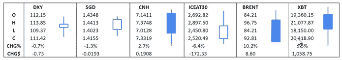
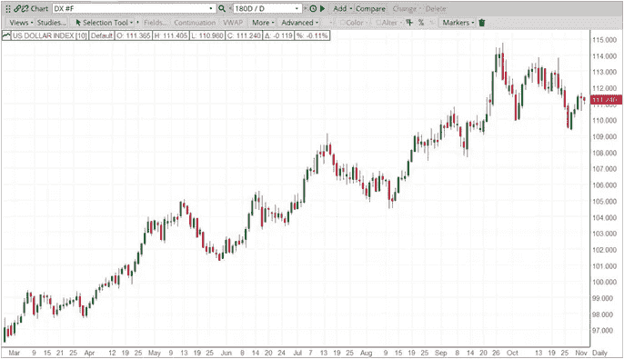

# 美元| 2022 年 10 月 TRADDICTIV 月度报告

> 原文：<https://medium.com/coinmonks/us-dollar-october-2022-monthly-report-by-traddictiv-d6cfc2ed3288?source=collection_archive---------44----------------------->

Source: ICE Connect

**美元-**

美元指数(USDX)10 月收于 111.72，打破了连续四个月的上涨势头。USDX 本月收盘下跌 0.65%。

*   9 月份公布的非农就业数据显示，新增就业岗位 263，000 个，超出 250，000 个的预期，尽管 9 月份数据显示新增就业岗位 315，000 个，连续第二个月下降。USDX 以 112.68 点收盘，涨幅为 0.42%。
*   10 月 12 日发布的联邦公开市场委员会(FOMC)会议记录证实了 9 月 21 日会议上 75 个基点的加息，并暗示了美联储的鹰派立场。USDX 以 113.22 点收盘，小幅下跌 0.01%。
*   过去 12 个月，核心通胀率(扣除食品和能源的所有项目)继续上升，达到 6.6%，高于 8 月份的 6.3%，创下 1982 年以来的最高水平。USDX 当日收于 112.25 点，跌幅为 0.81%。

每日趋势:横盘

*指标权重:*

*欧元 57.6% |日元 13.6% |英镑 11.9% |加元 9.1% | SEK 4.2% |瑞士法郎 3.6%*

Source: ICE Connect

在 9 月 28 日达到 20 年来的新高后，市场开始疲软，10 月初也不例外。交易的第一天，美元指数下跌，因为空头牢牢控制了对美元的需求。9 月份 ISM 制造业 PMI 数据公布，显示制造业产出下降至 50.9，而 8 月份公布的数据为 52.8。由于制造业增长继续放缓，该公告低于市场预期的 52.2%。美元指数当天收于 111.66，跌幅为 0.44%。

10 月 4 日，随着美国股市反弹走高，资金流出避风港，流入更具风险的资产，看跌势头持续。基准的标准普尔 500 出现了自 2020 年 4 月以来最大的两天反弹。美元指数当天收于 110-04-109.64(在 4 小时时间框架内形成)的支撑区域，略高于 109.87-109.04 的更广泛的每日支撑区域，跌幅为 1.37%，至 109.98。

多头于 10 月 5 日卷土重来，美元指数在 ADP 就业变化相关利好消息的帮助下从支撑区域反弹。公布的数据显示，私营部门就业岗位增加了 20.8 万个，高于市场预期的 20 万个，并向上修正了上月的 18.5 万个。此外，9 月份 ISM 服务业 PMI 数据公布为 56.7，尽管该数据较上月 56.9 有所放缓，但仍高于 56 的预期。美元指数收盘上涨 0.85%，报 111.01。

10 月 6 日，看涨势头加快，美元指数延续了前一天的涨势，因为过去几天观察到的鹰派言论继续来自美联储官员关于激进加息和对 2023 年前景的担忧。美元指数收高至 112.18，涨幅 1.18%。

10 月 7 日公布的非农就业数据显示，9 月份新增就业岗位 263，000 个，高于市场预期的 250，000 个，尽管这比前几个月报告的 315，000 个有所下降，创下 2021 年 4 月以来的最低月度增幅。公布的数据还显示，9 月份的失业率意外降至 3.5%(此前为 3.7%)，与 7 月份的 29 个月低点持平。工资继续上涨，平均时薪上涨 0.3%，与 8 月份公布的涨幅持平，比一年前上涨 5.0%。美元指数当天走高，收于 112.68 点，涨幅 0.42%。

截至 10 月 7 日，美元指数收盘上涨 0.48%。

10 月 10 日交易美元多头推动市场走高，虽然市场从 113.29 的日高点小幅回调，但美元指数收盘时为 113.07，涨幅为 0.37%。

10 月 11 日的交易起伏不定，因为多头和空头为了获得控制权而发生冲突，由于来自英国银行的信息导致 GBPUSD 下跌，资金转移到美元的避风港，多头占据了上风。(英镑是美元指数所包含的一篮子货币的一部分)。此外，国际货币基金组织(IMF)发布的一份报告提出了衰退担忧，并下调了 2023 年全球增长预测。美元指数收盘上涨 0.11%，至 113.13 点。

10 月 12 日发布的美联储 9 月会议 FOMC 会议纪要显示，在通胀开始下降之前，高利率很可能会保持不变。决策者注意到通货膨胀对经济的影响，尤其是对低收入人群的影响。委员会还提高了他们对联邦基金利率的评估路径，以实现他们的目标。此外，委员会的一些成员指出，全球经济和金融环境的不确定性以及美国经济活动的前景将在进一步收紧政策的步伐中发挥作用。

美元指数当天大部分时间横向交易，10 月 12 日收盘时为 113.22 点，几乎与开盘时下跌 0.01%持平。

10 月 13 日发布的最新通胀数据显示，通胀速度连续第三个月放缓，截至 9 月份的 12 个月内，所有项目的消费者价格指数(CPI)数据显示，价格上涨 8.2%，低于上月的 8.3%。汽油和燃油价格的较低涨幅导致了这一下降。核心通胀率(代表除食品和能源以外的所有项目)在截至 9 月份的过去 12 个月中再次意外增长至 6.6%，而 8 月份公布的数据为 6.3%，预期为 6.5%，仍远高于美联储 2%的目标利率。这是自 1982 年以来的最高增幅。

在创下 113.85 的日内高点并几乎达到周线布林线的上限以及 113.92-114.75 的 4 小时时间框架内的阻力区域后，美元指数遇到阻力并在空头控制下下跌。美元指数当天收于 112.25 点，跌幅为 0.81%。

由于通货膨胀将在整个 2022 年的利率决策中发挥关键作用，ICE 美元信息预期指数系列是一个帮助规划未来的伟大工具。下图提供了过去一年的历史指数设置:

Further information can be found on the ICE U.S. Dollar Inflation Expectations Index Family: [https://www.ice.com/iba/usd-inflation-indexes](https://www.ice.com/iba/usd-inflation-indexes)

10 月 14 日，多头回归，即使零售数据低于市场预期(0.2%)，9 月份销售持平，低于 8 月份向上修正的 0.4%的增幅，美元指数仍保持强劲。

当天晚些时候公布的密歇根消费者信心指数(Michigan Consumer perspective Index)的积极数据带来了可喜的消息，该指数公布的数据高于预期，为 59.8，而预期为 59，8 月份的数据为 58.6。美元指数测试了日布林线的中点，当天买家进场，市场反弹。美元指数当天收于 113.20，涨幅为 0.65%。

美元指数本周收于 113.20，整体上涨 0.49%。

10 月 17 日星期一，随着资金流出避险天堂，美元指数熊市卷土重来，部分原因是股票市场对英国之前宣布的小型预算做出 180 度大转弯的积极反应。投资者也对日本央行的任何干预保持谨慎(日元是货币篮子的一部分)。美元指数在整个交易日下跌，突破日线布林线的中点，在日线 20 均线上休整。美元指数收盘下跌 1.12%，至 111.91 点。

10 月 18 日，美元指数全天横盘整理，在找到日线 20 均线的持续支撑后，收于 111.99，小幅上涨 0.02%。10 月 19 日多头回归，美元指数回升，收盘上涨 0.95%，至 112.88。

在 10 月 20 日开始看跌后，20 日均线再次提供支撑，多头回归。市场回升，收复了一些早先的失地。美元指数当天收于 112.82 点，下跌 0.07%。

10 月 21 日，市场在早盘交易中反弹，尽管当卖方介入时，它刚刚跌破 113.92-114.75(在 4 小时时间框架内形成)的阻力区。空头卷土重来，美元指数全天大部分时间下跌。美元指数收于 111.98，收盘下跌 0.77%，仅低于此前作为支撑的日线 20 均线。

美元指数本周收于 111.98，整体下跌 1.05%，为 2022 年 7 月以来最大单周跌幅。

美元多头在 10 月 24 日推动市场走高，达到 112.47 的高点，在测试日线布林线中点时遇到阻力。空头卷土重来，美元指数下跌，直到交易日结束时找到支撑。美元指数收于 111.91，涨幅 0.27%。

空头在 10 月 25 日的交易中重新获得了控制权，美元指数全天走低，收于 110.83，跌幅为 0.88%。10 月 26 日，随着资金继续远离安全港，看跌的时刻加快了步伐。美元指数收于 109.55，在 109.87-109.04 的每日支撑区域内下跌 1.16%。

10 月 27 日，随着对美元的需求增加，市场从这一支撑区域反弹，买家又回来了。9 月份公布的耐用品订单数据显示，在 8 月份修正数据公布增长 0.2%(从-0.2%向上修正)后，订单增长 0.4%，尽管略低于市场预期的 0.6%。

非国防资本货物订单。10 月 27 日发布的飞机数据也显示出显著下降，数据显示下降至-0.7%，明显低于 0.5%的预期，8 月份发布的数据向下修正为 0.8%(从 1.3 修正)。

10 月 27 日公布的国内生产总值(初步)数据也带来了可喜的消息，美国经济第三季度年化增长率为 2.6%，超过了 2.4%的预期，在前两个季度出现负增长后大幅增长。美元指数收于 110.45，涨幅 0.92%。

10 月 28 日，市场继续反弹，美元指数达到 110.93 的高点，当时遇到阻力，空头卷土重来，导致市场回调。尽管如此，美元指数当天收于 110.61，涨幅为 0.19%。

10 月交易的最后一周，美元指数本周收盘下跌 0.90%，至 110.61。

看涨势头在 10 月 31 日继续，市场反弹。美元指数在 10 月交易的最后一天收于 111.42，涨幅为 0.67%。

总体而言，美元指数本月收盘下跌 0.65%，至 111.42 点，结束了此前连续四个月的正收盘。虽然我们已经看到日线时间框架上的回调，市场转变为横盘趋势，但周线时间框架上的上升趋势保持不变。

**即将到来的高影响力事件**

*   11 月 1 日星期二 ISM 制造业采购经理人指数(10 月)
*   11 月 2 日星期三 ADP 雇佣变化(10 月)
*   11 月 2 日星期三美联储利率决议
*   11 月 2 日星期三美联储货币政策声明
*   11 月 2 日星期三 FOMC 记者招待会
*   11 月 3 日第三季度 ISM 服务 PMI(10 月)
*   Fri 11 月 4 日非农就业报告(10 月)
*   11 月 10 日消费者价格指数(10 月)
*   Fri，11 月 11 日，密西根州，PREL，消费者情绪
*   11 月 16 日星期三零售销售(10 月)
*   11 月 23 日星期三 FOMC 会议纪要
*   Fri 11 月 25 日耐用品订单(10 月)
*   Fri，11 月 25 日，非国防资本货物订单。飞机(10 月)
*   11 月 28 日星期一 PREL 国内生产总值(第三季度)
*   11 月 30 日星期三 ADP 雇佣变动(11 月)

请随时加入我们的˲tradewithufos 社区，我们提供全面的交易课程和交易应用程序。

行情分析及交易 app:

**为所有人免费永久会员:
[**www.tradewithufos.com/membership**](https://www.tradewithufos.com/product/tradewithufos-membership/)**

**传统研究团队**

> **交易新手？尝试[加密交易机器人](/coinmonks/crypto-trading-bot-c2ffce8acb2a)或[复制交易](/coinmonks/top-10-crypto-copy-trading-platforms-for-beginners-d0c37c7d698c)**