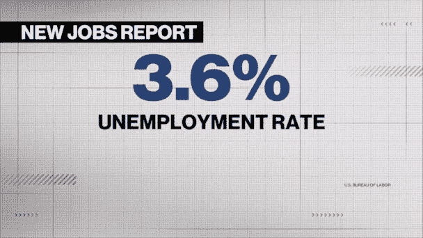

# 美国就业获得最高估计；失业率保持在 3.6%

> 原文：<https://medium.com/coinmonks/us-job-gains-top-estimates-jobless-rate-holds-at-3-6-34757745ce05?source=collection_archive---------41----------------------->

*   6 月份就业人数增加了 372，000 人，与前几个月的速度一致
*   随着越来越多的美国人离开劳动力市场，参与率下降

美国雇主 6 月份增加的就业岗位超过预期，失业率接近 50 年低点，这两个迹象表明需求强劲和劳动力市场紧张将使美联储官员倾向于另一个…