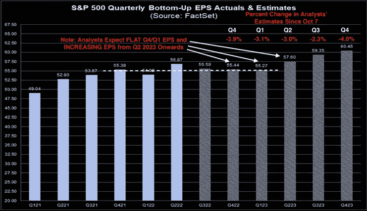
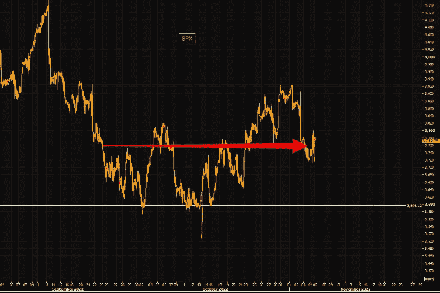
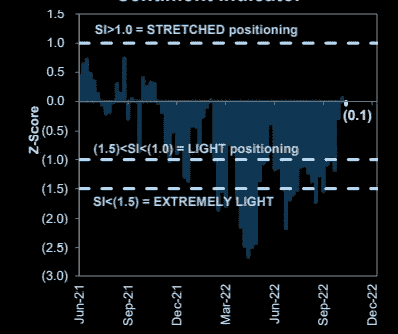
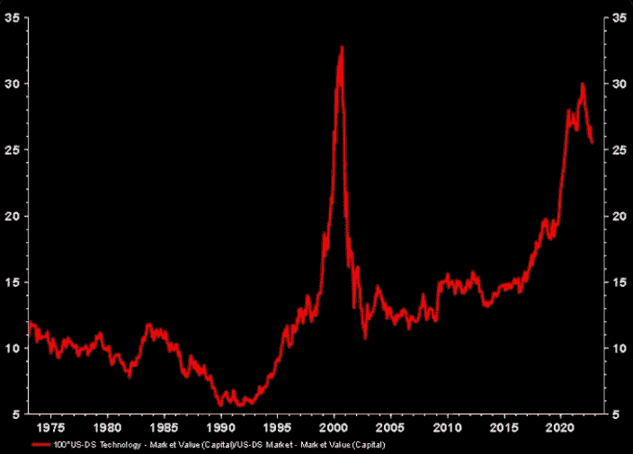
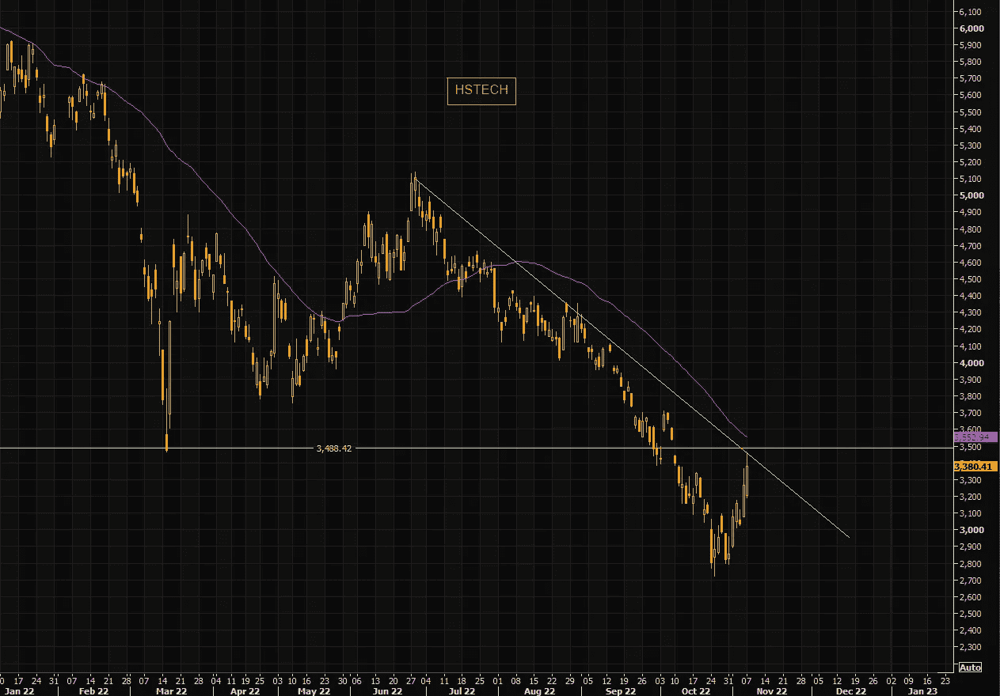
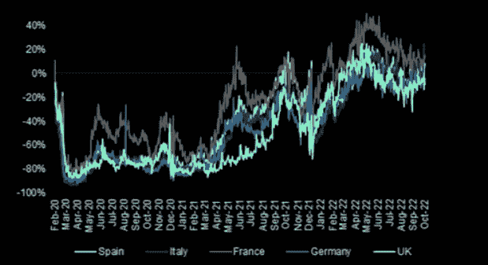
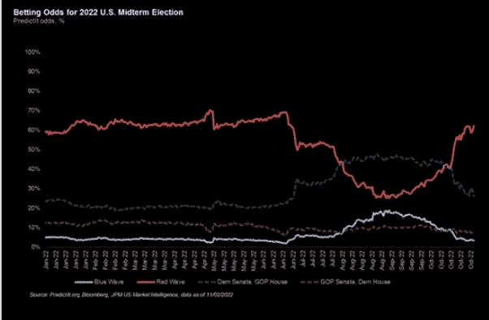

# 美国中期市场格局，盈利季节即将结束，亚洲科技股起死回生

> 原文：<https://medium.com/coinmonks/us-mid-terms-market-setup-earnings-season-almost-over-asian-tech-back-from-the-dead-fa2659777631?source=collection_archive---------52----------------------->

嘿，我是基兰！市场又将迎来新的一周，以下是需要注意的关键事件，以及来自投资银行的最有趣的宏观研究。我希望能在本周的[贸易挑战](http://www.traderseed.io/)中与你交谈，并且一如既往，如果你有任何问题，请在下面给我留言。

# 每周观察列表

本周可能会带来又一周的剧烈波动，因为周二我们将迎来美国中期选举，周四我们将迎来美国通胀数据。中期选举的结果可能意味着美国政策在多个方面发生转变，因为共和党在民调中领先，许多分析师认为，可能的结果将是一个分裂的政府，共和党控制众议院，并可能在拜登任期的后半段控制参议院。

周四，我们将看到 10 月份美国通胀(CPI)数据。与以往一样，对于这一重大数据发布，预计跨市场波动，如果我们得到任何重大惊喜。

# 宏观视角

**财报季即将结束。随着 82%的标准普尔 500 指数公司公布财报，第三季度的大部分收益已经过去。由于第三季度业绩不佳，华尔街分析师已经下调了对未来几个季度的预期。下面的 FactSet 图表以灰色显示了 2022 年第三季度至 2023 年第四季度的预期标准普尔 500 每股季度收益，以深蓝色显示了 Q1 2021 年至 Q2 2022 年的实际每股收益。**

标普 500 区间震荡。目前，标准普尔 500 指数仍处于盘整之中，较近期高点下跌约 140 点，较近期收盘低点上涨约 180 点。尽管过去几个月大幅波动，但该指数自 9 月以来基本未变。还没人能控制局面。

**高盛定位指标在 0。没有信号。**GS 指标衡量过去 12 个月零售、机构和外国投资者的股票头寸。读数低于-1.0 或高于+1.0 表明极端位置，这对预测未来回报很重要。

**科技残骸。**尽管最近经历了阵痛，但以科技股占美国总市值的百分比衡量，科技股仍几乎与上世纪 90 年代末一样膨胀。呀！从这里下去很远。

**亚洲科技——起死回生。亚洲科技正在卷土重来。HSTECH 指数从最近的低点收盘上涨了 20%。**

**航班搜索稳定在或高于 19 年水平。做研究时，广撒网总是值得的。Kayak 航班搜索趋势，年同比%。到目前为止看起来很健壮。**

下你的选举赌注。美银中期:“共和党获胜表示选民希望低通胀，民主党获胜表示选民希望低失业率；政策制定者将据此做出暗示……共和党获胜=货币政策收紧=收益率曲线反转更多，而民主党获胜=财政政策宽松=收益率曲线更陡。”

我希望你觉得这很有趣，很有用。**我每周一写这个简讯**，所以**一定要关注我**！像往常一样，把风险管理放在第一位，安全交易，保持敏捷。

祝你一周愉快！
基兰
**www.traderseed.io**

想交易本周的市场吗？ 100k 程序从 **$75** 开始！！点击这里查看新节目 [**！**](http://www.traderseed.io/)

[**查看节目**](http://www.traderseed.io/)

> 交易新手？尝试[加密交易机器人](/coinmonks/crypto-trading-bot-c2ffce8acb2a)或[复制交易](/coinmonks/top-10-crypto-copy-trading-platforms-for-beginners-d0c37c7d698c)