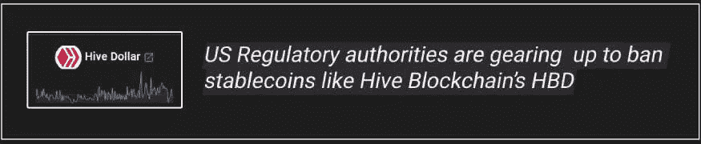
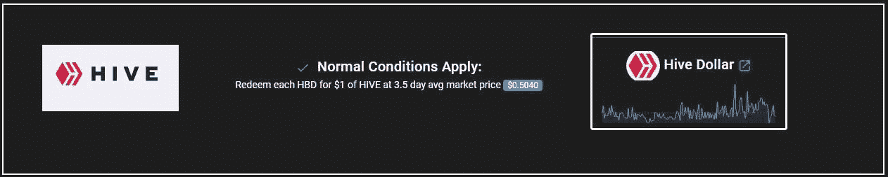
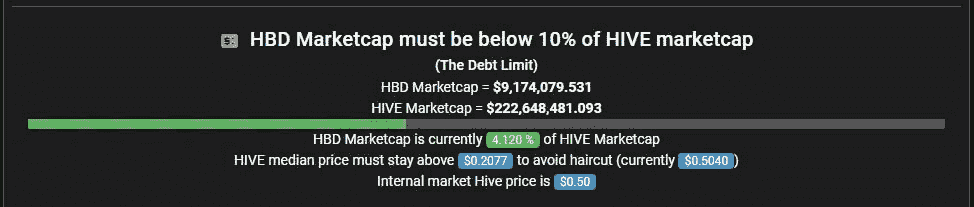
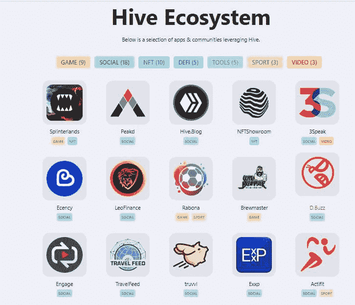
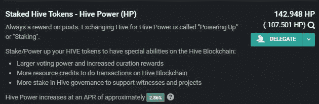
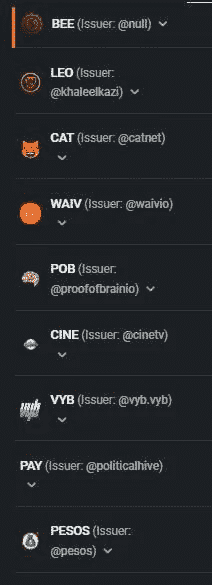

# 美国监管机构正准备禁止像蜂巢区块链的 HBD 这样的稳定公司

> 原文：<https://medium.com/coinmonks/us-regulatory-authorities-are-gearing-up-to-ban-stablecoins-like-hive-blockchains-hbd-6d36954d3349?source=collection_archive---------43----------------------->

# 美国马币草案寻求禁止马币，如区块链的 HBD！！

我意识到，自 TerraUST 大崩盘以来，美国监管机构一直在寻求监管 stablecoins。然而，目前的稳定币草案规定(T1)希望(T2)在两年内禁止算法稳定币(T3)，这让我很担心。

这是因为我是 HIVEr，Hive 区块链有两种货币一种是 Hive，一种是 HBD。后者作为分散的稳定币出售，它是通过交换价值 1 美元的蜂巢获得的。

目前，在网站上，HBD 没有作为算法稳定币进行销售，但即使如此，美国监管机构——美国财政部、证券交易委员会、美联储、货币监理署将 HBD 视为算法稳定币。

# HBD 是美国监管机构希望禁止的那种稳定货币

众议院的这个[稳定债券草案](https://cryptonews.com/news/stablecoins-regulation-looms-large-bill-before-us-congress-algo-versions-face-ban.htm)试图禁止的稳定债券种类是[‘内生抵押稳定债券’](https://cryptonews.com/news/terrausd-terra-luna-price-drop-as-algorithmic-stablecoins-face-ban.htm)。

这些稳定的硬币被宣传为可以以固定价格转换和赎回的资产，但它们的固定价值取决于同一发行者创造的另一种数字资产。

[HBD](https://hive.ausbit.dev/hbd) ，根据我再次阅读后的理解，似乎符合[‘内生抵押稳定债券’](https://cryptonews.com/news/stablecoins-regulation-looms-large-bill-before-us-congress-algo-versions-face-ban.htm)的定义。 [HBD](https://hive.ausbit.dev/hbd) 保持它的价值以换取价值 1 美元的蜂巢。

# HBD 不像露娜，因为它有防范死亡螺旋命运的措施

但是，在下结论之前，请等待，因为 HBD 在这方面不同于 terraUST，可以发行的 HBD 数量不能超过 Hive 市值的 10%。我读过的这条规定是为了防止这种稳定的货币资产的[死亡螺旋。](https://peakd.com/hive-167922/@dalz/how-exactly-is-the-hive-debt-calculated-important-things-to-know-when-monitoring-the-health-of-hbd)

[Source](https://hive.ausbit.dev/hbd)

在 terraUST 的情况下，铸造是在没有盖子的情况下进行的，所以死亡螺旋发生了。

# HBD 作为蜂巢的债务是可持续的，只要蜂巢有真正的效用

[@taskmaster4450le](http://twitter.com/taskmaster4450le) 和 [@dalz](http://twitter.com/dalz) 将能够从它是 [Hive 债务](https://peakd.com/hive-167922/@dalz/how-exactly-is-the-hive-debt-calculated-important-things-to-know-when-monitoring-the-health-of-hbd)的一部分的角度来解释 HBD 的概念，限制 HBD 相对于 Hive 的市值是对 HBD 成为[坏账](https://peakd.com/hive-167922/@dalz/how-exactly-is-the-hive-debt-calculated-important-things-to-know-when-monitoring-the-health-of-hbd)并陷入死亡螺旋局面的检查。

根据他们的说法，只要 Hive 保持实际效用，HBD 作为 Hive 的债务是可持续的，因为 Hive 的价值将永远存在。

# 我对 Hive 区块链中 Hive 效用的理解

Hive Blockchain 有很多用途——它是一个面向作家、视频创作者的去中心化社交媒体平台，还有流行的游戏 dapps 和许多其他应用程序。它拥有蓬勃发展的社区，如 leofinance，这些社区通过 PolyCub、Cub Finance 等金融应用程序为 Hive 增值。

Check out the [Hive ecosystem’s dapps here](https://hive.io/eco) >>

毫无疑问，Hive crypto 需要被购买和使用，才能在平台中获得良好的收益和发展。

作为一名作家，我知道启动 Hive 和获得 Hive Power 或 HP 的好处，因为这在我管理内容时会给我带来更多回报。

我们还将我们的 HP 委托给 Hive 策展社区，这些社区为我们带来了被动收入，他们的一些策展奖励会适当地分配给我们，用于委托我们的 HP。

@indiaunited Hive community curates content and distributes earned curation rewards to its delegators who delegate their HP.

Hive 区块链中的其他令牌，如 Leo、VYB，都是基于 Hive 的，通电给用户更多的权力，以获得进一步的奖励，并使用区块链平台增加他们的财富。

Hive community tokens created in Hive Blockchain

# 与 terraUST 不同，HBD 有防止其成为坏账的规定

嗯……我不是说 HBD 是一个傻瓜证明稳定币，老实说我不知道，但它不像卢娜的 terraUST 那样不负责任，没有周到的保障措施来维持 terraUST 的 1 美元挂钩。最终，terraUST 被制造出了更多的 Luna，稀释了 Luna 的供给。

这导致了两件事，UST 的市值超过了 Luna 的供应无法支持的点，以及 Luna 的价格暴跌，这是 terraUST 的死亡螺旋结局。

所以，我觉得这个试图禁止像 HBD 这样的稳定货币的草案是不合理的。

# 发行稳定债券需要美国联邦监管机构的批准

总之……还有，所有稳定的硬币发行者，无论是银行还是非银行实体，都需要得到美国联邦监管机构的[批准](https://cryptonews.com/news/terrausd-terra-luna-price-drop-as-algorithmic-stablecoins-face-ban.htm)，否则他们将受到 5 年监禁和 1 百万美元罚款的处罚。

对这份稳定的硬币草案的投票预计将在下周进行。

因此，如果 stablecoin 草案通过， [Hive Blockchain 必须获得美国相关监管机构的许可](https://cryptonews.com/news/terrausd-terra-luna-price-drop-as-algorithmic-stablecoins-face-ban.htm)才能发行 HBD。

我觉得这个要求太过分了，因为 HBD 的目标是成为一种分散的稳定的货币，如果它处于监管机构如美国证券交易委员会的监管之下，这是不可能的，因为他们显然不想要一种不受他们控制的稳定的货币。这是因为他们想保持美元的强势，美元是政府控制的货币！！

如果 HBD 是一个稳定的货币，通过维持美元储备来维持价值，我肯定这是另一回事，因为从长远来看，这只会增加美元的价值。

很不幸，蜂巢区块链可能因 HBD 而被美国监管部门盯上):

Hive 区块链是由社区领导的，比 Luna 更加分散，没有像 Do Kwon 或 Justin Sun 这样有争议的负责人领导区块链，它由目击者，开发者和社区领导。

无论如何…

# 蜂巢有真正的用途，不像露娜，她唯一的用途是铸造地球稳定币

你们觉得怎么样？

作为一个 Hiver，我可能有偏见，但 Hive 是一个蓬勃发展的区块链，因为真正的效用，这是不公平的，Hive 区块链应该与美国监管机构陷入困境，因为它的分散稳定在 HBD。

相比之下，Terra Blockchain 的主要用途是创造分散的稳定核心。对 Luna 的主要需求是为了铸造 terraUST stablecoin，但 Hive Blockchain 的 Hive 和 HBD 并非如此。

此外，Terra Blockchain 的控制权非常集中，由 Do Kwon 和某些大股东控制，我知道 Hive Blockchain 没有那么高。

随着钉住汇率制在中国的推广，时间将会证明 HBD 能否维持这一制度，但我知道它的方式比 terraUST 或 Justin Sun 的 USDD 更可靠。我是作为一个因 TerraUST 和 Luna 而遭受损失的人来说这番话的，当然，我可能没有正确地意识到 HBD 的关键风险方面，这就是为什么请将此视为我的意见，而不是投资建议。

每个人都被鼓励去研究他们持有股份的项目。

***感谢阅读……***

> 加入 Coinmonks [电报频道](https://t.me/coincodecap)和 [Youtube 频道](https://www.youtube.com/c/coinmonks/videos)了解加密交易和投资

# 另外，阅读

*   [MXC 交易所评论](/coinmonks/mxc-exchange-review-3af0ec1cba8c) | [Pionex vs 币安](https://coincodecap.com/pionex-vs-binance) | [Pionex 套利机器人](https://coincodecap.com/pionex-arbitrage-bot)
*   [我的加密副本交易经历](/coinmonks/my-experience-with-crypto-copy-trading-d6feb2ce3ac5) | [比特币基地评论](/coinmonks/coinbase-review-6ef4e0f56064)
*   [CoinFLEX 评论](https://coincodecap.com/coinflex-review) | [AEX 交易所评论](https://coincodecap.com/aex-exchange-review) | [UPbit 评论](https://coincodecap.com/upbit-review)
*   [AscendEx 保证金交易](https://coincodecap.com/ascendex-margin-trading) | [Bitfinex 赌注](https://coincodecap.com/bitfinex-staking) | [bitFlyer 审核](https://coincodecap.com/bitflyer-review)
*   [麻雀交换评论](https://coincodecap.com/sparrow-exchange-review) | [纳什交换评论](https://coincodecap.com/nash-exchange-review)