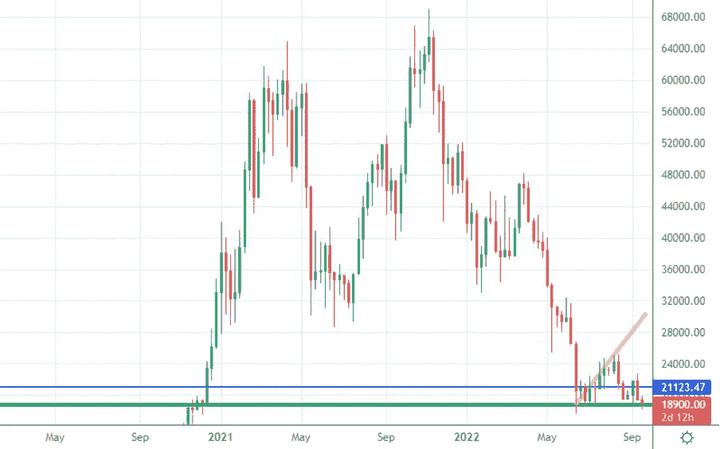
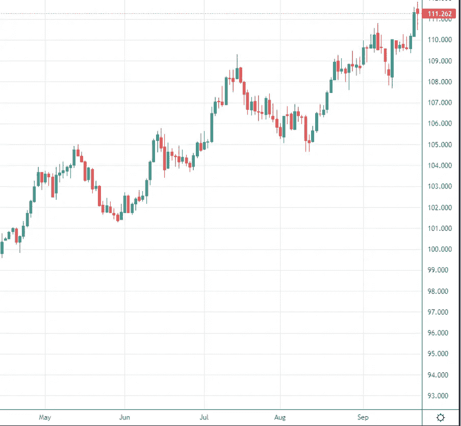
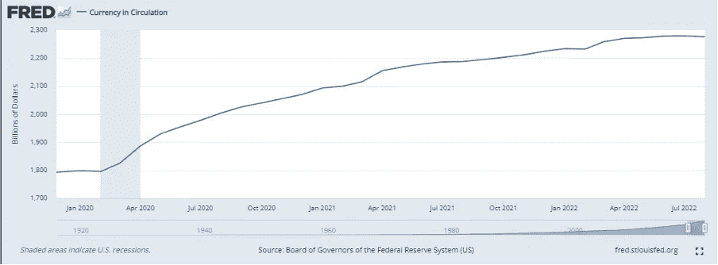
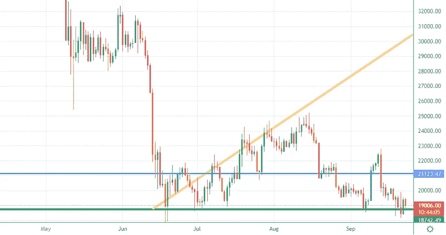
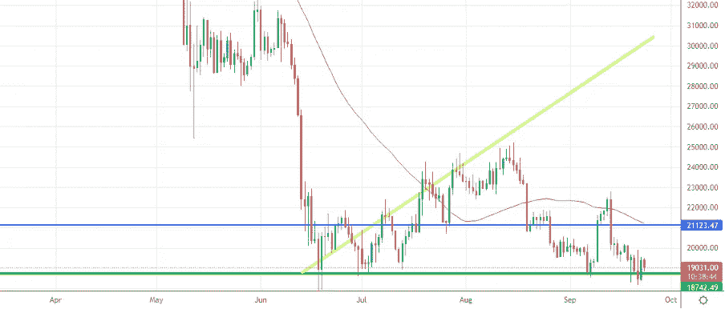
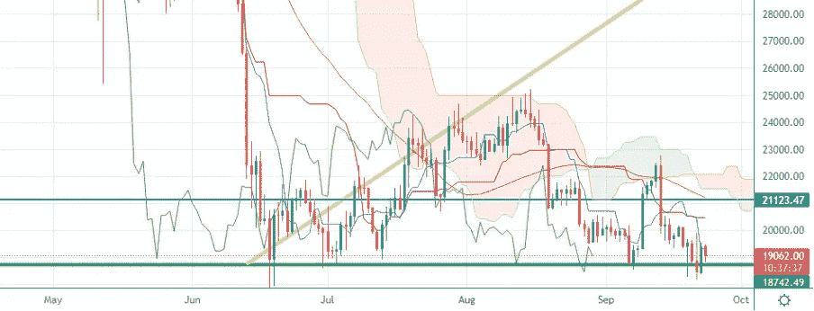
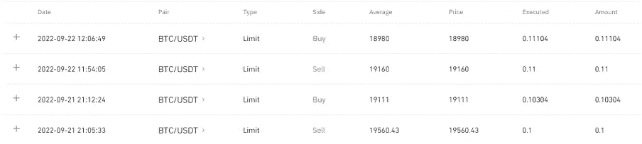
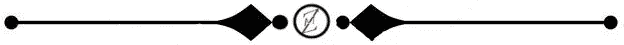

# 美国加息给 BTC 带来更多不稳定

> 原文：<https://medium.com/coinmonks/usa-increased-rates-create-more-instability-on-btc-5c5a75a76239?source=collection_archive---------12----------------------->

Source: Created by author

我们将进入什么样的市场阶段一直是我们上次约会的开场白问题。
欢迎来到“市场冲浪”,我们已经到了第 21 天，我希望通过这些简单的技术分析，我们已经在某些方面帮助了你，甚至只是评估不同的市场观点。

# 让我们从我们通常的每周视角开始

**WEEKLY CHART** — Source: Tradingview

在美国利率沟通的又一次强烈挫折后，价格现在正努力抵抗绿线上方，[升至 3.75%](https://www.reuters.com/markets/europe/central-banks-unleash-350-basis-points-more-rate-hikes-inflation-fight-2022-09-22/) ，这在市场上制造了更多的混乱和恐惧。而且看起来利率可能会增加更多，直到今年年底达到 4.4%-4.6%。

Screenshot on a D-TimeFrame of the Dollar Currency Index

美元强势指数在最近加息后显示出更大的强势，这意味着美国国家和银行的债务人将欠下更多利息，这可能会从美联储吸收一些货币量，这里有一个有趣的事实:

一个月的流通货币大规模收缩发生了，在过去两年半的时间里，我们只有两个月的美国货币收缩。这可能是限制金融通胀的第一次尝试，但不足以也太慢，无法避免即将到来的通胀螺旋。

> 你知道为什么我的交易目标是获得高于 0.003 BTC 的 BTC 部分吗？请在评论中给出你的答案。

# 从日常角度来看，我期望什么？

**DAILY CHART — Source: Tradingview**

我们与上周处于同一水平，3.2 万亿美元已经到期，现在我们在未来几天没有革命性的消息，这意味着比特币可能有一些自然(和呼吸)价格上涨的空间。

**DAILY CHART — Souce: Tradingview**

50MA 正在穿越静态蓝色阻力，使其成为一个需要突破的强势水平，但也是一个价格可能会很快反弹的强势统计区域。
Ichimoku Cloud 与当前的价格水平相差甚远，这意味着目前在这个时间框架内，没有来自它们的相关指示。

**Daily Chart — Source: Tradingview**

如果上周我在对美元的利润中带来了一些头寸，当市场更加看跌时，是时候积累了！

# 有什么特别要观察的？

我们仍然处于一个不稳定的范围，所以我会等待进一步的立场，我肯定会等待我上面提到的两个时刻的反应！但如果信号保持稳定，我将(再次)略微乐观。我现在做的是最多持有几个小时的短期头寸。
我正在等待 20k 美元的突破，以看到更多的上涨。
让我知道你对这个新的每周约会的看法，以及你希望更多地考虑(甚至解释)哪些指标。请继续关注，当我的内容出来时，请务必关注。

**推广建议**
还有一件事:如果你真的不关心技术分析，或者你不喜欢花时间在市场上，一定要看看 [Zignaly](https://zignaly.com/app/signup/?invite=mikezillo) 平台，这是一个管理着大量交易量的币安官方经纪合作伙伴。他们提供很好的利润分享交易服务，你可以模仿其他专业交易者，与他们分享利润！一定要给个眼神！
如果您有兴趣提前了解我们合作伙伴的指标发布情况，请在此留下评论，以便我们了解您是否有兴趣！

> 我写的任何东西都不能代表任何形式的财务建议。所以，在采取任何行动之前，先做好自己的研究。

> 交易新手？尝试[加密交易机器人](/coinmonks/crypto-trading-bot-c2ffce8acb2a)或[复制交易](/coinmonks/top-10-crypto-copy-trading-platforms-for-beginners-d0c37c7d698c)