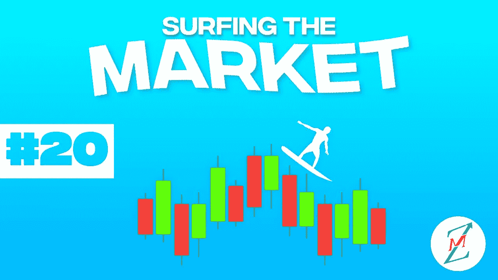

# 美国通货膨胀率和世界不稳定拖累 BTC

> 原文：<https://medium.com/coinmonks/usa-inflation-rate-and-world-instability-drag-btc-down-8e1542db29d4?source=collection_archive---------17----------------------->

我们将进入什么样的市场阶段一直是我们上次约会的开场白问题。
欢迎来到“市场冲浪”,我们已经进行了第 20 次约会，我希望通过这些简单的技术分析，我们已经在某些方面帮助了你，甚至只是评估不同的市场观点。