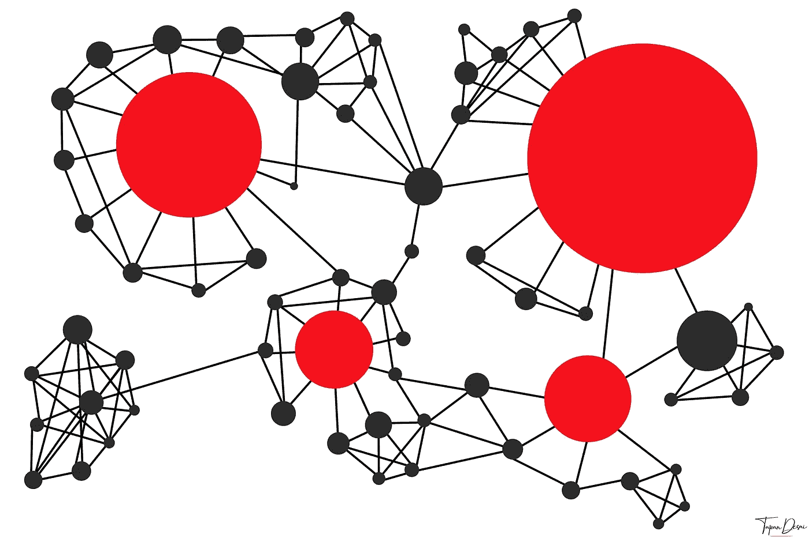

# 使用增加了网络相关性

> 原文：<https://medium.com/coinmonks/usage-increases-network-relevance-886ccf7f99ed?source=collection_archive---------14----------------------->

区块链网络有两个主要的有用功能。它们允许用户在没有第三方的情况下持有硬币和代币，并通过分散的交易网络将它们发送给其他人。只有使用交易网络才需要付费。该网络不从持有硬币中获利。

网络相关性随着网络效应的增加而增加。用户之间的直接交互是…