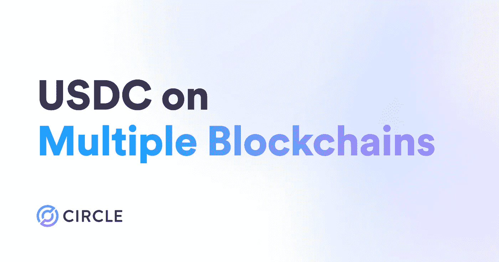

# USDC 现在将在新区块链 5 号

> 原文：<https://medium.com/coinmonks/usdc-will-be-now-on-5-new-blockchains-6e044f9c01dd?source=collection_archive---------20----------------------->

这对 crypto 意味着什么？

TL；速度三角形定位法(dead reckoning)

*   将提供:Arbitrum、Cosmos、NEAR、乐观和 Polkadot
*   已有:以太坊，索拉纳，雪崩，创，阿尔格兰德，恒星，流量，和海德拉
*   检查你的投资组合中的这些密码(但不是全部)。

## **首先要做的事。什么是 USDC，它代表什么？**

USDC 代表**美元**欧元。

> USDC 是一种完全保留的稳定币，是一种加密货币，或数字资产。与其他价格波动的加密货币不同，USDC 旨在保持与美元的价格等值。USDC 是一个稳定的价值储存库，受益于区块链技术的速度和安全性。

USDC 是 2018 年推出的[圈](https://www.circle.com/)和[比特币基地](https://www.coinbase.com/join/chaudh_qdw)(加密领域最具影响力的玩家)的产物。USDC 是一个开源协议，这意味着任何人都可以使用它——不仅仅是 Circle 和他们的合作伙伴。USDC 和 USDT 相当于所有与美元挂钩的稳定货币总市值的 80%以上。尽管 USDT 在所有稳定的国家中拥有最大的市场资本总额，但 USDC 有其自身的优势和与同行的不同之处。

## 为什么是 USDC？还是稳定的硬币？

想想看，你有一些 BTC，你想卖掉它获得一些收益。现在你可以选择卖掉它来换取法定货币。但是你不知道你想卖多少钱。你喜欢的菲亚特可能会在你卖出的时候下跌。现在，stablecoins 通过保持储备形式的抵押品(通常是美元)，将典型的加密货币波动性降至最低。

例如，你以欧元出售它。现在你想把它发到钱包里。你会怎么做？在 stablecoin 的帮助下，您可以将其发送到您的钱包或支持的钱包。

USDC 的目的是为客户提供一种快速且经济高效的方式，在世界任何地方快速转移价值。与一些与单一资产或一篮子资产价格挂钩的稳定货币不同，USDC 的价值与美元直接挂钩。

## USDC 有多透明？

与其竞争对手 USDT 不同，USDC 有着严重的透明度问题，它完全由现金和美国国债支持，USDC 的核心价值主张之一是金融机构可以持有它而不用担心波动。

> 每流通 1 美元的 USDC，Circle 就持有 1 美元。USDC 得到了现金和短期美国国债的全力支持，这些储备由主要金融机构保管。

## 所有这些对密码意味着什么？

事实上，这对于加密和区块链互操作性来说是一个非常好的消息。如果我们不是在熊市，我们可能会看到一个新的支持提供加密泵。如果你看一下列表，Polkadot 和 Atom 都是为了区块链的互操作性和通信。像 USDC 这样稳定的硬币将被大量用于多链操作。USDC 的目标也是成为这一领域的主要参与者。

列表中的另外两个密码是 Arbitrum 和乐观主义。如果您不熟悉这些，它们是以太坊的第 2 层解决方案。这两个目的，使以太坊更快，交易费用更低，并保持以太坊的内在安全性。他们的工作是建造一座通往以太坊区块链的桥梁。所以这两种密码都代表区块链互通和多链通信。

> 区块链桥的工作方式就像我们在物理世界中知道的桥一样。正如物理桥连接两个物理位置一样，区块链桥连接两个区块链生态系统。桥梁通过传递信息和资产来促进区块链之间的交流。

与列表中的其他 cryptos 不同，NEAR 是以太坊的竞争对手之一，代表解决缩放问题。对于 NEAR 它的长相，他们只是把它添加到列表中，以跟上它的竞争对手(**索拉纳、**以太坊、雪崩、创、阿尔格兰德)。

## 最后的想法

对我来说，这个消息是区块链内部通信和第二层协议的利好消息。因为列表中的大多数密码都有第二层行为，它们代表区块链可解释性。

资源:

*   【https://www.coindesk.com/learn/how-does-usdc-work/ 
*   [https://www.circle.com/en/usdc](https://www.circle.com/en/usdc)
*   [https://ethereum.org/en/bridges](https://ethereum.org/en/bridges)
*   [https://bitcoinist.com/u-s-judge-orders-tether-to-produce/](https://bitcoinist.com/u-s-judge-orders-tether-to-produce/)

> 交易新手？尝试[加密交易机器人](/coinmonks/crypto-trading-bot-c2ffce8acb2a)或[复制交易](/coinmonks/top-10-crypto-copy-trading-platforms-for-beginners-d0c37c7d698c)