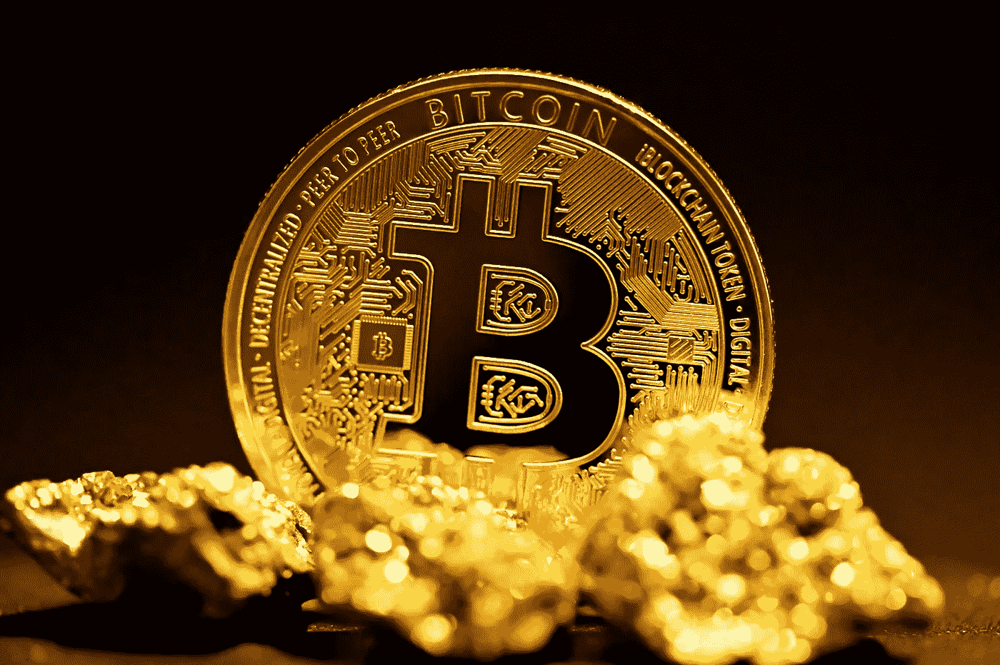

# 比特币的使用案例:黄金的替代品

> 原文：<https://medium.com/coinmonks/use-cases-for-bitcoin-alternative-to-gold-a1578c0035a0?source=collection_archive---------47----------------------->

将比特币与黄金相提并论是多么完美的时机。就在 BTC 从将近 7 万美元跌到 2 万美元之后。所以我听到你尖叫: ***BTC 太不稳定了，无法成为黄金的替代品！！！*** 。在这一点上看起来可能是这样。但是让我们探索一些不同的观点。也许我们会发现这种比较并不太牵强。

# 稀缺

让我们先来看看最明显的一个。黄金可以作为价值储存手段，因为它是一种稀缺资产。可用的黄金只有这么多。这同样适用于比特币。比特币有 2100 万的硬上限，存储在核心代码中。

但是黄金真的这么稀缺吗？不完全是。想想上个月的新闻:[乌干达发现黄金。根据这一信息，乌干达发现了 320，158 公吨黄金。我们目前有大约 200，000 公吨的黄金。难道只有我一个人认为未来黄金价格的稳定性存在问题吗？](https://cointelegraph.com/news/uganda-s-gold-discovery-what-it-could-mean-for-crypto)

让我们公平一点。开采这些黄金将会永远持续下去。但这凸显了黄金作为价值储存手段的一个重要因素:总供应量根本没有上限。

对我来说，谈到稀缺性，比特币显然是赢家。我想很多人只是还没有意识到这一点。

# 透明度

好吧，让我们假设我们承认开采黄金不会显著增加流通中的黄金数量。至少不会以我们目前看到的比特币价格波动的方式出现。

但是我们怎么知道呢？现实中，大部分黄金是作为“纸黄金”交易的。我们实际上并没有把金条送到世界各地。这意味着我们在交易黄金支持的凭证。但是大多数证书实际上不允许你用黄金来兑换证书。你当然可以卖掉它。但你永远看不到你拥有证书的黄金。

就我个人而言，我无法摆脱这种感觉，这是一个作弊的好机会。大玩家可能会想:为什么不在没有黄金的情况下出售黄金证书呢？或者在你卖掉证书后卖掉黄金？我确信黄金交易有非常严格的规则。然而，这个系统容易出现人为错误。

比特币的情况就不同了。首先，只有 2100 万 BTC 可供使用。它在代码中。这是最终决定。代码可以更改，但矿工会拒绝更改。

区块链是透明的。因此，只要有地址，每个人都可以去自己选择的街区浏览器查看个人钱包。让我们假设一家大型银行提供了一份资产报告。他们声称拥有巨额比特币。你不必相信那份报告。只要检查一下他们的钱包地址，你就能看出这种说法是真是假。(如果银行不提供他们的钱包地址，这将是一个危险信号)。

因此，当再次谈到透明度时，我认为比特币显然是最受欢迎的。不幸的是，主流观点仍然认为比特币是完全匿名的。

> 交易新手？试试[加密交易机器人](/coinmonks/crypto-trading-bot-c2ffce8acb2a)或者[复制交易](/coinmonks/top-10-crypto-copy-trading-platforms-for-beginners-d0c37c7d698c)

# 价值储存手段

好吧。从目前的经济状况来看，黄金似乎更适合作为价值储存手段。想象你以 6 万美元买下了 BTC。那么，现在比特币对你来说显然没有价值。

然而，如果我们看看过去 10 年，我们会发现比特币的价格大幅上涨。这也不是价值储存的好理由。甚至通货膨胀也不能解释这种价格上涨。但我们忽略了一个事实，即比特币本身仍处于采用阶段。

虽然黄金在世界各地被视为价值储存手段，但比特币目前正处于人们“听说过它”的阶段。黄金已经存在了几个世纪，而 BTC 只有 10 年。所以价格波动是可以预料的。

因此，对我来说，价格的不确定性并不是反对比特币价值储存用例的真正理由，因为比特币还没有在全球被采用。加密空间还不存在。所以我们必须非常精确:**目前**比特币不是真正的价值储存手段。暂时来说，金牌赢了。如果你担心当前的加密崩溃，这篇文章可能适合你:[如何看待当前的加密崩溃？](/@oldschripp/how-about-a-positive-view-of-the-current-crypto-crash-8753bd3c6d68)

# 可交易性

黄金只有在你交易凭证的情况下才容易交易。除此之外，你可能会发现很难把你的一盎司金条换成你认为的价值。

比特币显然比黄金更容易交易。你可以在集中交易所和分散交易所买卖，也可以用它来支付。我认为这是一个简单的论点。让我们不要在这个问题上纠缠太久。比特币赢了。

# 结论

那么比特币是黄金的替代品吗？比特币很容易交易。它的稀缺性是真实存在的，是可以验证的。比特币区块链也比黄金更加透明。

然而，比特币的“价值储存”方面非常重要。尤其是最近的价格暴跌。我认为比特币 ***正在成为黄金的*** 替代品，但它还没有出现。

比特币必须被全球接受，才能被视为真正的价值储存手段。过去几年收养率一直在上升，所以我一点也不担心。我们会到达那里的！

声明:这不是财务建议。只是我的看法。

完全公开:我拥有比特币和黄金。

> *加入 Coinmonks* [*电报频道*](https://t.me/coincodecap) *和* [*Youtube 频道*](https://www.youtube.com/c/coinmonks/videos) *获取每日* [*加密新闻*](http://coincodecap.com/)

# 另外，阅读

*   [复制交易](/coinmonks/top-10-crypto-copy-trading-platforms-for-beginners-d0c37c7d698c) | [加密税务软件](/coinmonks/crypto-tax-software-ed4b4810e338)
*   [网格交易](https://coincodecap.com/grid-trading) | [加密硬件钱包](/coinmonks/the-best-cryptocurrency-hardware-wallets-of-2020-e28b1c124069)
*   [密码电报信号](/coinmonks/top-3-telegram-channels-for-crypto-traders-in-2021-8385f4411ff4) | [密码交易机器人](/coinmonks/crypto-trading-bot-c2ffce8acb2a)
*   [最佳加密交易所](/coinmonks/crypto-exchange-dd2f9d6f3769) | [印度最佳加密交易所](/coinmonks/bitcoin-exchange-in-india-7f1fe79715c9)
*   [面向开发者的最佳加密 API](/coinmonks/best-crypto-apis-for-developers-5efe3a597a9f)