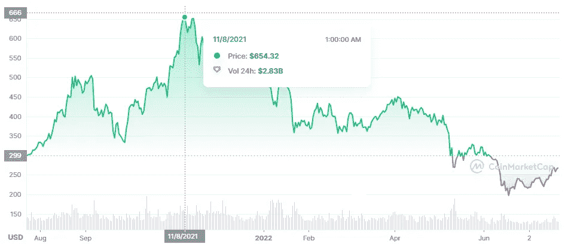
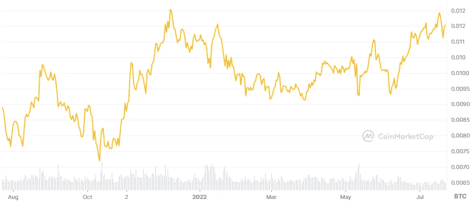
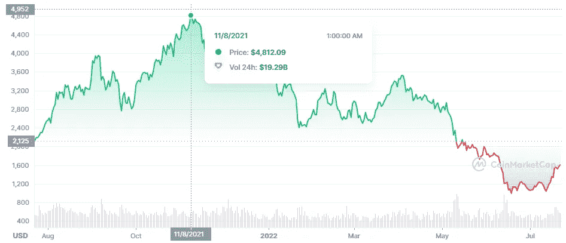
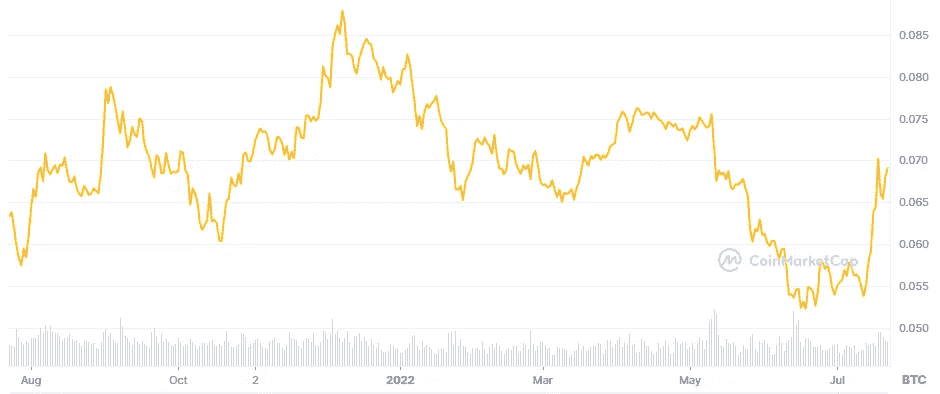

# 比特币的使用案例:价值储存(但不像黄金)

> 原文：<https://medium.com/coinmonks/use-cases-for-bitcoin-store-of-value-but-not-like-gold-3fc8a96a612?source=collection_archive---------47----------------------->

等等什么？不喜欢黄金？不要！在这个故事中，我将探索比特币作为价值储存手段，而不是黄金的替代品。我已经在另一篇文章中将比特币比作黄金:你可以在这里阅读[。](/coinmonks/use-cases-for-bitcoin-alternative-to-gold-a1578c0035a0)

所以我听到你问:那么比特币是如何成为价值储存手段的呢？

“A bitcoin is standing alone”; Photo created by [https://unsplash.com/@kanchanara](https://unsplash.com/@kanchanara) and made available through [https://unsplash.com/](https://unsplash.com/).

# 加密货币的用途是什么

好吧，让我们后退一步，看看加密货币的用途。对我们大多数人来说:我们想变得富有。所以我们**投资和交易**加密货币。很公平。

由于采用率正在迅速增长，你也可以使用加密货币进行支付。我说的不仅仅是比特币。有很多方法可以直接使用你的密码，或者使用某种即时转换方案。例如，币安 Visa 卡提供了一种将密码存储在卡上并以菲亚特支付的方式。当你购买时，你的密码立即转换为菲亚特。因此，零售商甚至不需要接受加密作为工作的报酬。我们可以使用加密货币进行 T4 支付。

# 区块链是用来做什么的

嗯，看看比特币，区块链被用来**在一个不可信的系统中保护交易**。这意味着我们不必信任银行或其他中间人来保护我们的资金安全并实际执行交易。这也有一个好处，就是你的资金不会被查封(尽管随着越来越多的法规出台，预计钱包会被列入黑名单)。

如果你看看替代硬币，比如说区块链以太坊，我们可以看到这项技术被用于智能合约。这意味着我们可以创建基于一组硬编码规则执行的合同。同样不需要信任中间人(尽管您需要验证代码以确保没有安全问题)。

# 互联网的演变

哦好的。现在我们正在谈论互联网…听我说完。互联网正在发展。如果你想了解更多关于这一演变的信息，你可以从这里开始。但是我们不必在这里讨论细节。

理解互联网的当前迭代，即 Web3，旨在创建一个版本的互联网就足够了，在这个版本中**机器、人工智能和其他算法**彼此交互。迄今为止，网络主要是为人类创造和管理内容而设计的。但这种情况正在改变。接受现实吧！

# 回到“有价物品商店”…

所以让我们把这些点联系起来。随着互联网的发展，我们可以看到重心正在从人类向机器转移。我们希望机器能够相互交流。

如果我们将同样的视角转换(从人类到机器)应用于区块链和加密货币，我们会开始看到一些有趣的特征。

虽然我们人类可以投资和交易这些货币，但它们可以用作支付。但是被谁？当然，人类可以用它们来支付。但更重要的是，智能合约也可以。需要执行智能合同。每次执行都需要某种形式的支付(加密)。

因此，真正的加密货币是智能合约支付执行和交易的一种方式。想想看:**加密货币用于支付，但主要是通过智能合约**。把人类排除在外。从设计上来说，密码不是用来支付你的杂货的。它们意味着在区块链上的支付，因此是由机器和算法来完成的。

# 但是比特币区块链的智能合约呢？

虽然不是完全不可能，但这是不可行的。围绕比特币建立了一个完整的生态系统，这使得智能合约成为可能，但要在比特币区块链本身上做到这一点……祝你好运。

我认为比特币是一种价值储存手段，但仅限于加密领域！让我们暂时把人类排除在等式之外，让我们忽略法定货币。我们人类在菲亚特支付和思考。机器，人工智能…他们用加密货币思考。

和加密货币是必要的。通过这种方式，智能合约可以支付他们需要的金额。《区块链求生》不包月。没有维护服务器的年托管费，只是为了每周执行几次代码。对于智能合同来说，密码是支付所需资源的高效方式。

或者，我们是否希望制造这样的机器，它首先必须从您的银行发起电汇，以便运行您的代码？等待 2 个工作日？或者使用维萨卡……当然要让机器接管你的信用卡。你最好在你的代码中建立一些好的警报系统！

# 区块链作为一家公司

把区块链想象成一家公司。为了吸引开发者和消费者，区块链必须提供一些好的特性。如果区块链很慢，很多开发人员不太可能使用这个区块链来构建应用程序。

如果区块链提供低廉的交易费用，开发者更有可能使用它。如果区块链提供的交易费太低，验证者可能不会向区块链提供资源，因为他们赚得不够多。只有当足够多的开发者建立在这个链条上时，他们才能赚到足够的钱。

因此，在某种程度上，区块链必须表现出竞争力。就像一个公司为了吸引投资者而不得不表现一样。

就像公司股票一样，区块链本地股票的价值取决于区块链本身的表现。当然，我们可以将这与它的法定价值进行比较，我们会看到巨大的价格波动。但是我们不是说过不要把菲亚特扯进来吗？

# 看着这些数字

让我们看看菲亚特价值中的 BNB 链条。

Price of BNB in USD over 1 year

我们可以看到，在 2021 年 8 月左右，BNB 的美元价值徘徊在 650 美元左右。在最近的崩盘中，油价在 2022 年 6 月短暂跌破 200 美元。

但问题是。在这段时间里，BNB 链的数量在增长:更多的应用程序，更多的用户等等。只是一个表现出色的区块链。然而，我们正在看它的“人”的一面。加密货币是为机器制造的！

Price of BNB in BTC over 1 year

嗯嗯嗯……现在我们来看看比特币的价格。请记住，比特币是一种价值储存手段(对密码而言)。因此，如果区块链的价值上升，它在 BTC 的价格也会上升。

上面的购物车显示了与 BNB/美元图表相同的时间线。然而在 BTC，你可以看到 BNB 确实在升值。价值储存！

# 另一个例子:以太坊

现在以太坊度过了艰难的一年。特别是因为区块链正在经历一次巨大的更新，这导致了许多不确定性。矿工将不再能够使用他们的硬件来采矿。更新本身已经被推迟了很多次。

顺便说一句，如果你拥有 ETH，你可以通过支持以太坊区块链的更新版本(ETH 2.0)立即获得 3%的可观收益。如果你有兴趣，可以在这里免费阅读我的简短指南。

但是回到我们的数字。如果以太坊区块链是一家公司，我们预计其价格将承受巨大压力。你可以看看 ETH/USD 图表，但是你会看到和其他加密货币一样的崩溃。

Price of ETH in USD over 1 year

但我们感兴趣的是 BTC 联邦理工学院的价格。

Price of ETH in BTC over 1 year

正如你所看到的，从顶部到底部的价格崩溃不像以美元计算的那样严重。由于区块链的更新应该会在不久的将来发生，你也可以看到 ETH/BTC 的价格最近大幅上涨。比在菲亚特更是如此。(我承认这张图表看起来和用美元表示的相似。然而，相对而言，价格波动并没有那么糟糕)

# 结论

比特币确实是一种价值储存手段，但仅限于加密领域。菲亚特是我们人类的货币系统。密码是机器的货币系统。我们已经在这篇文章中探讨了其中的原因。

我认为，如果我们真的想判断某些区块链的价值，我们需要看看它在 BTC 的价值，而不是菲亚特。菲亚特是美国人使用的，因此价格只会反映人类现在对空间的想法。在 BTC 你会发现对它的价值的真实评价。

# 谢谢大家！

我希望你喜欢这个故事。喜欢就留言评论吧。喜欢就关注我:)谢谢你花时间看我的故事！我知道时间比金钱更宝贵。我真诚地希望这个故事能给你的生活增加价值，并给比特币和加密空间带来新的视角！

Thank you

> 交易新手？试试[密码交易机器人](/coinmonks/crypto-trading-bot-c2ffce8acb2a)或者[复制交易](/coinmonks/top-10-crypto-copy-trading-platforms-for-beginners-d0c37c7d698c)