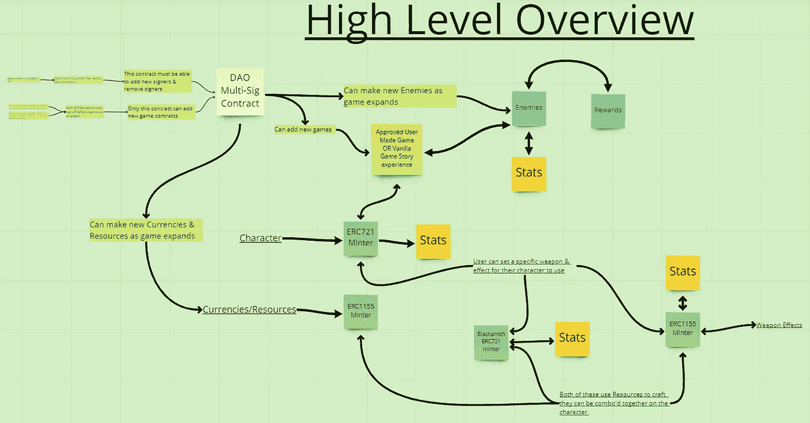

# 用户制作的 web3 游戏体验

> 原文：<https://medium.com/coinmonks/user-made-web3-game-experiences-a069b267c6e0?source=collection_archive---------3----------------------->

今天，我将深入探讨一些更适合用户定制的东西。

首先，如果你还没有深入阅读我之前关于区块链发展的文章&被上面的图片弄糊涂了，请阅读下面的:
[https://medium.com/p/28a8bb064e86](/p/28a8bb064e86)

让我们分解它。

多签刀契约
人物 ERC721 铸币人
货币/资源 ERC1155 铸币人
武器 ERC721 铸币人
武器效果 ERC1155 铸币人
敌人契约
一系列允许的游戏契约

多重签名。

有一个技术团队和社区团队，在采取任何行动之前，两者都必须签准。
只有这个契约才有能力给生态系统添加新的资源/货币/敌人/武器/武器效果。

字符 ERC721

每个令牌都有自己的统计数据(也许是随机的？可以为 RNG 使用神谕)
每个令牌都可以附带自己的武器&武器效果以增加其属性。

货币/资源 ERC1155 Minter

这个契约是金、银、铜、木材、石头等的来源…

武器 ERC721 分钟和武器效果 ERC1155 分钟

这些合同都需要烧掉来自货币/资源铸造者的令牌，以便铸造新的令牌。这两种武器都有自己的属性。

敌人合同

这份合同将存储关于生态系统中什么类型的敌人是可用的，他们的统计数据和用户击败这样的敌人应得的奖励的信息。

允许的游戏合同范围

这些游戏合同只有经过严格的合同检查后，才会加入生态系统。这些契约只能使用生态系统内的角色/武器/武器效果/敌人。
契约之间交互的一个好的解决方案是编写一个抽象的契约，游戏契约可以继承它来自动化底层代码&减轻开发人员的入职流程。

如果你觉得这篇文章有趣，试试这篇吧！
[https://medium.com/me/stats/post/cd06bca5e541](/me/stats/post/cd06bca5e541)

坚实发展研究小组—[https://discord.gg/KzbcGmrnfN](https://discord.gg/KzbcGmrnfN)

-多边形联盟—[https://www.polygonalliance.com/](https://www.polygonalliance.com/)

——多边形联盟不和—[https://discord.gg/kJKPCGQu66](https://discord.gg/kJKPCGQu66)

你喜欢这篇文章吗？想请我喝杯咖啡吗？
Polygon/Eth/Bsc—0x4a 581 E0 EAF 6b 71d 05905 e8e 6014 DC 0277 a1 b 10 ad

> *交易新手？试试* [*加密交易机器人*](/coinmonks/crypto-trading-bot-c2ffce8acb2a) *或* [*复制交易*](/coinmonks/top-10-crypto-copy-trading-platforms-for-beginners-d0c37c7d698c) *上* [*最好的加密交易*](/coinmonks/crypto-exchange-dd2f9d6f3769)

> 加入 Coinmonks [电报频道](https://t.me/coincodecap)和 [Youtube 频道](https://www.youtube.com/c/coinmonks/videos)获取每日[加密新闻](http://coincodecap.com/)

# 另外，阅读

*   [免费加密信号](/coinmonks/free-crypto-signals-48b25e61a8da) | [加密交易机器人](/coinmonks/crypto-trading-bot-c2ffce8acb2a)
*   杠杆代币的终极指南
*   [16 款最佳折叠电动自行车](/coinmonks/top-17-folding-electric-bikes-5e296f0918cb)
*   [28 款最佳电动自行车点评](/coinmonks/the-28-best-electric-bikes-review-and-buying-guide-in-2023-7bb3146cb403)
*   前三名[币安期货交易机器人](/coinmonks/top-3-binance-futures-trading-bots-e6031f84b3f9)