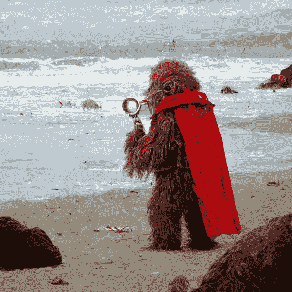
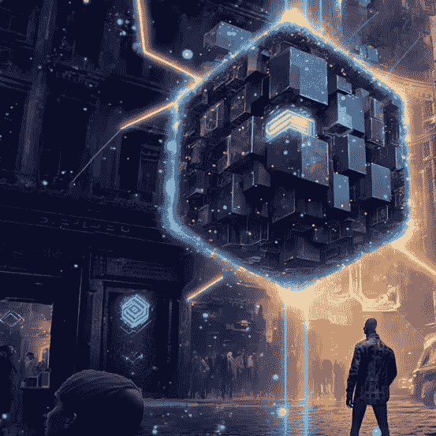
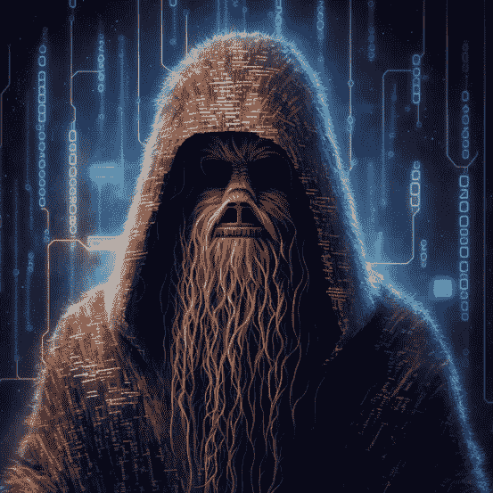

# 用人工智能来采访自己👨🏻‍💻

> 原文：<https://medium.com/coinmonks/using-ai-to-interview-itself-e0845f2507ab?source=collection_archive---------16----------------------->

我有一个面试，是一家大公司的市场总监职位，我想看看人工智能如何通过问我一些问题来帮助我准备面试。然后我有了让人工智能回答他们自己提出的问题的想法。以下是结果⬇️

_ _ _ _ _ _ _ _ _ _ _ _ _ _ _ _ _ _ _ _ _ _ _ _ _ _ _ _ _ _ _ _ _ _ _ _ _ _ _ _ _ _ _ _ _ _ _ _
_ _ _ _ _ _ _ _ _ _ _ _ _ _ _ _ _ _ _ _ _ _ _ _ _ _ _ _ _ _ _

**问:您如何跟上最新的 web3 趋势和技术？**
*答:为了跟上最新的 web3 趋势和技术，我关注行业博客和出版物，参加网络研讨会和会议，并与其他专业人士建立联系。*

**问:在过去，您使用了哪些策略来为 web3 公司成功营销产品？**
*答:过去，我曾使用几种策略成功地为 web3 公司营销产品，包括为 SEO 创建和优化内容、利用社交媒体渠道、电子邮件营销活动和在线广告。*

**问:你如何衡量营销活动的成功？**
*答:在衡量营销活动的成功时，我通常会查看网站流量、转化率和投资回报率(ROI)等指标。*

**问:你认为什么样的策略能在未来成功营销一家 web3 公司？**
*答:要想在未来成功营销一家 web3 公司，我认为专注于创造引人入胜的内容、了解客户需求和动机以及利用最新技术和趋势非常重要。*

问:你将如何管理预算以确保营销活动的最大投资回报率？
*答:在管理营销活动预算时，我确保将适量的资源分配到正确的领域，同时密切关注投资回报率和其他指标。*

**问:在策划营销活动时，你对使用数据驱动的决策有多满意？**
*答:在策划营销活动时，我能自如地运用数据驱动型决策，因为它能让我根据数据和分析做出明智的决策。*

**问:你在使用社交媒体平台进行营销方面有什么经验？答:我有使用各种社交媒体平台进行营销的经验，比如脸书、推特、Instagram 和 LinkedIn。**

**问:您如何确保遵守 web3 法规？**
*答:为了确保遵守 web3 法规，我及时了解最新的法律法规，并确保我的所有活动都符合这些法规。*

**问:你如何确保公司的信息在所有营销渠道中保持一致？**
*答:为了确保公司的信息在所有营销渠道中保持一致，我确保创建一个在所有渠道中保持一致的有凝聚力的品牌战略和信息。*

**问:你如何与其他部门(如设计、工程等)合作？)来打造成功的营销活动？**
*答:我曾与设计、工程和产品开发等其他部门合作，通过了解每个部门的目标并找到共同努力实现这些目标的方法来创建成功的营销活动。*

_ _ _ _ _ _ _ _ _ _ _ _ _ _ _ _ _ _ _ _ _ _ _ _ _ _ _ _ _ _ _ _ _ _ _ _ _ _ _ _ _ _ _ _ _ _ _ _ _ _ _ _ _ _ _ _ _ _ _ _ 的
__________________ 的

> 艺术是用[中途](https://www.midjourney.com/)创作的，文字是用 [OpenAI](https://openai.com/) 创作的。我不知道我是否会在艺术或写作/故事/食谱/问题/笑话等方面不使用人工智能。又来了！

> 沃基人来了！！！

_ _ _ _ _ _ _ _ _ _ _ _ _ _ _ _ _ _ _ _ _ _ _ _ _ _ _ _ _ _
_ _ _ _ _ _ _ _ _ _ _ _ _ _ _ _ _ _ _ _ _ _ _ _ _ _ _ _ _ _ _

永远要小心！！！⚠️

> 我怎么强调这一点都不为过！保持高度警惕，留意你点击的每一个链接、你做的每一笔交易和你接触的每一个人，因为这个领域骗子很多，即使是最好看的项目也会被撤下。
> 
> 在你点击所有链接之前，要再三检查，确保它们是你正在寻找的官方链接。此外，在给自己或他人发送任何有价值的东西之前，要再三检查所有的钱包地址。

关注我的新营销机构， [**多层营销**](https://www.multilayeredmarketing.xyz/) ，在未来的几年里获得更多关于营销、写作和社区建设的技巧/建议！

> [*推特*](https://www.twitter.com/metadadsxyz)[*不和*](https://discord.gg/mchzhDCwhF)[*YouTube*](https://www.youtube.com/channel/UC7pbtSBs9nRJHK6coMhCR8g)[*抖音*](https://www.tiktok.com/@thedudescrypto)[*insta gram*](https://www.instagram.com/metadadsxyz)[*Spotify 播客*](https://open.spotify.com/episode/5U8vXE9HDAsGbSbebw9p62?si=2rZIigw-Tw2pCxjxmkbYzQ)
> 
> 请通过发送 Polygon Matic 到这个 Eth 地址或 Eth Tokens 来支持我和我的家庭🙏🏼
> 
> ***0xb 53 b 3978333 e 11 c 382 ab 619 f 02 f 469 A8 c 70750 af***
> 
> *或*
> 
> ***买点 Merch！*** [*https://wokeyverse.gumroad.com/l/wokeyverse1*](https://wokeyverse.gumroad.com/l/wokeyverse1)[*https://www . red bubble . com/I/sticker/Mick-And-Rory-Adventure-Time-2-by-多层/131503580。ejug 5*](https://www.redbubble.com/i/sticker/Mick-And-Rory-Adventure-Time-2-by-MultiLayered/131503580.EJUG5)

> [*订阅简讯！*T81*📰_ _ _ _ _ _ _ _ _ _ _ _ _ _ _ _ _ _ _ _ _ _ _ _ _ _ _ _ _ _ _ _ _ _ _ _ _ _ _ _ _ _ _ _ _ _ _ _ _ _ _ _ _ _ _ _ _ _ _ _*](https://multilayeredmarketing.beehiiv.com/subscribe)

# 干杯，
泰

[LinkTree 链接](https://linktr.ee/multilayeredmarketing)

**我的一些其他博文:** [web 3 十大作家](/coinmonks/top-10-web3-writers-ca995689c17f) [web 3 五大败笔](/coinmonks/5-downfalls-of-web3-cd5dc8ade4fd)
[5 + 5 不欢而散的战术](/coinmonks/5-tips-for-a-better-discord-nft-crypto-edition-ff9b039d0359)
[Crypto 101:初学者指南](/coinmonks/crypto-101-a-beginners-guide-345d440bd163)
[NFT 五大最佳实践(营销&社区成长)](/coinmonks/top-5-nft-best-practices-marketing-and-community-growth-7025e26eb50c)
[Web3 基础知识](/coinmonks/web3-basics-252121357f33)
[可供 NFT 选择的实用案例【t2t](/coinmonks/alternative-nft-crypto-real-life-use-cases-b7c0b08d99ef)

> 交易新手？尝试[加密交易机器人](/coinmonks/crypto-trading-bot-c2ffce8acb2a)或[复制交易](/coinmonks/top-10-crypto-copy-trading-platforms-for-beginners-d0c37c7d698c)