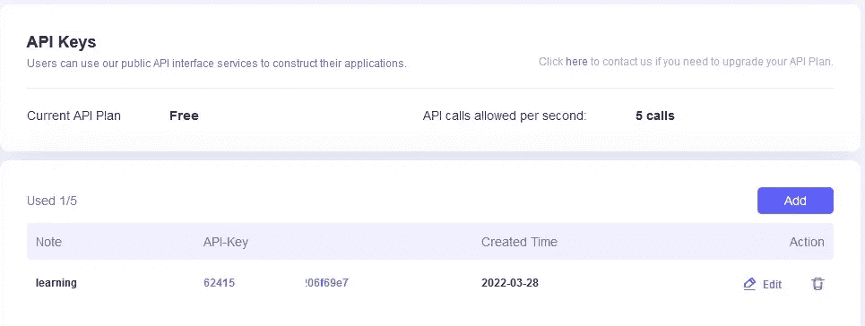

# 使用 Coinex.net 工具促进发展

> 原文：<https://medium.com/coinmonks/using-coinex-net-tools-for-development-50d4b247457?source=collection_archive---------30----------------------->

嘿嘿嘿

0Xlive 在这里😃

coinex.net 是 csc 的官方浏览器。在本教程中，我们将通过 coinex.net 开发工具的目的，留在我身边😉

[https://www.coinex.net/my/account](https://www.coinex.net/my/account)

让我们看看 coinex.net 工具和选项。首先你需要创建一个账户。如果您没有任何帐户，您可以在此注册帐户:

[https://www.coinex.net/login](https://www.coinex.net/my/account)

## 我的概要

在此选项卡中，您可以查看您的帐户详细信息。它显示您的用户名，电子邮件地址和最近登录。

## 地址监视

[https://www.coinex.net/my/address](https://www.coinex.net/my/address)

在地址监视选项卡中，您可以监视地址活动。如上图所示，您可以设置地址，选择通知方法和其他选项。

## 私人笔记

[https://www.coinex.net/my/notes](https://www.coinex.net/my/notes)

在私人备忘中，您可以为特定地址保存备忘。

> 交易新手？试试[密码交易机器人](/coinmonks/crypto-trading-bot-c2ffce8acb2a)或者[复制交易](/coinmonks/top-10-crypto-copy-trading-platforms-for-beginners-d0c37c7d698c)

## 令牌忽略列表

[https://www.coinex.net/my/tokens](https://www.coinex.net/my/tokens)

如果您不喜欢看到令牌，可以将其添加到令牌忽略列表中，并将其从显示或计算中排除。

## 验证地址

我们将在验证合同教程中讨论这一部分。您可以使用此工具验证合同的所有权。

## API 键

[https://www.coinex.net/my/apikey](https://www.coinex.net/my/apikey)

你可以在这里生成你自己的 api 密匙来与 coinex.net API 系统交互。我们在本教程中使用了这一点:

 [## 使用 Python3 和 Coinex.net API 的 CSC 支付网关

### 嘿嘿嘿！

medium.com](/coinmonks/csc-payment-gateway-using-python3-coinex-net-api-95ab8d3f6d2a) 

## 自定义 ABI

[https://www.coinex.net/my/customabi](https://www.coinex.net/my/customabi)

在此部分中，您可以添加用于与智能合约交互的自定义 ABI。

## ABI

在[计算机软件](https://en.wikipedia.org/wiki/Computer_software)中，**应用二进制接口** ( **ABI** )是两个二进制程序模块之间的[接口](https://en.wikipedia.org/wiki/Interface_(computing))。通常，这些模块中的一个是[库](https://en.wikipedia.org/wiki/Library_(computing))或[操作系统](https://en.wikipedia.org/wiki/Operating_system)工具，另一个是用户正在运行的程序。

ABI 定义了如何在机器码中访问数据结构或计算例程，机器码是一种低级的、硬件相关的格式。相比之下， *API* 在源代码中定义了这种访问，这是一种相对高级的、独立于硬件的、通常人类可读的格式。ABI 的一个常见方面是调用约定，它决定了如何将数据作为输入提供给计算例程，或者如何从计算例程中读取数据作为输出。x86 调用约定就是这样的例子。

遵循 ABI(可能是也可能不是官方标准化的)通常是编译器、操作系统或库作者的工作。然而，当用混合编程语言编写程序，或者甚至用不同的编译器编译用同一种语言编写的程序时，应用程序员可能不得不直接处理 ABI。