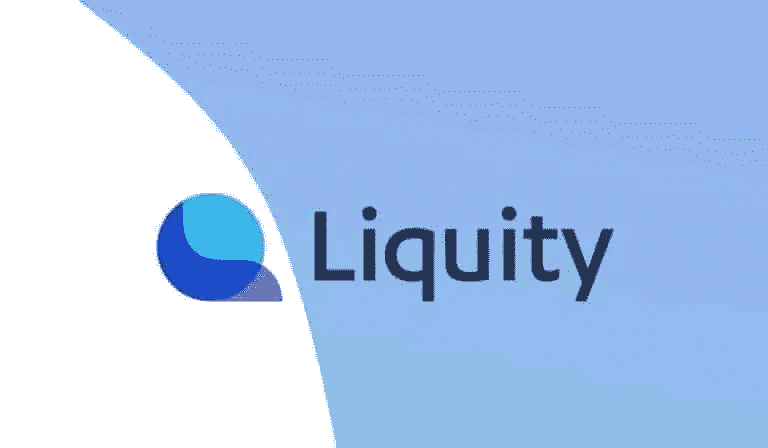
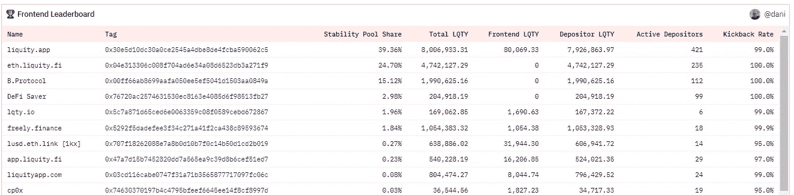
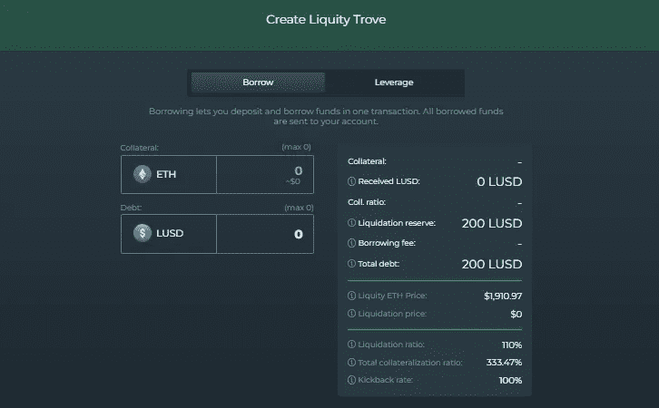
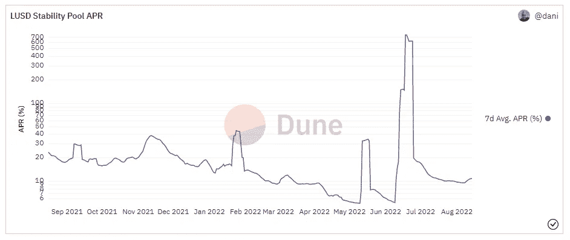
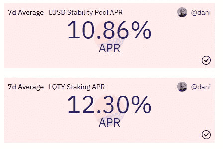
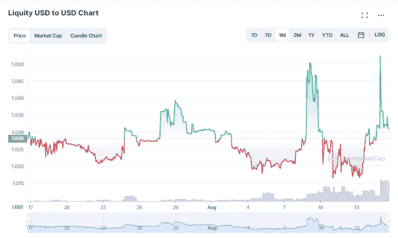
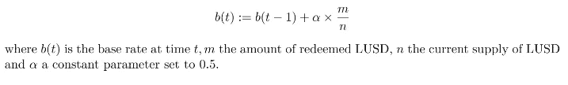

# 利用流动性从清算中获利，并获得无息贷款(不，流动性不是一个打字错误)

> 原文：<https://medium.com/coinmonks/using-liquity-to-profit-off-of-liquidations-and-to-get-interest-free-loans-and-no-liquity-is-not-d570a469ef5?source=collection_archive---------9----------------------->

如果你关注过我之前在 [GMX](/coinmonks/is-gmx-a-option-for-the-bear-market-an-in-depth-review-2c2eff249b7b) 的帖子，你就会知道，自从我们进入熊市以来，我一直在寻找安全存放我的蓝筹股的地方，以等待风暴结束。与 GMX 类似， [Liquity](https://www.liquity.org/) 是一个分散的协议，从人们的清算中产生回报，除了高达 100%的利润被“踢回”给股东，而不是 GMX 的 70%。

此外，Liquity 的机制明显不同，因为为了参与奖励收入，用户必须拿出$ETH 作为抵押，以便借入$LUSD，然后将$LUSD 存入“稳定池”，在那里赌注者从被清算的人那里获得一定比例的奖励。对于借款人来说，Liquity 非常有吸引力，因为用你的$ETH 借款是 0%的费用。

听起来有点复杂？好吧，请跟随我，我将介绍我通过对该平台的研究所了解到的情况，以及在我们结束当前熊市(希望如此)的尾声时，为什么您可能希望将 Liquity 视为存放您的$ETH 的地方。

# 前端

首先也是最重要的，一个有趣的特性(或者说缺乏)是 Liquity 没有一个本地前端来访问 Liquity 协议。取而代之的是[一系列不同的公共前端](https://www.liquity.org/frontend)(或者实际上你可以创建自己的)。简而言之，一个**前端**实际上只是一个用户界面——你可以从 Liquity 的网站上访问所有不同的选项，这些选项在用户界面和不同的回扣率上有所不同。**回扣率**是你作为用户将获得的奖励的百分比。我把它比作你可能给一个验证器的费用，你用它来赌你的代币，100%相当于 0%的费用，或者换句话说，99%的回扣率意味着将有 1%的费用。

不确定使用什么前端？在 [dune analytics](https://dune.com/dani/Liquity) 上有一个很好的细分，显示了前端排行榜以及每个排行榜上有多少活跃储户。迄今为止，最广泛使用的前端及其相应的回扣率如下:

在对几个不同的前端进行排序后，我能找到的唯一差异是用户界面或附加功能的差异(例如 DeFi Saver 允许您访问止损保护)，但本质上大多数将允许您完全访问 Liquity，如果您的主要目标是用您的$ETH 借款和/或从$LUSD 赌注中获利。在文章的其余部分，我将从[app.defisaver.com](https://app.defisaver.com/)那里截取截图，但我绝不推荐(或不推荐)它们。你应该 DYOR 研究，找到哪个前端是最适合你的。

# 创造宝藏

选择所需的前端后，为了使用 Liquity，您必须通过存入$ETH 作为抵押品来创建一个“**宝库**，然后借入$LUSD，这是 Liquity 的本地稳定币:

正如你在上面看到的，你可以设定你自己的抵押比率，这取决于你想要承担的清算风险。该平台有一些限制，最低抵押率至少需要达到 110%，这意味着你以美元形式贷出的金额必须相当于你借入金额的 110%。需要注意的一件重要事情是，如果你借出的$ETH 的价值显著下降，你的抵押比率会重新调整，使你面临被清算的风险。你当然可以定制你自己的抵押率，以降低你的清算风险水平，似乎大多数流动性并没有那么差，因为目前的总抵押率约为 335.6%。

还有一点要注意的是，你会看到 200 美元 LUSD 被放在“清算准备金”中，这是为了以防万一，如果你的宝藏被清算，因为清算的汽油费是由宝藏持有人支付的，而不是清算人。因此，你的抵押品比率是基于你借的钱减去 200 美元 LUSD，这笔钱已经在清算准备金中预留出来了。

# 回报

抱歉，我花了这么长时间才讲到这一部分，因为这可能是大多数人感兴趣的部分——回报。因为市场状况会迅速变化，所以 LUSD 赌注者的回报率也会迅速变化。这就是为什么我们看到奖励率的大幅波动并不奇怪:

看看 7 天的历史平均水平，回报率有一个巨大的范围，从低至 5.3%到高达 751%。如果你好奇的话，这 751%的峰值对应的是$ETH 在短短几天内从大约 1800 美元跌至大约 900 美元。

$LQTY 令牌:类似于$GMX 令牌，Liquity 也有自己的本地协议令牌$LQTY，当下注时，将提供协议的借款赎回费的一部分。迄今为止，LQTY 赌注的当前利率略高于$LUSD 的回报率:

# 关于流动性的其他关键因素

**所见即所得:**如他们的[白皮书](https://docsend.com/view/bwiczmy)、所列，Liquity 被定义为协议而非平台，这也是他们没有原生前端的原因。没有治理建议，没有管理员，或者换句话说，没有真正的方法来停止协议，只有停止前端的方法。我认为这可能是 Liquity 最酷的地方，因为整个协议是完全去中心化和基于算法的。该协议本质上是不可变的，并且自其最初发布以来一直如此。

**$LUSD 价格波动:**如果你看一下$LUSD 的价格历史，你会注意到一个与美元挂钩的稳定货币的一些非常令人担忧的事情，其挂钩范围从大约 1.00 美元到有时 1.05 美元:

从我收集的信息来看，这种波动是简单的供求压力的产物——当新贷款相对较少时，LUSD 美元的价格就会上涨，从而导致对该货币的需求增加。或者换句话说，没有新的贷款意味着没有新的 LUSD 发行，这意味着 LUSD 美元的稀缺，这反过来推高了价格。

赎回费:我之前提到过，你可以用你的$ETH 无息借入$LUSD，但这并不意味着流动性是免费的。当您赎回贷款时，协议会向您收取赎回费，而不是支付利息，赎回费由以下计算确定:

因此，因为它是经过算法调整的，所以很难说你的确切费用是多少，但该费用仅在你赎回时一次性产生，可以低至 0.5%。

**恢复模式:**正如我之前提到的，在正常情况下，如果抵押比率低于 110%，用户就有被清算的风险，但是要跟踪的一个关键指标是协议的总抵押比率。如果协议上的$ETH 的总值很快崩溃，因为$LUSD 的总值保持不变，为了补偿余额，Liquity 进入“恢复模式”,在该模式中，清算率基本上被重新调整到 150%的阈值，导致更高的清算价格。

# **Liquity 与 GMX 相比如何？**

就像我之前提到的，GMX 是一个类似的平台，允许$GMX/$GLP 的股东从清算中获利；但是，有一些重要的区别:

1.  有了 Liquity，除非你被清算，否则你基本上仍然拥有你的$ETH。虽然从技术上来说，GMX 没有非永久性的损失，但你仍然在将你的$ETH 转换成不同的令牌来产生回报。
2.  说到$ETH，Liquity 在以太坊主网上，而 GMX 在 Arbitrum 和 Avalanche 上运行。这就是为什么我们看到 Liquity 需要 200 美元的 LUSD 清算准备金，以补偿以太坊主网潜在的更高的天然气费用。
3.  Liquity 的内在风险更大，因为你的贷款$ETH 总是有可能被清算，然而，奖励的潜在上限相对比 GMX 高得多，因为更大比例的清算奖励被返还给 Liquity 的$LUSD 股东。

# **结论**

在深入研究了 Liquity 的基本原理之后，我真的相信协议 Liquity 是贷款协议的下一个发展步骤，如果我们在未来几年看到更多 liquiy 类型的协议而不是 MakerDao，我不会感到惊讶。此外，尽管存在清算风险，但我真的希望我能更快地发现 Liquity，因为就像我对 GMX 一样，在未来的熊市平静期，我肯定会同样利用 Liquity 来存放一些闲置的美元资产。

再次感谢您的阅读，如果您有任何其他问题或评论，请随时在下面留下。感谢您的阅读，请务必在我的推特账户上关注我，获取我所有的最新消息:【https://twitter.com/CryptosWith

免责声明:最后提醒一下，这不是财务建议，仅用于教育和娱乐目的。请一如既往地做自己的研究，找到最适合你的投资。干杯大家！

> 交易新手？试试[密码交易机器人](/coinmonks/crypto-trading-bot-c2ffce8acb2a)或[复制交易](/coinmonks/top-10-crypto-copy-trading-platforms-for-beginners-d0c37c7d698c)