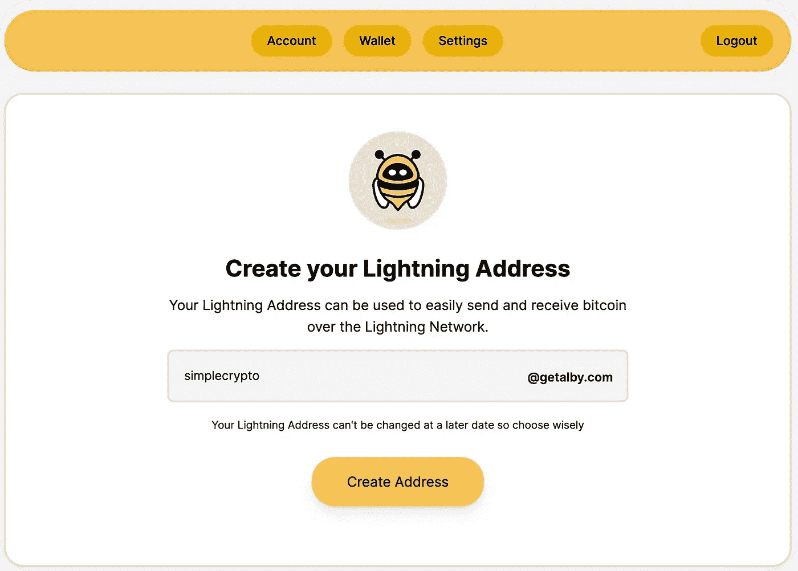
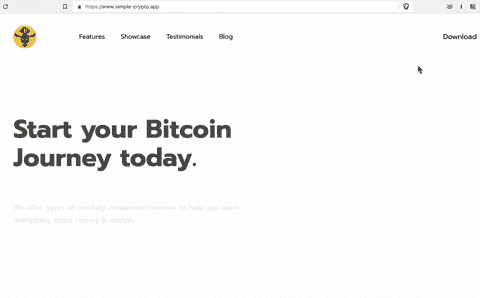

# 使用一行代码接受微交易

> 原文：<https://medium.com/coinmonks/using-one-line-of-code-to-accept-microtransactions-50781bf2625c?source=collection_archive---------57----------------------->

## 使用比特币的互联网再货币化才刚刚开始。这个简单的指南告诉你如何在几分钟内接受微交易。

## 为什么您应该接受微交易

微交易是一种在线支付形式，可用于*任何*数量的事情，例如购买可下载的文件、捐赠小额款项或获得会员专用内容。它们方便快捷，不需要任何实物支付。

**最棒的是，它们可以在任何网站上实现，不需要任何编程技能。**

通常，微交易是指购买价格低于 10 美元的数字商品或服务。**有了比特币闪电，甚至可以低至 0.01 美元**。这就是为什么比特币闪电正在成为在线支付的新标准。

**简单、快速、安全。**

你应该开始在你的网站、博客或应用程序上接受微交易还有其他一些原因。一个原因是你可以对你的商品或服务收取更少的费用，但仍然可以赚更多。您还可以通过接受来自世界各地的付款来扩大您的客户群。

## 分两步实施小额支付

在自己的网站上收款从未如此简单。你只需要做两件事。

首先，你需要有自己的[闪电地址](https://lightningaddress.com/)。其次，你需要修改你的网站的标题。

## 建立一个免费的闪电地址

一个闪电地址就像一个电子邮件地址，*只是*用来收钱。

设置自由地址的一个简单方法是通过 [Alby](https://getalby.com/) 。注册后，选择您的个人姓名。

如果你是一个经常使用电报的用户，你也可以通过你在 [LN.tips](https://ln.tips/) 上的用户名使用 get a lightning address。

Setting up an address is free and lightning fast.

## 将你的地址嵌入到你的网站标题中

你需要做的第二步也是最后一步是添加一行代码，这样像 Alby 这样的 Lightning wallets 就能识别出你的网站是兼容的。

在`<head>`标签的末尾添加代码:

`<meta name="lightning" content="YOURUSERNAME@getalby.com"/>`

## 就是这样！

从现在起，你可以很容易地通过你的网站收到钱。当然，你创建的地址也可以用来汇款。

这里有一个关于它在实践中如何工作的快速直观总结，[以我们的网站](https://simple-crypto.app)为例:

这篇文章是我们关于闪电技术及其实际应用的新系列文章的一部分。这是我们在互联网上支付、交流和交换价值的新模式。

如果你还没有订阅，可以考虑[在这里](https://blog.simple-crypto.app/#/portal/signup/free)注册。

块高#752934

_ _ _ _ _ _ _ _

[阅读我们的博客](https://blog.simple-crypto.app/how-to-accept-microtransactions/)

👋嗨，我是扬尼克！我是 App-Learning 的联合创始人，也是一名热情的比特币爱好者。请随时联系 yannic@app-learning.com 或 LinkedIn

> 交易新手？尝试[加密交易机器人](/coinmonks/crypto-trading-bot-c2ffce8acb2a)或[复制交易](/coinmonks/top-10-crypto-copy-trading-platforms-for-beginners-d0c37c7d698c)