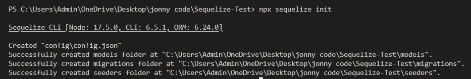
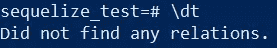

# 使用带后缀的序列—第 1 部分

> 原文：<https://medium.com/coinmonks/using-sequelize-with-postgres-part-1-f5caa9ceb30f?source=collection_archive---------14----------------------->

你将需要:
-Node JS
-Postgres
-Time

如果您还没有安装 postgres，请执行此操作—[https://medium . com/@ Dan . chiniara/installing-PostgreSQL-for-windows-7ec 8145698 e 3 #:~:text = Graphical % 20 installer % 3A % 20 postgres . app 和%20database。&text = Mac % 20 users % 2C % 20 you ' s % 20 all % 20 set](/@dan.chiniara/installing-postgresql-for-windows-7ec8145698e3#:~:text=Graphical%20Installer%3A%20Postgres.app,and%20database.&text=Mac%20users%2C%20you%27re%20all%20set)！

使用 node 创建项目目录，然后安装。

安装后运行。

让我们做模型吧。

使用 Sequelize，我们可以连接到我们的 Postgres 服务器，创建我们的数据库，将我们的模型作为表迁移到 DB 中。

您的配置文件应该如下所示。

每当你在你的代码中与你的模型交互时，默认情况下它会选择开发。将您的 postgres 用户名、密码、数据库名称、主机 IP 和方言设置为“postgres”。

请注意，此时 postgres 服务器中不存在该数据库。

保存文件。

只要您正确地完成了这些，现在就可以运行下面的命令了。

在迁移我们的模型之前，让我们再做一个模型。

现在让我们首先在 postgres 中检查我们的 DB 是否存在

好的，就在那里。
连接到您的数据库。

列出任何表格。

让我们迁移我们的模型。

让我们再次检查数据库中的表。

如果你觉得这很有趣，那就看看这个吧！
[https://medium.com/p/63a563c56b96](/p/63a563c56b96)

坚实发展研究小组—[https://discord.gg/KzbcGmrnfN](https://discord.gg/KzbcGmrnfN)

-多边形联盟—[https://www.polygonalliance.com/](https://www.polygonalliance.com/)

-多边形联盟不和—[https://discord.gg/kJKPCGQu66](https://discord.gg/kJKPCGQu66)

你喜欢这篇文章吗？想请我喝杯咖啡吗？
Polygon/Eth/Bsc—0x4a 581 E0 EAF 6b 71d 05905 e8e 6014 DC 0277 a1 b 10 ad

> *交易新手？试试* [*加密交易机器人*](/coinmonks/crypto-trading-bot-c2ffce8acb2a) *或* [*复制交易*](/coinmonks/top-10-crypto-copy-trading-platforms-for-beginners-d0c37c7d698c) *上* [*最好的加密交易*](/coinmonks/crypto-exchange-dd2f9d6f3769)

> 加入 Coinmonks [电报频道](https://t.me/coincodecap)和 [Youtube 频道](https://www.youtube.com/c/coinmonks/videos)获取每日[加密新闻](http://coincodecap.com/)

# 另外，阅读

*   [免费加密信号](/coinmonks/free-crypto-signals-48b25e61a8da) | [加密交易机器人](/coinmonks/crypto-trading-bot-c2ffce8acb2a)
*   [杠杆代币的终极指南](/coinmonks/leveraged-token-3f5257808b22)
*   [16 款最佳折叠电动自行车](/coinmonks/top-17-folding-electric-bikes-5e296f0918cb)
*   [28 款最佳电动自行车点评](/coinmonks/the-28-best-electric-bikes-review-and-buying-guide-in-2023-7bb3146cb403)
*   前三名[币安期货交易机器人](/coinmonks/top-3-binance-futures-trading-bots-e6031f84b3f9)