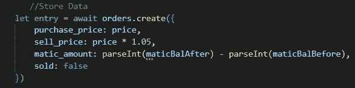

# 使用带后缀的序列—第 2 部分

> 原文：<https://medium.com/coinmonks/using-sequelize-with-postgres-part-2-203b44cb7e95?source=collection_archive---------21----------------------->

第一部分—[https://medium.com/p/f5caa9ceb30f](/p/f5caa9ceb30f)

啊，又来了。

好的，我们将涉及:
-在表格中创建记录
-更新表格中的记录
-删除表格中的记录
-查询表格中的记录

导入模型

所以现在我的文件夹结构是这样的。

我将在 bot.js 中引入所需的模型。

解构它们是一种足够简单的与表格交互的方式。

创造

与表的交互使用 json 对象。

更新

使用 update 函数，我们可以更新满足特定条件的记录的值。

删除

检索表中匹配搜索参数的第一条记录。如果找到一行，删除它。

询问

检索表中的所有记录。

觉得这个有意思？看看这个。
[https://medium.com/p/47ab0a54c0c7](/p/47ab0a54c0c7)

坚实发展研究小组—[https://discord.gg/KzbcGmrnfN](https://discord.gg/KzbcGmrnfN)

-多边形联盟—[https://www.polygonalliance.com/](https://www.polygonalliance.com/)

-多边形联盟不和—[https://discord.gg/kJKPCGQu66](https://discord.gg/kJKPCGQu66)

你喜欢这篇文章吗？想请我喝杯咖啡吗？
Polygon/Eth/Bsc—0x4a 581 E0 EAF 6b 71d 05905 e8e 6014 DC 0277 a1 b 10 ad

> *交易新手？试试* [*加密交易机器人*](/coinmonks/crypto-trading-bot-c2ffce8acb2a) *或* [*复制交易*](/coinmonks/top-10-crypto-copy-trading-platforms-for-beginners-d0c37c7d698c) *上* [*最好的加密交易*](/coinmonks/crypto-exchange-dd2f9d6f3769)

> 加入 Coinmonks [电报频道](https://t.me/coincodecap)和 [Youtube 频道](https://www.youtube.com/c/coinmonks/videos)获取每日[加密新闻](http://coincodecap.com/)

# 另外，阅读

*   [免费加密信号](/coinmonks/free-crypto-signals-48b25e61a8da) | [加密交易机器人](/coinmonks/crypto-trading-bot-c2ffce8acb2a)
*   [杠杆代币的终极指南](/coinmonks/leveraged-token-3f5257808b22)
*   [16 款最佳折叠电动自行车](/coinmonks/top-17-folding-electric-bikes-5e296f0918cb)
*   [28 款最佳电动自行车点评](/coinmonks/the-28-best-electric-bikes-review-and-buying-guide-in-2023-7bb3146cb403)
*   前三名[币安期货交易机器人](/coinmonks/top-3-binance-futures-trading-bots-e6031f84b3f9)