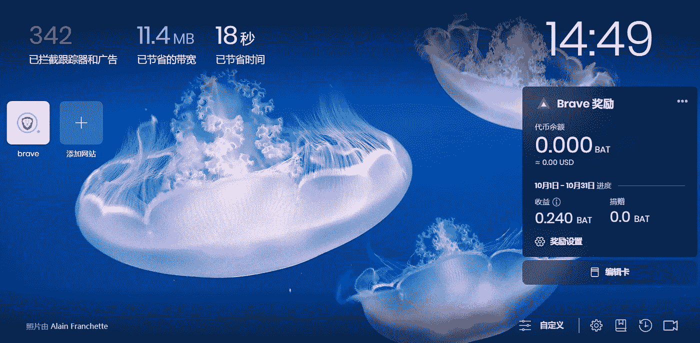
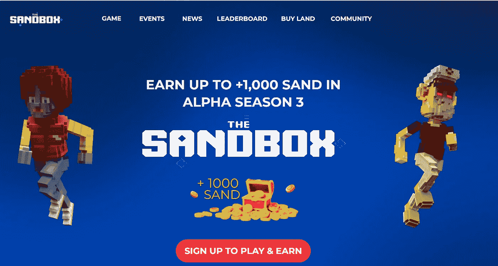
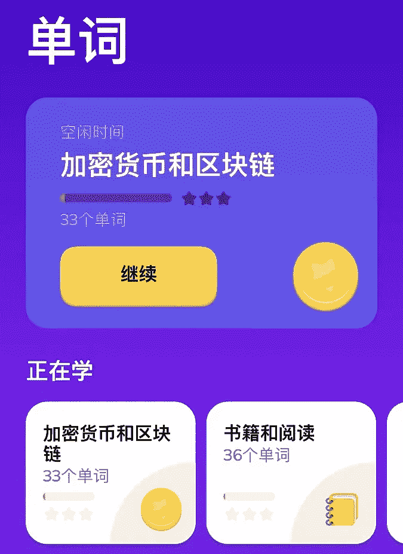
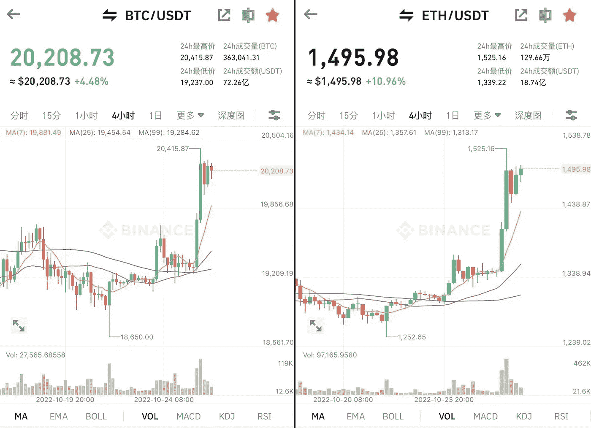

# 使用 Web3 浏览器 Brave 也能边搜索边赚钱？

> 原文：<https://medium.com/coinmonks/using-the-web3-browser-brave-can-also-make-money-while-searching-a28cdbc61fca?source=collection_archive---------21----------------------->

最近一直在关注 web3 浏览器勇敢搜索，这是一个基于 Google 核心技术的匿名搜索，支持大部分 Google 扩展。

勇敢的主要特征是隐私和独立。它的定位是不跟踪用户点击和搜索内容，是一个私人搜索工具。Vitalik 在 2018 年关注了 Brave，并在其推特上推荐了它。

勇敢者的主要受众是 crypto 玩家，用户可以通过浏览推送广告或成为内容创作者获得 BAT 代币奖励。

楚小莲这两天开始用勇者，增益 0.24BAT 左右，还是比较低的。

Earn BAT with Brave Browser

作为 web3 的搜索工具，用户自己的使用和交互操作也能产生收益。用户的搜索数据是匿名的，不被平台收集整合，贴上画像标签。

看广告成为一种主动行为，可以通过浏览广告赚钱，看广告的关注度成为可以货币化的 BAT 代币。

大部分推送的广告都是 web3 项目。玩家可以自由选择是否观看。他们每看一次可以获得 0.1 BAT，也可以直接关闭广告提醒。

Brave browser ads are all Web3 ads

在 web3 世界中，任何行为都变得有价值，XtoEarn 成为直观的方式。

比如互动空投，大量用户的互动行为就变成了项目数据，数据是有价值的。前期互动的玩家会收到项目空投，互动操作可以实现。

还有玩赚，写 eanr，看赚等方式。，这可能成为互联网上一种新的表达方式。

在 web 2.0 中，创作者也有一定收益，但投入产出不成正比，用户收益极低。比如楚小莲在百家号上更新自媒体文章。平均月收入不到 10 美元。而在其他自媒体平台，如知乎、微博，内容并没有实现。

在 web3 的世界里，所有的创作者、用户、平台、广告主都在一个生态系统里，相互联系，每个环节都可以赚。

web3 learn english letmespeak

随着 web3 方式应用于更多互联网场景，未来可能会出现新的用户聚集平台。每个用户自己的行为都可能成为收入的一部分，每个人的行为都有结果作为回报。

参与者还可以在整个 web3 升级中找到机会。

例如，技术团队可以专注于 web2 到 web3 场景的升级和切换；内容创作者可以深度参与 web3 模式，并在其中输出内容；

玩家可以选择一个已经接入 web3 方法的平台进行体验，参与早期的游戏性迭代，或许还能抓住早期的机会。

BTC and ETH rose sharply today

比特币的价格今天暂时回到了 20k 美元，不知道这个价格还能稳定多久。

现阶段，crypto 市场没有大的市场，也没有大量的 fomo 人气，只是提供了项目酝酿和发展的机会。

谁也不知道未来市场会如何发展，所以要钻研一个方向，提高认识；熊市的积累会在下一个牛市爆发。

比如每天去了解一个新项目，市场上的新项目是否真的解决了一些需求，或者是热门话题；或者深度参与项目互动，在空投的道路上寻找机会。

或者找个目标投资，看看时间是否真的能让人慢慢变富。

密码市场充满不确定性，今天和明天完全不同；如果你找到了某个切入点，你可能会找到别的东西。

以上只是我个人观点，没有投资建议。我是初晓·钱恩，我正在关注元宇宙和 web3。

> 交易新手？试试[加密交易机器人](/coinmonks/crypto-trading-bot-c2ffce8acb2a)或者[复制交易](/coinmonks/top-10-crypto-copy-trading-platforms-for-beginners-d0c37c7d698c)