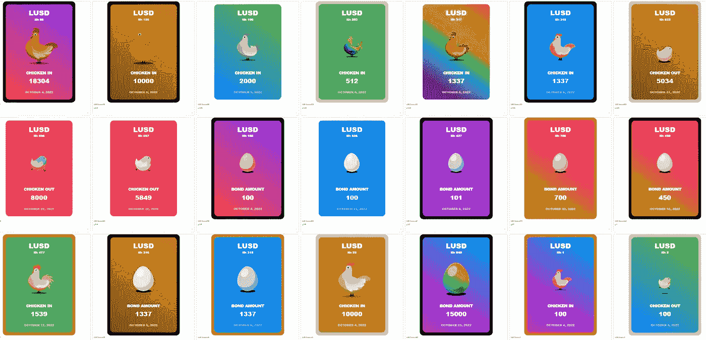
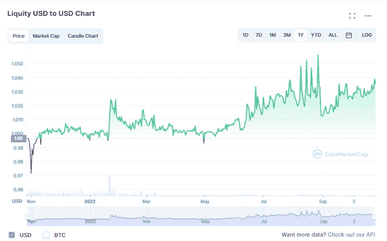

# 利用$LUSD 和鸡债券赚取+60%的马厩 APY

> 原文：<https://medium.com/coinmonks/utilizing-lusd-chicken-bonds-to-earn-60-apy-off-of-stables-49c1b9538be?source=collection_archive---------2----------------------->

嘿，伙计们，我在过去的[中写过关于 Liquity 的文章，作为一个已经被证明是创新和有利可图的平台，该团队在过去的一个月中继续引入更多的变化，这些变化彻底改变了协议筹集大量流动性的方式。](/coinmonks/expecting-a-market-downturn-why-using-liquity-might-be-your-best-bet-to-profit-big-6316363488a6)

如果你对 [Liquity](https://www.liquity.org/) 不熟悉，它本质上是一个分散的贷款协议，允许人们以相对较低的费用从他们的抵押$ETH 中借款和铸造$LUSD。当借款人被清算时，该平台的$LUSD 稳定池提供商将获得利润，换句话说，来自清算的收入将被“踢回”给稳定池中的$LUSD 储户。就我个人而言，每当我预计市场将出现大幅下跌时，我都会经常访问 Liquity，因为很容易就能看到人们离实时清算有多近。

# 引入小鸡债券

简而言之，小鸡债券是动态的 NFT，代表了所有者对其债券 LUSD 的要求。也许最接近的比较是[的小鸡债券](https://www.chickenbonds.org/)是 [Uniswap 的 LP NFTs](https://blog.apy.vision/uniswapnft/) ，但是随着我的深入，小鸡债券要多得多。

一旦一个人创建了一个鸡债券，所有者就开始积累由鸡蛋 NFT(上图)代表的$bLUSD(增加的$LUSD)，直到鸡蛋基本上准备好孵化并变成一只完全长大的鸡(这个过程称为“鸡进来”):

NFT 的$bLUSD 收益率可以变化，但最终会受到其上限的限制，您可以在此计算:

从上图中可以看出，收益率起初相对较高，但随着达到$bLUSD 上限，收益率将大幅下降。显著降低这些 NFT 风险的是，在任何时候，用户都可以决定赎回债券的全部基础 LUSD 资产，NFT 将从债券变成一只逃跑的小鸡(这个过程称为“临阵脱逃”):

小鸡债券团队基本上创建了一个二级市场来筹集流动性，通过查看自 10 月 4 日开始以来的指标，该项目取得了巨大的成功:

在仅仅 3 周多一点的时间里，小鸡债券已经能够筹集到价值近 2000 万美元的 LUSD，我想这个数字只会继续增长。

# 用鸡债能赚多少？

正如我之前提到的，作为一个鸡债券的所有者，你可以开始赚取$bLUSD，这是一种$LUSD 衍生品。迄今为止，$bLUSD 可以产生 54.52%的年利率，而在[曲线](https://curve.fi/pools?)上的$bLUSD/$LUSD LP 的年利率为 66.46%；

像许多最近自举的有限合伙人一样，我想象随着鸡肉债券越来越受欢迎(我相信会的)，我完全预计利率会下降，但是如果你考虑到基础资产的最小风险，这些利率确实是例外。

说到风险…

# 潜在风险因素

没有一个 DeFi 平台没有风险，Liquity 也不例外，因为有几个要考虑。

**一些收益来自其他用户:**令人想起庞氏经济学，最早的鸡肉债券人从后来的债券人那里获得了更高的收益，换句话说，收益来自于在你之后存款的人。这听起来可能有点可怕，但是在小鸡债券的情况下，正如我之前提到的，用户可以随时“退出”，并保留他们的初始存款减去他们在持有小鸡债券期间丧失的收益。此外，Chicken Bonds 团队明确指出:

> 产量的增加不仅仅依赖于更多的键合机的加入。随着时间的推移，永久桶的 POL 将增长，并为扩增提供额外的收益，即使没有新的键产生。
> 
> 在鸡肉债券中，银行挤兑的情况得到了缓解，因为每个人都可以按比例赎回储备中的 LUSD。因此，没有人留下来收拾残局。

尽管小鸡债券持有者免受银行挤兑可能是真的，但我相信大多数经济学家都会同意，没有一个平台是真正抗银行挤兑的。换句话说，如果$LUSD 本身出现了挤兑，那么你是否赎回你的原始债券金额就无关紧要了，因为你的$LUSD 可能没有那么值钱了。

**$LUSD-佩格:** $LUSD 由$ETH 完全担保，因为只有有人打开宝库，发行更多的$LUSD，才能铸造新的$ LUSD。因此，如果$ETH 的价值大幅下跌，可能会影响其抵押，但理论上这不应该发生，因为这意味着 Liquity 通过大规模清算保留资本。尽管如此，流动性确实倾向于波动，通常是向上的:

因此，注意你的美元 LUSD 头寸的进/出场价格是很重要的，因为 1.00 到 1.05 美元的差价会对你的回报产生很大的影响。

$bLUSD-peg :作为一种相对较新的产品，很难说$bLUSD 与$LUSD 的关联度有多高。根据团队的 [FAQ](https://liquity.gitbook.io/chicken-bonds/faq/economic-design) :

> 预计 bLUSD 的交易价格将高于其赎回价格。
> 
> 这是因为与它赎回的基础 LUSD 相比，bLUSD 赚取了放大的收益率。
> 
> 作为 bLUSD 持有者，你的 bLUSD 现在可以兑换一定数量的 LUSD——比如说 **x** LUSD。但在未来，同样数量的 bLUSD 可以兑换比 T2 x LUSD 通过投资于最佳收益源所能兑换的更多的钱

换句话说，尽管$bLUSD 是$LUSD 的衍生产品，但$bLUSD 收益累积的不同使用案例和应用可能会对$bLUSD 的价格行为产生不可预测的影响。

# 结论

我真的相信，Liquity 团队已经将他们的抵押稳定币带到了真正去中心化的下一个进化步骤，随着小鸡债券的引入，我只能假设更多的平台将开始分享他们的想法，就像 [DeFi Franc](https://app.defifranc.com/stability-pool) 对 Liquity 的稳定池/trove 机制所做的那样。

如果你想进一步了解 Liquity，我强烈建议你查看我以前关于 Liquity 借款/清算机制的文章( [1](/coinmonks/expecting-a-market-downturn-why-using-liquity-might-be-your-best-bet-to-profit-big-6316363488a6) ， [2](/coinmonks/using-liquity-to-profit-off-of-liquidations-and-to-get-interest-free-loans-and-no-liquity-is-not-d570a469ef5) )，或者如果你有兴趣了解更多关于小鸡债券的信息，我在这里只是略读了表面，所以我强烈建议你查看他们的网站[https://www.chickenbonds.org](https://www.chickenbonds.org/)，特别是他们关于 NFT 本身及其所有不同属性的[深度文章](https://www.chickenbonds.org/blog-posts/nft-x-defi-deep-dive-into-lusd-chicken-bonds-dynamic-nft)。

感谢你花时间阅读这篇文章，一定要在推特([https://twitter.com/CryptosWith](https://twitter.com/CryptosWith))上关注我，获取所有这些最新的更新。

免责声明:最后提醒一下，这不是财务建议，仅用于教育和娱乐目的。请一如既往地做自己的研究，找到最适合你的投资。干杯大家！

> 交易新手？尝试[加密交易机器人](/coinmonks/crypto-trading-bot-c2ffce8acb2a)或[复制交易](/coinmonks/top-10-crypto-copy-trading-platforms-for-beginners-d0c37c7d698c)