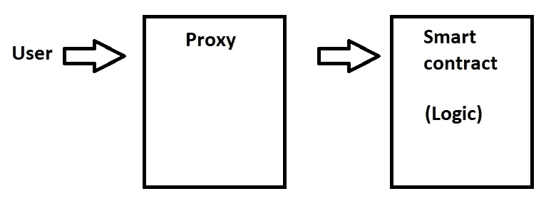

# 代理——可变不变性

> 原文：<https://medium.com/coinmonks/variable-immutability-proxy-112b861a9cb4?source=collection_archive---------9----------------------->

区块链技术是由几个理念建立的:安全、开放、平等和不变性。让我们把注意力集中在最后一个词上。当我们创建任何事务，并且它将在块内被接受时，块内的信息将永远不会改变。该事务可以是任何事情:创建新的智能合同，与其他合同交互或向某人发送以太网等。—没什么不同。保存到区块链的所有信息都将永远存在。感谢每一个区块链的用户可以放心睡觉，不用担心有人改变游戏规则，而他们没有注意到这一点。

但这是一把双刃剑。如果没有人能够改变区块链的内容，那么你也一样。即使您想要更改您部署的智能合约中的某些内容，并且在此之后您发现了一个错误。对不起，在你的合同中总是会有这个错误，除非你创建一个没有这个错误的新的智能合同，并部署它。但是错误的合同仍然会在区块链。但这不是问题，是吗？答案是:是也不是。当这个契约不相关时，例如，你在学习 Solidity 时创建了它，它就没有问题。但是当它很重要的时候，因为这个合同是一个大项目的一部分，并且有人可以通过这个错误破坏整个项目，这是一个巨大的问题，我们希望尽快解决它。但是当我们做不到的时候，怎么做呢？

## 解决方案 1 —迁移

解决方案之一是创建一个新的无错误的合同并部署它。之后，通知每个人，所有人都应该使用这个新的。很简单，不是吗？不完全是，让我们看看这一举措的潜在影响。想象一下，这个契约非常受欢迎，并且有很多用户，他们在自己的契约中努力编写它的地址。当我们部署新合同来替换旧合同时，他们都必须更改合同中的地址。我们如何改变硬编程地址？当然，通过编写新合同并部署它。你看到了吗？就像雪崩一样。一开始，这只是一个合同的变更，但它有可能产生巨大的不安全影响。为什么没有安全感？因为，例如，可能有人没有注意到地址的改变。

## 解决方案 2 —代理

那么，另一个解决方案是什么？让我给你介绍一个代理人。最简单的方法是，代理是一个智能契约，它有第二个智能契约的地址(称之为逻辑)。当用户想要使用逻辑中的任何函数时，将带有函数名和发送值等信息的事务发送到代理的地址。理论上，代理在逻辑上没有与此同名的函数，所以来自用户的事务转到代理的回退。实现了对逻辑的*委托调用*。因为代理使用 *delegatecall* ，所以所有状态的改变都将保存在代理的存储器中，而不是逻辑中。

The idea of Proxy.

当有人发现逻辑中的一个错误，或者有人想实现一个新的功能时，没有简单的方法来改变它。怎么会？只需替换代理内部的逻辑地址。由于这一点，用户将仍然使用相同的地址(代理地址)，但他将能够使用新版本的逻辑。

代理的想法是优雅和美丽的，但有几个问题。

## 代理的问题

不恰当地使用*委托调用*会导致安全漏洞，因此在代理和逻辑中保持相同的变量集非常重要。签名只有 4 个字节长，所以几个函数可能有相同的签名。这个问题叫做存储冲突。为了避免这种情况，我们使用三种主要的代理存储组织方式之一:[继承存储](/coinmonks/proxy-inherited-storage-7887f63944e6)、[永久存储](/coinmonks/proxy-eternal-storage-f67c54972cdb)和[非结构化存储](/coinmonks/proxy-unstructured-storage-7f41a9ac22f2)。我将在我的下一篇文章中写下所有这些。

代理的下一个困难是不可能使用*构造函数*来初始化初始值。为什么？因为*构造函数*在拥有这个*构造函数*的契约的存储中设置值，而不是在代理内部，我们从那里读取值。因此，即使我们通过*构造函数*设置值，代理也不会注意到它。为了避免这种情况，我们可以使用*初始化器。*这是一个只能调用一次的函数，它包含了我们通常在*构造函数*中写入的所有信息。此外，在逻辑内部编写类似于`uint256 public InitValue = 42;`的东西不会初始化值，因为这样设置值是由编译器改变为由*构造器*设置值。因此，我们可以将所有这类操作放到*初始化器*中。

我前面提到过，代理使用 fallback 方法，在那里实现了 *delegatecall* ，即从逻辑上使用函数。我们知道 EVM 使用签名来选择被调用的函数。如果代理和逻辑有一个同名的函数会怎样。EVM 将如何知道它应该打电话给他们中的哪一个？这个问题被称为代理选择器冲突。

目前有 3 种最流行的代理模式:透明代理模式、通用可升级代理标准和钻石模式。我将在下一篇文章中展示它们。它们都是为了避免代理选择器冲突而创建的。

> 交易新手？试试[加密交易机器人](/coinmonks/crypto-trading-bot-c2ffce8acb2a)或者[复制交易](/coinmonks/top-10-crypto-copy-trading-platforms-for-beginners-d0c37c7d698c)