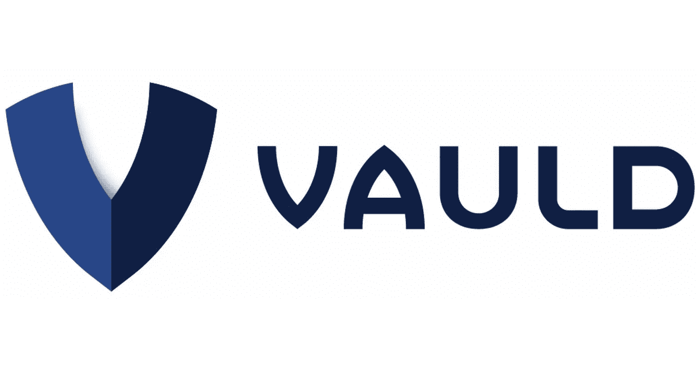
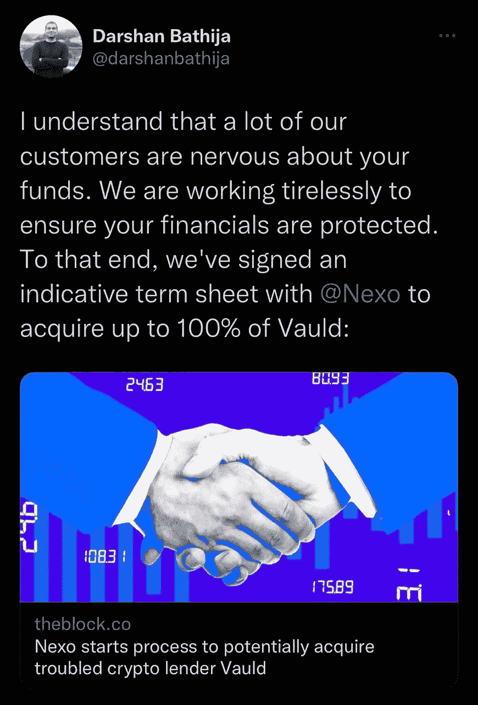

# vauld——又一个 Web 3 多米诺骨牌倒下了

> 原文：<https://medium.com/coinmonks/vauld-another-web-3-domino-falls-d851610d2393?source=collection_archive---------44----------------------->

总部位于新加坡的加密交易平台 Vauld 现已暂停交易，因为破产的传言本周得到了证实。这家风险投资支持的初创公司已经从梵拉风险投资公司、潘迪拉和比特币基地筹集了超过 2700 万美元。两周前，当该平台被迫裁员 30%时，危险信号开始出现。据报道，Vauld 在 5 月份管理着超过 10 亿美元的资产，现在正面临重大的财务挑战，因为自 6 月份以来，客户已从该平台提取了近 2 亿美元。这是继 Luna、Celsius、Voyager 和 Three Arrows Capital 之后最新倒下的 Web 3 多米诺骨牌。

Vauld 提供“主要加密货币的行业最高利率”也就不足为奇了。不可持续的收益率似乎是最近几个月崩溃的许多加密交易平台的共同特点。Terra Luna 通过锚定协议提供了接近 20%的 APY 给 staked UST，我们都看到了这是如何发生的。Vauld 提供了 12.68%的年收益率和 6.7%的回报。鉴于我们所看到的 Terra Luna 的崩溃，Vauld 的高收益率应该已经敲响了警钟，但许多用户仍然涌入交易平台，在不确定的时期寻找避风港。

随着市场在过去几个月开始崩溃，许多加密领域的人有理由担心 Vauld 的财务偿付能力。在 6 月 16 日的一篇博客中，Vauld 的首席执行官 Darshan Bathija 向 Web 3 社区保证，加密交易平台照常运行。

“我们没有任何 Celsius 或 Three Arrows Capital 的敞口，尽管市场状况不佳，我们仍保持着流动性。在过去的几天里，所有的提款都照常进行，今后也将继续如此。”达尔山·巴蒂亚

Bathija 的声明鼓励了许多前 Celsius 和 Voyager 客户将他们的资产转移到 Vauld，但随着加密交易平台本周破产，他们的资产被冻结。

“我们希望 Vauld 平台的客户理解，我们将无法处理这方面的任何新的或进一步的请求或指示。将对客户存款做出特殊安排，这可能是某些客户满足与抵押贷款相关的保证金要求所必需的

> 交易新手？试试[加密交易机器人](/coinmonks/crypto-trading-bot-c2ffce8acb2a)或者[复制交易](/coinmonks/top-10-crypto-copy-trading-platforms-for-beginners-d0c37c7d698c)

Vauld 现在正与总部位于伦敦的加密交易平台 Nexo 就潜在的救助进行谈判。Nexo 计划收购这家陷入困境的交易平台 100%的股份，旨在更深入地拓展亚洲市场。对于希望再次看到自己的钱的 Vauld 客户来说，对 Nexo 的救助可能是唯一的希望。

尽管有 Nexo 的潜在救助，人们不得不怀疑 Vauld 的商业模式是否从一开始就是合理的。不可持续的收益率和无力应对市场低迷正成为许多资不抵债的加密交易平台反复出现的主题。此外，这些平台中的许多向客户保证，直到最后一切都照常运营，这可能会鼓励人们将资金转移到该平台，尽管在不久的将来可能会破产。人们不禁要问，对于像 Bathija 这样积极误导用户并在此过程中摧毁人们财务前景的行业领导者，是否会有任何程度的问责。

感谢您的阅读。

看看我在推特上未经过滤的想法:

[https://twitter.com/wasifmrahman](https://twitter.com/wasifmrahman)

在 LinkedIn 上关注我的职业生涯:

https://www.linkedin.com/in/wasifmrahman/

我对媒体的另一个想法是:

【https://medium.com/@wasifmrahman 

来源:

[https://www . vauld . com/blog/vauld-继续照常运营/](https://www.vauld.com/blog/vauld-continues-to-operate-as-usual/)

[https://www.vauld.com/blog/a-message-from-darshan-bathija/](https://www.vauld.com/blog/a-message-from-darshan-bathija/)

[https://www.vauld.com/blog/corporate-statement/](https://www.vauld.com/blog/corporate-statement/)

[https://www . vauld . com/blog/corporate-statement 2022 年 7 月 11 日/](https://www.vauld.com/blog/corporate-statementjuly-11th-2022/)

[https://TechCrunch . com/2022/07/04/crypto-lending-platform-vauld-suspended-取款-交易-存款-金融挑战/](https://techcrunch.com/2022/07/04/crypto-lending-platform-vauld-suspends-withdrawals-trading-and-deposits-amid-financial-challenges/)

[https://Indian express . com/article/technology/crypto/crypto-lender-nexo-plans-to-buy-fellow-lender-vauld-8010618/](https://indianexpress.com/article/technology/crypto/crypto-lender-nexo-plans-to-buy-fellow-lender-vauld-8010618/)

[https://www . CNBC . com/2022/07/04/crypto-lender-vauld-halts-extractions-as-market-crash-take-it-toll-。html](https://www.cnbc.com/2022/07/04/crypto-lender-vauld-halts-withdrawals-as-market-crash-takes-its-toll-.html)

[https://decrypt . co/104380/crypto-lending-platform-vauld-halts-operations-quoting-financial-differences](https://decrypt.co/104380/crypto-lending-platform-vauld-halts-operations-citing-financial-difficulties)

[https://coin gape . com/vauld-to-reveal-backup-plan-mid-nexo-deal-talks-customer-fears/](https://coingape.com/vauld-to-reveal-backup-plan-amid-nexo-deal-talks-customer-fears/)

[https://fortune . com/2022/07/04/coin base-backed-crypto-lender-vauld-freezing-取款-重组/](https://fortune.com/2022/07/04/coinbase-backed-crypto-lender-vauld-freezes-withdrawals-restructuring/)