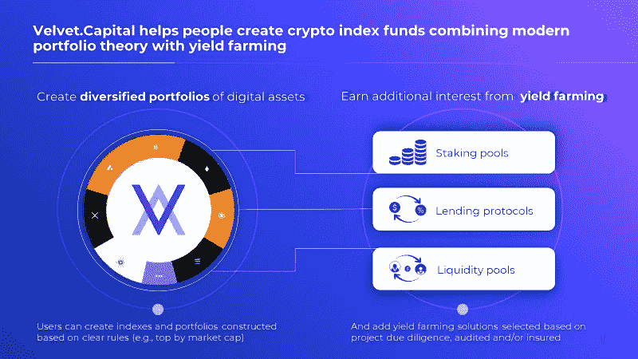
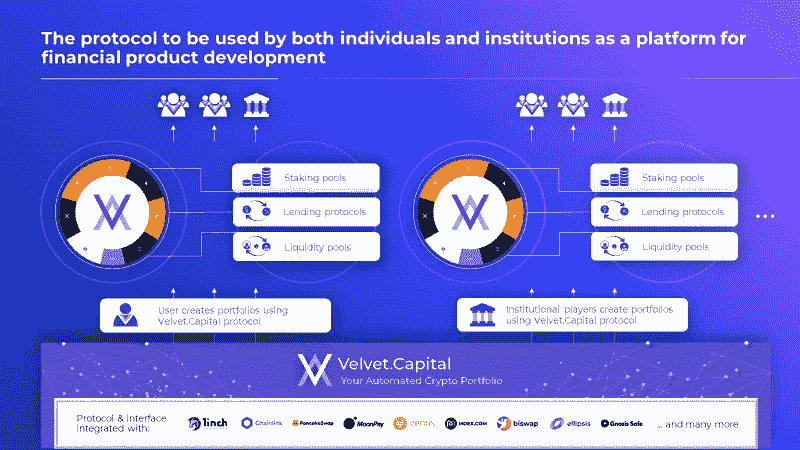
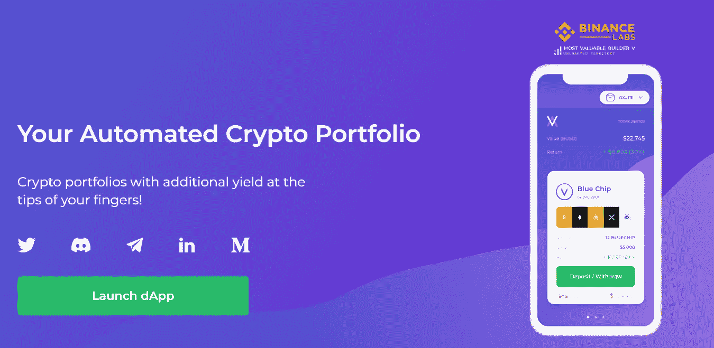
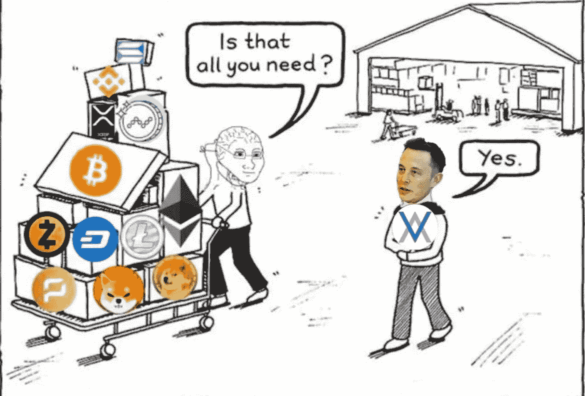
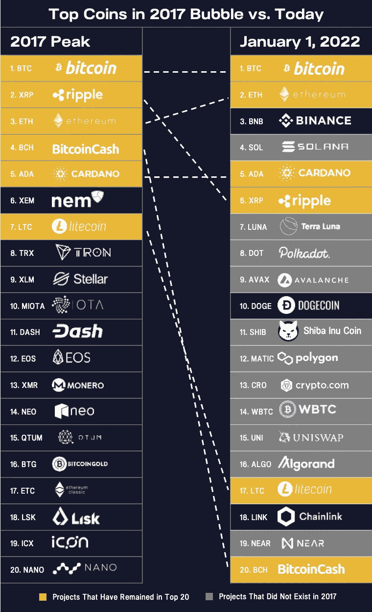
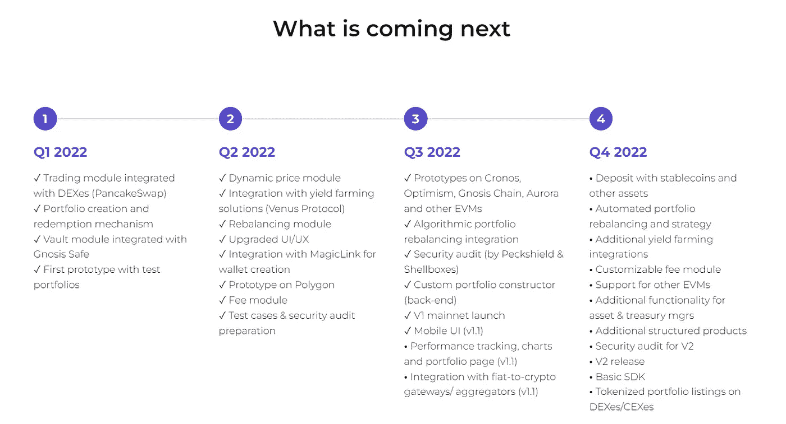

# 天鹅绒。资本上线！DeFi 变得更加简单和安全。

> 原文：<https://medium.com/coinmonks/velvet-capital-goes-live-defi-just-got-a-whole-lot-simpler-safer-cf509c86ce7d?source=collection_archive---------8----------------------->

# 天鹅绒。资本现在在 BNB 链上活了。借助我们超直观的界面，任何人只需点击几下鼠标，就可以轻松创建包含市场上所有最佳项目的定制加密组合。现在，任何人都可以像专业人士一样投资。大写。

# **几个先生的故事**

GM Sir (& Sir-ettes)

> **先生**:那是什么？！？
> 
> **其他先生**:是鸟！是一架飞机！
> 
> 其他，其他先生:不，那是天鹅绒。资本！
> 
> **其他，其他，其他先生:**谁是天鹅绒。资本？

谢谢询问，先生们。

# 我们让 DeFi 更简单、更安全——无论您是谁！

我们的跨链 DeFi 资产管理协议有助于任何人只需点击几下鼠标，即可轻松创建包含市场上所有最佳项目的定制加密组合。凭借我们独特的产量农业集成，我们还提供了从投资组合中赚取额外收益的机会。您的投资组合可以完全在线管理。

**从今天开始像专业人士一样投资**:[https://app.velvet.capital/](https://app.velvet.capital/)

**1)针对个人(B2C):**

*   我们提供一个 Web3 本地应用程序，用于产品的直接存款和取款(创建和赎回)
*   我们在交易所(DEX & CEX)上市投资组合支持的证券，以创造一个流动性的二级市场

**2)对于机构(B2B):**

*   我们提供 SDK/API，允许第三方平台使用该协议并创建自己的金融产品
*   我们为传统资产管理公司、家族理财室和 DAO 财务人员提供定义即服务和定制支持

# 我们理解 DeFi 可能很难&有点吓人。

即使是专业投资者也会成为集中风险的受害者，他们追逐收益率最高的期权，当基础资产的价格跌至零时，他们就会被套牢。正如我们所知，100%的零收益仍然是零。

但是不要害怕，天鹅绒。资本来了！我们的使命是让 DeFi 比以往任何时候都更简单、更时尚、更安全。我们做所有的重活，所以你不必做。我们帮助您实现资产、生态系统和高产农业解决方案的多样化！

# 立即试用我们！

[https://velvet.capital/](https://velvet.capital/)

> **开始使用它就像访问**[**https://velvet.capital/**](https://velvet.capital/)**一样简单，启动我们的 dApp，连接您的钱包，并创建一个投资组合！**

我们已经开始为我们的 V1 引入用户，并计划在今年剩余的时间里继续快速迭代我们的产品——添加特性并构建我们的核心功能。现在，用户将可以访问 BNB 生态系统，但我们将在年底前推出其他连锁店。

天鹅绒。资本将跨链和生态系统运作，为您提供无与伦比的访问整个加密领域。早期采用者不会被忘记，因为我们有很多计划好的机会奖励我们的 OGs(治理令牌空投，NFT 项目即将启动等)。

所以加入我们，积极起来，让我们建立朋友！我们需要您的所有反馈:)

# **我们为什么做我们所做的事情**

在天鹅绒。资本，我们对 DeFi 的颠覆性和创新性充满热情。无摩擦、无信任和无许可的特征将不可避免地永远重塑金融。自工业革命以来，传统的金融系统没有发生系统性的变化，我们认为 DeFi 是传统技术体系变化的第一个重要催化剂。

因此，DeFi 将带来金融革命，帮助数十亿人恢复金融包容性、机会和公平。这是我们感到兴奋的事情&坚定地致力于发挥我们的作用。

我们的使命是为下一个十亿密码用户带来财务自由——没有中介和中央集权。同时着眼于成为管理您的数字资产的头号跨链平台。没错，最终，任何可以令牌化的东西都可以用 Velvet.Capital 在链上管理。

# **公司亮点:**

> -币安实验室最有价值建筑商计划(从 650 名入围者中选出的 11 名入围者之一，用于演示日展示)
> 
> -超过 20，000 个早期注册
> 
> -在 BNB 黑客马拉松中因颠覆性定义获得银牌，在 Eth NYC Hack 我们获得乐观奖金，在 Ledger & Starknet Hack 我们从 Ledger & Empiric Protocol 获得金牌，在 EthCC Paris Hack 我们获得 Cronos 和 Fluence 奖金。我们还参加了巴黎 EthCC，在那里我们展示了我们的项目，作为 EthVC 的一部分
> 
> -多元化团队，在技术、业务和营销方面拥有丰富的经验

# 未来是天鹅绒。资本

Diversified & dynamic portfolios at your service.

我们的分散协议将发展成为一站式 DeFi 平台。作为我们的第一个产品，天鹅绒。《资本论》将现代投资组合理论与产量农业相结合，创造了加密投资组合。这是一种双重的方法，可以带来最好的结果，一方面，通过现代投资组合理论，人们可以接触到多样化的资产，并获得象征性升值的好处。另一方面，在收益农业中，他们从每项资产的赌注、贷款或流动性供应中获得额外收益。

天鹅绒。资本可以自动化您的整个加密组合。只需简单地点击几下，你就可以创建自己的加密组合(想想标准普尔 500 的加密),让你接触到各种最好的令牌，而无需进行所有的个人交易或进行必要的令人生畏的研究，以跟上不断变化的市场。我们还提供专业投资者定义即服务。

如果你仍然不相信，考虑一下在过去的两年里这种情况是如何演变的。我们见证了前所未有的数量的项目在整个 Web 3.0 堆栈中获得牵引力，无论是在基础设施方面(L1 连锁店，L2 扩展解决方案等)。)和应用方面(清晰度、游戏、媒体等)。).比特币的主导地位在 2022 年下降到 40%，加密宇宙变得更加分散，活动在多个链和生态系统(以太坊、BNB 链、Polygon、Avalanche、Solana、Polkadot 等)中爆炸。).

*Source: Blockchain Letter, 01/18/2022, Pantera Capital*

为了抓住这个快速变化的市场的优势，仅仅购买并持有比特币或保持几个加密资产的静态篮子是不够的。拥有一个动态的投资组合至关重要，这个投资组合由不同链上的资产组成，并且可以动态地重新平衡，以放弃“下跌”的项目，增加即将到来的“赢家”。

# 让我们一起建设 DeFi 的未来

2022 Roadmap

DeFi 将允许人们重新控制他们的资产和财务前景。所有人都将更容易获得财务自由。而这仅仅是开始！

这种转变不会很容易，但在[天鹅绒。我们不会在大问题面前退缩——我们会解决它们！我们已经准备好尽我们的一份力量将 DeFi 带入主流。这就是为什么我们专注于构建用户友好的解决方案，让人们&机构能够最好地利用 DeFi 提供的好处。](http://velvet.capital/)

但这需要一个村庄！我们不能独自完成这项任务。我们希望你能加入我们的旅程。我们希望你成为我们社区的一员。

别忘了在[推特](https://twitter.com/Velvet_Capital)、[领英](https://www.linkedin.com/company/31423126/admin/)上关注我们，并加入我们的[不和](https://discord.gg/heXYgFZuGw) & [电报](https://t.me/velvetcapital)以获取更多更新！我们希望听到你的声音，不要害羞。

直到下一次，

干杯！

天鹅绒。Capital 是一个跨链的 DeFi 资产管理协议，帮助个人和机构(DeFi 即服务)创建令牌化的指数基金、投资组合和其他具有额外收益的金融产品。我们的可定制投资组合跨链和生态系统运作，以提供最广泛的市场暴露。我们利用现代投资组合理论和高度审查的产量农业来放大你的回报。

欲了解更多信息，请访问[https://velvet.capital/](https://velvet.capital/)，或发送电子邮件至 info@velvet.capital

###

> 交易新手？试试[密码交易机器人](/coinmonks/crypto-trading-bot-c2ffce8acb2a)或者[复制交易](/coinmonks/top-10-crypto-copy-trading-platforms-for-beginners-d0c37c7d698c)