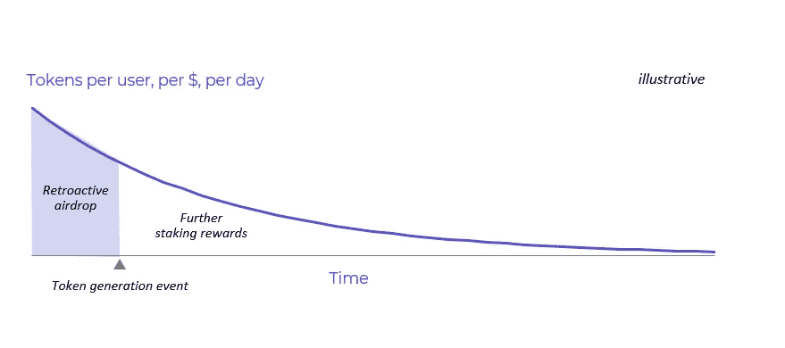

# 天鹅绒。资本空投

> 原文：<https://medium.com/coinmonks/velvet-capital-token-distribution-airdrop-5a51978f5409?source=collection_archive---------1----------------------->

Grow your crypto portfolio: [https://velvet.capital/](https://velvet.capital/)

# DeFi 的未来是天鹅绒。资本

**白皮书**:【https://docs.velvet.capital/ 

我们正在建造[天鹅绒。Capital](https://velvet.capital/) —一种跨链资产管理协议，帮助人们&机构创建 DeFi 产品。这些产品可以是简单的令牌化基金&加密投资组合，也可以是复杂的结构化产品&先进的收益农业策略，让您获得额外的收益，让您始终从您的数字资产中获得最大收益！

B2B Potential

我们独一无二的多元化团队——拥有在 Web3 和金融领域发起数字风险投资的经验——通过共同的热情走到一起，让金融世界变得更好！在天鹅绒。资本，我们致力于为下一个十亿加密用户带来财务独立，摆脱中介和集中各方！但是，为了实现我们的宏伟愿景和塑造金融的未来，我们需要像您这样的 DeFi 先驱的支持和参与！

# DeFi 资产管理做得好

Create a portfolio: [https://velvet.capital/](https://velvet.capital/)

## 分散的社区管理的生态系统

在[天鹅绒。资本](https://velvet.capital/)，我们相信 DeFi 做得对！金融基础设施应该是一种公共产品，由用户所有，并为他们带来价值！为了确保 Velvet 成为一个分散的、由社区管理的协议，我们引入了 VLVT，这是一个治理令牌，向在 Velvet 上下注的令牌持有者授予投票权。

然而，当我们努力建立一个可持续的生态系统时，效用将远远超出治理。天鹅绒。资本正在 BTC、瑞士联邦理工学院、BNB 和其他加密货币中赚取收入，并将使用它们从市场上回购 VLVT，并向持有令牌的令牌持有者分配奖励，这些令牌持有者持有他们的令牌以参与治理。除此之外，我们正在创建一个风险管理模块，它将在发生不可抗力事件的情况下充当后台(并且最终将调整对治理参与者的激励)。这将尽职调查的责任和对集成的投票与对标记的责任联系起来，创建了一个网络效应，随着项目的增长和变得越来越安全，该网络效应增加了用户的利益。通过参与这个系统，你可以帮助保护和加强天鹅绒。资本协议，同时为您的贡献赢得奖励。

## 令牌分配和分发

作为创建分散的社区管理生态系统的第一步，将通过追溯分配和进一步的奖励向早期采用者分配 50，000，000 个 VLVT 代币。在确定分配时有三个主要参数:

1.  **锁定(TVL)在天鹅绒上的用户总价值** —您存款越多，分配给您的代币就越多
2.  **使用天鹅绒的时间** —您保存存款的时间越长，分配给您的代币就越多
3.  **开始日期** —每天的收益率将呈指数下降，越早加入，你将获得越大的分配

除了这些参数，**要获得追溯分发的资格，您必须在代币发行**之前的几个快照日期持有 Velvet 产品。这些快照将公开共享，以便每个人都可以验证他们是否有资格进行令牌分发。

## 早起的鸟儿有(最多)代币

这个模型的关键是它的指数衰减函数，也就是说，在其他条件相同的情况下，你越早，你得到的代币就越多。与此同时，这种模式奖励最忠诚的成员，因为它考虑到了在天鹅绒上的时间。最后，这种模式确保最大的参与者因为给平台带来更多的 TVL 而获得更多的回报。

作为代币持有者，**您有机会通过提交提案**来推动 Velvet 的发展&增长，这些提案的范围可以从新的集成和协议升级到新产品提案，并且如果您积极参与整体治理，您将获得更多代币。

通过担当天鹅绒大使的角色或积极参与协议开发和发展，将有更多的机会获得代币。VLVT 令牌将通过 Velvet 生态系统基金定期分发给贡献者(当前和未来)，该基金将奖励对 Velvet 协议的开发、营销、BD 和其他贡献。

## 成为 DeFi 下一个大事件的一部分

我们正在寻找 DeFi 先锋加入我们重塑金融的旅程！到目前为止，这是忙碌的一年&我们完成了很多，但我们还有更多工作要做！我们得到了币安实验室和其他顶级网络 3 和传统基金的支持，并在 BNB 启示黑客马拉松、EthCC、EthIndia、EthNYC、Polygon Summer Hack、Ledger、Starknet Hack 等活动中赢得了黑客马拉松和奖金。我们非常期待将 DeFi 带给下一个十亿用户！

想象一下，如果你加入我们，我们会做些什么？让我们一起打造金融的未来！

关注我们的 [Twitter](https://twitter.com/Velvet_Capital) 、 [Instagram](http://instagram.com/velvet.capital) 、 [LinkedIn](https://www.linkedin.com/company/31423126/admin/) 和/或加入我们的[Discord](https://discord.gg/heXYgFZuGw)&[Telegram](https://t.me/velvetcapital)了解更多更新！

*最初发布于*[*https://velvet . capital*](https://velvet.capital/tpost/y2bkhbdve1-velvetcapital-token-distribution-for-ear)*。*