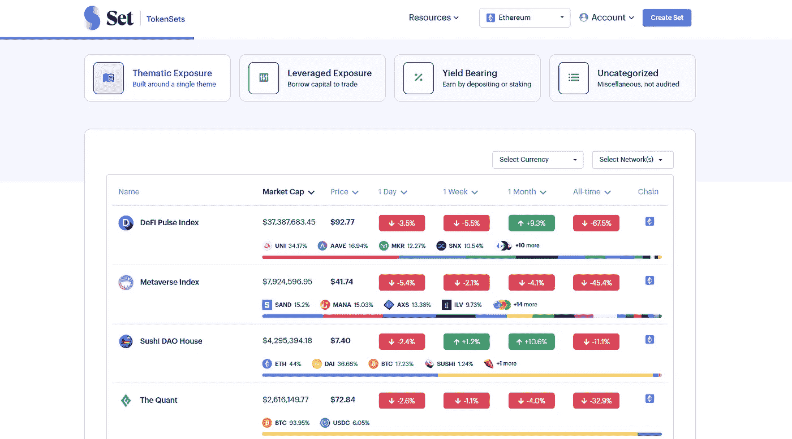
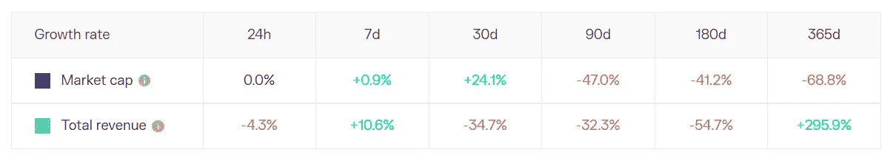
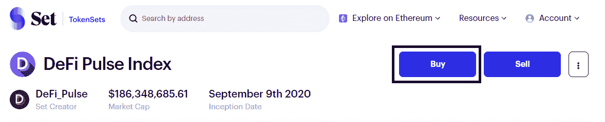
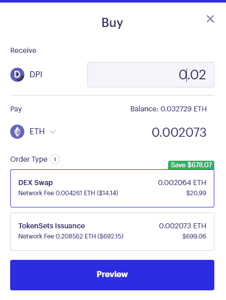

# 冒险进入我的第一笔 DeFi 指数投资

> 原文：<https://medium.com/coinmonks/venturing-into-my-first-defi-index-investment-947cd841dc2b?source=collection_archive---------50----------------------->

叫我婴儿潮，但哇，我最近发现 Set 协议的加密索引的存在，人们可以投资。这绝对是一次大开眼界的经历，因为传统金融中的指数投资一直是金融界最伟大的发明之一。通过指数投资，人们可以获得对广泛基础资产的敞口，而无需实际手动购买单个资产。我从未像现在这样看好 DeFi

所以，让我们从我的经历和我未来的计划开始吧！

什么是 Set 协议？

Set Protocol 是一个基于以太坊的工具，它允许任何人创建被称为 Set 的 ERC 20 资产的投资组合。使用 TokenSets，一个基于集合协议的应用程序，任何人都可以创建、管理和购买集合。这允许任何人执行自动化资产管理策略和重新平衡标准。一个集合有一个独特的令牌，代表对基础资产组合的主张，可以在 Uniswap 等交易所交易。

我如何在 Set 协议上购买 DPI？

1.  首先，我去了 https://www.tokensets.com/的
2.  然后我用我的 metamask 钱包登录。

Source: TokenSets

3.从这里开始，有不同类别的索引可供选择。就我个人而言，我选择了主题曝光和 DeFi 脉冲指数。

在选择了选择的索引之后，您可以看到关于集合的更深入的信息，例如集合创建者、市值、流费用、网络、当前余额等。

什么是 DeFi 脉搏指数？

DeFi Pulse 指数是由 DeFi Pulse 发行的市值加权指数，追踪 DeFi 市场的整体表现。在不单独购买资产的情况下，投资者可以接触到 DeFi 领域的市场领导者，并从他们的被动投资中获得回报。基础代币根据其总流通市值进行加权。DPI 由智能合约管理，利用一组预定义的规则来确定该组规则的组成、重新平衡和费用结构。

在我看来，由于 CeFi 内爆系列震动了加密行业，TVL 在 DeFi 上的股价已下跌近 65%,许多 DeFi 令牌的估值处于有吸引力的定价。其他可能导致代币价格进一步下跌的显著逆风是即将于 7 月 26 日至 27 日举行的美联储会议，许多人预计将加息 75 个基点。从根本上说，这些协议继续在关键指标上恢复，如总收入、总贷款发放等。在我看来，价格的进一步下跌可能会给投资者提供一个有吸引力的切入点。

Revenue and Market Cap Metrics for AAVE from Token Terminal

目前，DPI 套件没有发行费和赎回费。因此，投资者在赎回他们的股票时，不需要支付任何费用。

作为平台上最受欢迎的产品之一，投资者可以通过在 Uniswap 等指数上用 ETH 交换 DPI 来购买它们。或者，投资者可以单独批准购买基础资产，以最终铸造 Set Token。然而，这可能比前一种选择更昂贵。

4.点击购买。

Source: TokenSets

5.选择 DEX Swap 以较低的价格购买 DPI。

Source: TokenSets

6.确认购买和哒哒！你准备好了！由于 Zerion 提供了对 Set 协议的支持，所有以太坊 Set 的性能都可以在应用程序上进行跟踪。

展望未来，作为一个长期来看被动投资优于主动投资的信徒，我计划每月将美元平均成本计入 DPI。这是一个真正的方便和无忧无虑的过程中获得接触最有前途的 DeFi 项目的空间！

> 交易新手？试试[加密交易机器人](/coinmonks/crypto-trading-bot-c2ffce8acb2a)或者[复制交易](/coinmonks/top-10-crypto-copy-trading-platforms-for-beginners-d0c37c7d698c)