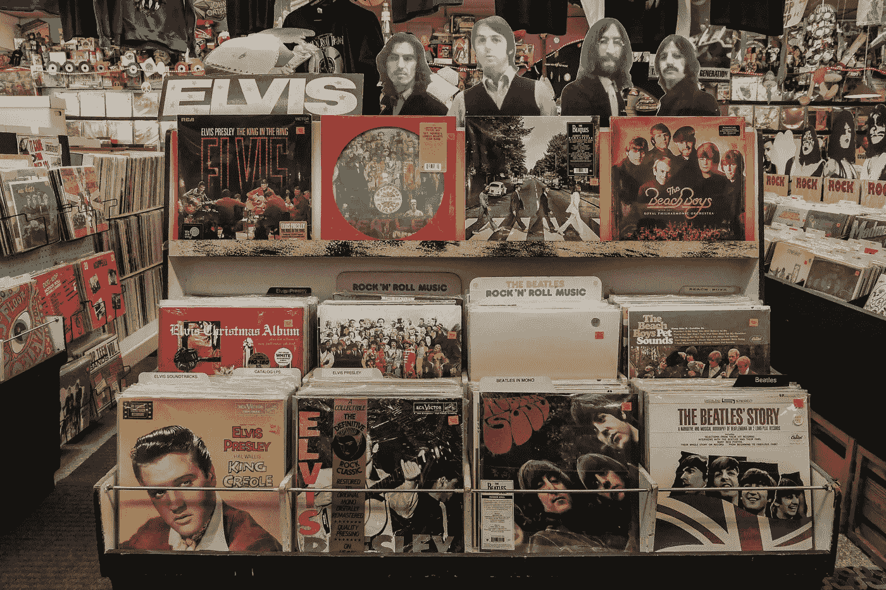
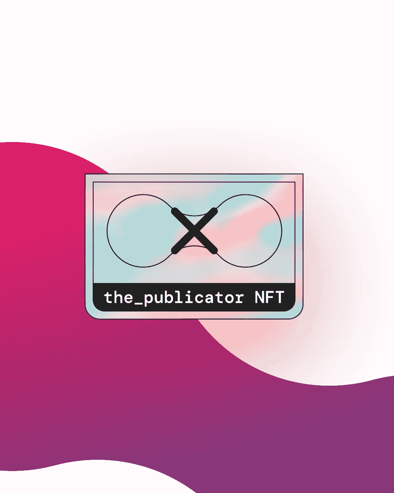

# 乙烯基和 NFTs:音乐收藏品的集合

> 原文：<https://medium.com/coinmonks/vinyls-and-nfts-a-convergence-of-music-collectables-9675770ce419?source=collection_archive---------22----------------------->

区块链技术最有前途的方面之一是它能够给数字世界带来一种可触知和独特的感觉。随着 NFTs 的引入，音乐产业正因收藏品而重新焕发活力。我们想回溯并揭示这些年来音乐收藏品是如何变化的，从黑胶唱片一直到非音乐唱片。

自从 1930 年 RCA Victor 推出第一台商用电唱机以来，黑胶唱片就越来越受欢迎。事实上，2010 年代带来了乙烯基收藏的惊人复苏，2017 年的全球乙烯基销售额超过了 1991 年以来的任何一年。更令人印象深刻的是，仍在市场上流通的稀有、未发行和极具价值的限量版新闻记录目录不断扩大。

**价值超过黄金** 除了数量有限，是什么让一个记录变得稀有？首先是音乐界的赞誉。在甲壳虫乐队成为一个紧密的、打破排行榜的现象之前，他们以采石工人的身份拼凑了他们的第一首单曲，“尽管有各种危险”。这张黑胶唱片(连同巴迪·霍利的 A 面)今天价值惊人的 216，000 美元，如果你足够幸运能找到的话！有传言称，保罗·麦卡特尼早已将这 50 多份拷贝分发给朋友和家人。甲壳虫乐队对收藏[声望](https://www.thisisdig.com/feature/rarest-vinyl-ever/)并不陌生——2015 年，林哥·斯塔尔以不到 56.6 万美元的价格出售了他个人的白色专辑(鼓手恰好拥有第一家出版社)。这标志着迄今为止最昂贵的黑胶唱片销售。

虽然在美国，花在黑胶唱片上的钱比花在 CD 上的钱多(自 [2021](https://www.musicbusinessworldwide.com/us-music-fans-spent-more-on-vinyl-than-cd-last-year-for-the-first-time-since-1986/) 起)，但小唱片公司更小更便宜的小兄弟仍然可以在收藏品部门获得大量收入。2015 年，武堂帮第七张录音室[专辑](https://www.nme.com/en_au/news/music/martin-shkrelis-2million-wu-tang-clan-album-has-been-sold-by-the-us-government-3004854)《少林往事》，仅发行一张双碟 CD，就卖出了 200 万美元的天价。音乐收藏品在 NFT 时代继续保持如此高的价值和兴趣，这对区块链市场的未来是一个好兆头。

**海盗！当黑胶唱片的销量和受欢迎程度持续稳步攀升时，数字下载音乐的引入给音乐收藏带来了一个相当险恶的威胁:盗版。2018 年[一项针对全球音乐盗版习惯的](https://dataprot.net/statistics/piracy-statistics/)研究显示，超过三分之一的在线音乐消费者是非法的。这导致原创作品的创作者和发行者损失了大量收入——据估计，美国每年因音乐盗版而损失的收入约为 125 亿美元。**

这对实物收藏品有什么影响，比如稀有的黑胶唱片？
未经许可和批准的艺术家作品目录在线流通意味着一首歌曲或专辑的稀有性和感知价值可能[下降](https://www.riaa.com/reports/the-true-cost-of-sound-recording-piracy-to-the-u-s-economy/#:~:text=The%20U.S.%20economy%20loses%20%2412.5,and%20in%20downstream%20retail%20industries.)。当一个稀有音乐收藏品的内容可以很容易地在网上找到和传播，而不需要原创者支付一分钱时，拥有这个收藏品的排他性似乎变得更加多余。

艺术家和投资者面临的问题显而易见:尽管面临在线盗版和盗窃的威胁，我们如何进行可靠的和安全的音乐收藏品交换？看来区块链正开始以 NFTs 的形式形成一个答案。

**透明架构**
利用相对[安全](https://www.sofi.com/learn/content/blockchain-security/)和面向公众的区块链技术基础设施，像列昂之王这样的乐队已经开始以 NFTs 的形式发布他们的音乐，结果尤其[积极](https://www.nft-stats.com/collection/kings-of-leon-yellowheart-nfts)。除了音乐本身，NFT 的购买还包括重要的信息，比如合同地址和代币的个人身份证号码，以及创作者自成立以来的收入。这意味着每笔交易都附有一份透明的代币分类账，有点像连续的数字收据。人们很容易开始发现购买一张实体的、重量在手中的黑胶唱片和一张可交易的、独一无二的数字 NFT 之间的相似之处。

其实两个世界早就碰撞了。今年 4 月，瑞典公司 [Infinity NFT](https://www.digitaljournal.com/pr/infinity-nft-converts-10000-physical-vinyl-records-into-non-fungible-tokens#:~:text=Infinity%20NFT%20Converts%2010%2C000%20Physical%20Vinyl%20Records%20into%20Non%2DFungible%20Tokens,-By&text=April%205%2C%202022%20%E2%80%93%20Infinity%20NFT,70s%2C%2080s%2C%20and%2090s.) 发布了一万个独特的代币，每个都包括一个 70 年代、80 年代和 90 年代经典稀有唱片的数字副本。购买者还可以选择从 Infinity 的大量收藏中为每一次 NFT 购买获得一张实体黑胶唱片。北卡罗莱纳州的一家名为 Vinylkey 的公司已经开始在唱片中心附近植入可扫描的 NCF 码来制作实体唱片。这一代码导致一个完全成熟的 NFT 链接，包括每一个乙烯基购买。

随着 NFT 市场的崛起，这将是令人兴奋地看到乙烯现场进一步融合这一创新和有前途的技术。

Publicator 致力于为艺术家、粉丝和 NFT 爱好者创建一个平台，完全拥抱音乐行业的去中心化未来。你可以在[https://the-publicator.com/](https://the-publicator.com/)申请成为 beta 测试员。

> 交易新手？尝试[加密交易机器人](/coinmonks/crypto-trading-bot-c2ffce8acb2a)或[复制交易](/coinmonks/top-10-crypto-copy-trading-platforms-for-beginners-d0c37c7d698c)