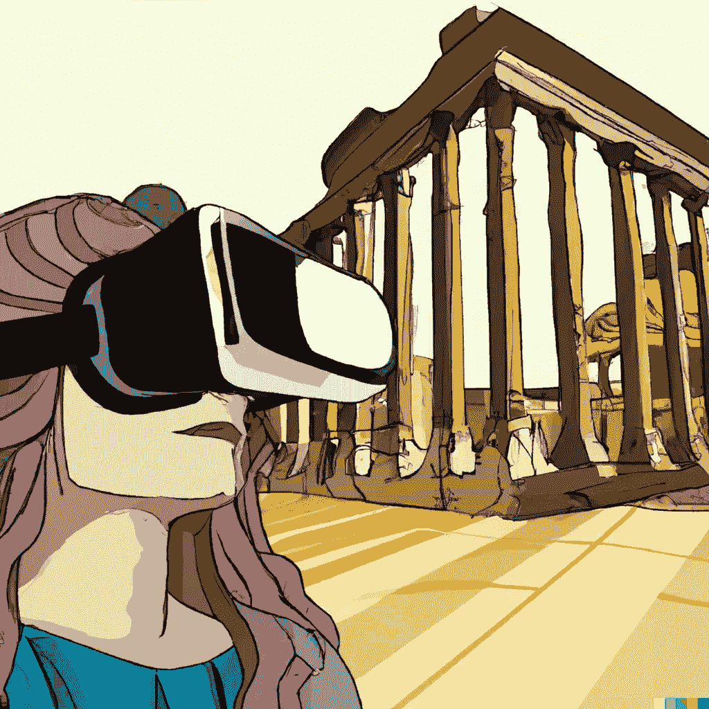
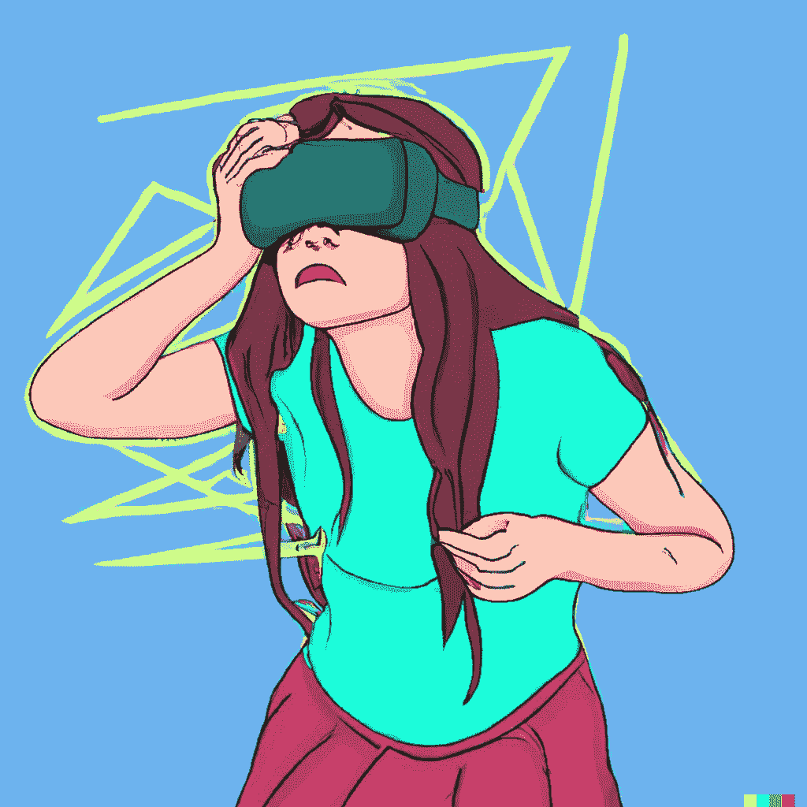

# 虚拟现实:教育和学习的未来？

> 原文：<https://medium.com/coinmonks/virtual-reality-the-future-of-education-and-learning-cb69d8ceb1a9?source=collection_archive---------7----------------------->

虚拟现实(VR)是一种人工的、计算机生成的环境，为用户创造一种沉浸感。虚拟现实可以用来创建一个虚拟世界，用户可以探索和互动。虚拟现实技术已经存在很多年了，但最近随着 Oculus Rift 和 HTC Vive 等平价耳机的发布，虚拟现实技术变得更加流行。现在有许多 VR 头戴设备可以让用户体验 VR，而不必学习如何使用复杂的软件。

***VR 如何改变教育？***

VR 可以用来创造模拟体验，包括训练模拟和教育体验。近年来，虚拟现实在教育领域的应用越来越多，尤其是在高等教育领域。虽然有人担心虚拟现实学习的有效性，但有证据表明虚拟现实可以提高学习效果。

虚拟现实正在改变教育，为学生提供身临其境的体验，让他们沉浸在不同的场景中。通过提供一种新的学习方式，虚拟现实正在彻底改变教育！有了这项技术，教师现在可以用一种更具吸引力和互动性的方式向学生展示新信息。这为我们如何教学开辟了新的可能性，并为学生提供了对他们周围世界更现实的视角。

***VR 在教育方面的优势***

随着新设备的不断发布，虚拟现实(VR)耳机越来越受欢迎。虽然许多人认为 VR 只是一种游戏技术，但它可以用于更多方面。虚拟现实最有趣的应用之一是在教育领域。在教育中使用 VR 有很多好处，这里只是其中的一部分。

> 交易新手？尝试[加密交易机器人](/coinmonks/crypto-trading-bot-c2ffce8acb2a)或[复制交易](/coinmonks/top-10-crypto-copy-trading-platforms-for-beginners-d0c37c7d698c)

VR 在教育上最大的一个优势就是可以帮助学生以更身临其境的方式学习。有了 VR，学生不用离开教室就可以探索不同的世界，了解新的文化。他们还可以进行虚拟实地考察，去那些他们在现实生活中永远去不了的地方。虚拟现实还可以帮助学生以更有趣和更有吸引力的方式学习困难的概念。VR 头戴设备还可以帮助学生学习数学、科学和历史。例如，你可以进入火山内部了解火山爆发，或者穿过人体了解解剖学。你可以参观古代遗迹，进行狩猎旅行，或者探索海洋深处。这是了解其他文化和地方的好方法。VR 头戴设备对老师也有帮助。他们可以用它们来创建虚拟教室，来自世界各地的学生可以一起上课。教师还可以使用 VR 头戴设备来播放电影或图像，这些电影或图像太危险或太昂贵，无法亲自播放。在教育中使用虚拟现实有许多优势，包括以下几点:

VR 可以帮助学习者探索新的信息或场景。

VR 可以帮助学习者更有效地评估和理解信息。

虚拟现实对学生来说是一种非常吸引人的学习方式。

VR 可以帮助学生更好地保留信息。

它可以创造更沉浸式的学习体验。

将技术带入课堂是一种非常划算的方式。-学生在使用 VR 时可以有更多的自由。

***VR 在教育中的局限性***

在教育中使用 VR 有一些限制。最大的一个限制就是 VR 头戴设备还是挺贵的，这就限制了它们的可及性。此外，并不是所有的学生都能接触到可以与 VR 头戴设备配合使用的电脑或智能手机。还有人担心长时间使用 VR 头戴设备对健康的影响。以下是使用虚拟现实的一些缺点:

为了让虚拟现实正常工作，它需要高质量的计算机和显卡以及稳定的互联网连接。

学生可能会晕车。

学生可能会从课上分心，错过重要信息。

由于虚拟现实的沉浸性，学生可能很难集中精力听课。

很难控制学生在虚拟环境中的位置。

学生回到现实世界可能会感到困惑。

购买和维护设备是昂贵的。

***VR 在教育中的未来***

虚拟现实有可能改变我们的学习方式。它可以创建一个更加身临其境和互动的体验，比传统的学习方法更有效。虚拟现实可以帮助学生理解复杂的概念，提供一个模拟的环境，让他们可以探索和互动。它也可以用来为某些工作提供培训或帮助人们学习新技能。有了新技术，就如何利用虚拟现实来增强学习而言，可能性是无穷无尽的。