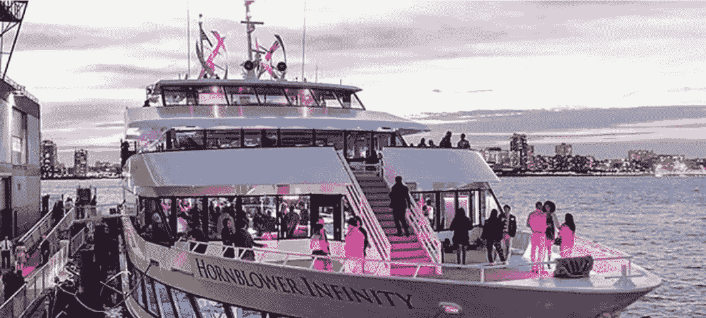

# 虚拟门票、NFT 奖励计划和当前市场

> 原文：<https://medium.com/coinmonks/virtual-tickets-nft-rewards-programs-and-the-current-market-2d1eaec3a095?source=collection_archive---------34----------------------->

By [Holly Eimer](https://medium.com/u/e25f399c6d84?source=post_page-----2d1eaec3a095--------------------------------) for [Message in a Bottle Newsletter by Lazy 8ight YC](https://medium.com/u/6dcb932fb22b?source=post_page-----2d1eaec3a095--------------------------------)

NFTs 持有人在 2021 年投资了 250 亿美元，比前一年有了巨大的改善，当时只有 9490 万美元的投资。本周，加密货币矿商的股价上涨了 9.6%，因为比特币越过 21000 美元关口，显示出持续反弹的迹象。挪威奥斯陆 Arcane Research 的研究员贾兰·梅勒鲁德(Jaran Mellerud)表示，投资者可能不确定公共矿业公司将如何应对熊市。然而，随着市值最大的加密货币的价格稳定下来，他们现在感觉更有信心了。Digihost Technology、TeraWulf 和 Marathon Digital 排名第一，从周三开盘到周四收盘分别上涨 26.6%、18.94%和 17.62%。TeraWulf 的表现与该公司周二宣布将威尔明顿信托公司(Wilmington Trust)的 1.235 亿美元贷款增加 5000 万美元以支持进一步扩张相吻合。本文发表时，比特币每股上涨 3.20%，至 21，700.10 美元；以太坊上涨 0.59%，至 1222.23 美元；索拉纳上涨 0.68%，至每股 38.44 美元。

Web3 的首批元宇宙平台之一 Roblox 的股票价格在过去一个月上涨了 25%，尽管市场普遍下跌，但周二上涨了 14%，并在本周继续攀升。雅虎财经网站上最受欢迎的股票之一是元宇宙游戏。Needham 分析师 Bernie McTernan 表示，“对于一个家庭来说，这不是一笔很大的月支出，因为 Roblox 的月活跃用户每月为该网站支付大约 20 美元。”McTernan 还对 Roblox 如何通过扩大游戏内广告和市场销售来更有效地利用其用户群感兴趣。此外，他预计 Roblox 不会受到美国经济衰退的影响。

LiveNation 推出了数字纪念票。门票是特殊的数字收藏品，当你购买音乐会门票时免费赠送。每一个都是个性化的，带有所购买座位的细节，包括巡演中的艺术品，并且很容易分发。纪念活动的门票是环保的…每一张都比典型的网络搜索或社交媒体帖子需要更少的处理能力。每张合格的门票都包含一张免费的虚拟纪念门票，这是一种特殊的数字纪念品，是您自己的一段音乐历史(经过验证的转售门票除外)。通过积累虚拟纪念票来欣赏喜爱的表演，与朋友分享虚拟纪念票。门票可以留作纪念，在社交媒体上分享，送给朋友，或者卖给另一个粉丝。纪念门票可以通过一个人的活动帐户。

埃隆·马斯克(Elon Musk)周四晚上抵达艾伦公司(Allen & Co .)的太阳谷会议，加入了媒体和技术精英在大山深处的行列。马斯克定于周六向观众发表讲话。尚不清楚他是否会讨论围绕他以 440 亿美元收购 Twitter Inc .的冲突。这位特斯拉公司(Tesla Inc .)和 SpaceX 的亿万富翁首席执行官质疑 Twitter 是否公平地报告了使用该服务的垃圾邮件机器人的数量，令人对该协议产生怀疑。Twitter 经常表示，其用户群中只有不到 5%的人是垃圾邮件机器人，并表示将让马斯克信守承诺。

美联储的一名高级官员非常明确地表示，该机构作为一个强大的金融监管机构，正在密切关注随着密码行业的衰落而出现的问题。美联储副主席莱尔·布雷纳德周五在伦敦的一次演讲中列出了数字资产行业的一系列缺陷，声称“最近的波动凸显了加密金融系统的严重弱点。”布雷纳德一直负责美联储在未来数字美元方面的工作，并一直在关注有关加密政策的对话。布雷纳德表示，美联储一直“密切关注最近的发展，系统性风险已经具体化，许多加密货币投资者遭受了损失，强有力的监管保障将有助于投资者和开发商建立持久的数字原生金融基础设施”。

> 交易新手？试试[加密交易机器人](/coinmonks/crypto-trading-bot-c2ffce8acb2a)或者[复制交易](/coinmonks/top-10-crypto-copy-trading-platforms-for-beginners-d0c37c7d698c)

这位副主席认为，加密货币的缺点本质上与传统金融的缺点相同，该行业必须遵守相同的安全要求，才能发展到对金融系统其他部分构成危险的规模。“我们观察到，加密交易平台和加密贷款公司将传统金融市场中必须分开的活动结合在一起，例如，一些平台将市场基础设施和客户便利与资产创造、自营交易、风险资本和贷款等风险业务结合在一起，而没有相应的监管合规性。”美联储和其他监管机构已经注意到 TerraUSD 的崩溃，布雷纳德将其与以前的金融挤兑相提并论。她断言，所有这些都支持一种观点，即美国央行的数字货币“可能有利于未来的金融稳定。”这种性质的政府代币可能会对私人稳定的货币市场产生重大影响。

Solana 生态系统的关键人物被指控非法受益于 SOL，这是区块链的本土标志，诉讼声称这是一种未注册的证券，上周在加利福尼亚州的一家联邦法院提起了集体诉讼。索拉纳基金会、索拉纳实验室和阿纳托利·亚科文科对索拉纳·区块链的管理和开发在诉讼中被称为“溶胶股票价值的基石”。在他们的分析中，SOL 被描述为一种高度集中的加密货币，它以牺牲普通交易者的利益为代价，偏袒其内部人员。

该诉讼由加州公民马克·杨提起，他声称在 2021 年夏末购买了 SOL。Young 在诉状中声称，SOL 的创建和销售符合 Howey 测试中规定的三个标准，Howey 测试是美国最高法院的一项决定，经常被用作判断交易是否构成证券销售的标准。Young 在 token 首次公开募股前的文件中提到了一些 SOL token 销售或销售 SOL token 的协议。

随着数字资产越来越受欢迎，旅游行业开始接受数字资产。企业越来越多地试图吸引来自世界各地的加密货币投资者，使用加密货币支付的旅行者数量也在增长。现在是国家旅游局熟悉旅游业的时候了。作为旨在结合便利性和创新酒店空间的前瞻性商业战略的一部分，并为创新当前的酒店忠诚度计划做好准备，总部位于亚特兰大的第一个加密货币和科技酒店品牌 EV Hotel 最近宣布，该品牌将为其客户创建专属 NFT 会员。EV Hotel 是第一家拥有 NFT 奖励计划的酒店。

该业务旨在通过数字化创新酒店行业。EV 酒店的技术正在改善客户体验并简化业务运营，它的每个位置都将减轻任务繁重的酒店系统的负担，并鼓励更加关注客户服务和游客对技术和加密货币的参与。NFT 所有者和爱好者将有机会充分沉浸在现实世界和元宇宙的卓越服务、技术、加密货币和基于 NFT 的体验中。

在 Web0(真实世界)中，豪华酒店公司 Luxe Week 旨在与志同道合的人一起给游客带来无与伦比的奢华体验，并留下终身记忆。对于千禧一代的旅行者来说，豪华周提供了一个奢华的度假体验，包括 100 名客人，10 栋别墅，以及在令人惊叹的地点度过的一周。在短短的七天时间里，一次豪华周之旅可以让你与来自世界各地的人们互动，住在令人惊叹的别墅里，并参观每个地方的顶级景点。

通过建立一个只想要充分享受生活的个人社区，将旅行者聚集在一起，这是奢华周的一个目标。不是每个人都喜欢组织一次旅行…阅读旅游博客、寻找最好的住宿社区、决定去探索什么样的短途旅行，都需要花费大量的时间。豪华周包租私人游艇，举办贵宾聚会，并安排游览，包括浮潜和冲浪课程。为了保证游客的安全，Luxe Week 为每栋别墅提供别墅安保。此外，这家豪华酒店公司还提供定制服务，包括国际 DJ、摄影师、冲浪指导和司机。

不受 Web0 或 Web3 的限制，Lazy 8ight 游艇俱乐部(L8YC)旨在通过整合 NFTs、游艇租赁选项和豪华接待服务，在豪华接待和区块链技术之间架起一座桥梁。Lazy 8ight 社区成员不仅受益于奢侈品服务折扣，还受益于被动奖励。由于 L8YC 与现实世界中的企业有着密切的联系，因此它能够在定制活动中为其会员节省大量费用。豪华酒店和 NFT 公司为世界各地的 NFT 社区、Web2 公司、有影响力的人士和个人组织活动。每个活动都是个性化的，以满足 L8YC 客户的特定需求，无论是通过其米其林五星级餐饮服务、游艇和别墅活动、直升机旅游、安保服务，还是名人亮相。世界上第一个区块链游艇租赁服务于 2022 年 6 月 11 日起航，史无前例地将 50%的利润分配给 L8YC NFT 持有者。到目前为止，只有少数精英才能享受游艇运动。凭借 L8YC 会员资格，其 8，888 名持卡人可享受全球最奢华度假方式的专属折扣。

请务必访问位于[http://www.l8yachtclub.com](http://www.l8yachtclub.com)的 Lazy 8ight Yacht Club 网站，了解最新信息和可用的豪华服务，或者通过 Twitter、Discord、Instagram 和 Medium 访问社交媒体。