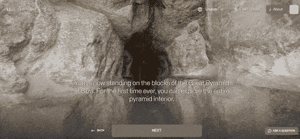

# 虚拟参观吉萨大金字塔

> 原文：<https://medium.com/coinmonks/virtually-visit-the-great-pyramid-of-giza-648b397532ce?source=collection_archive---------26----------------------->

我一直是历史迷，尤其是金字塔和埃及。我也一直想参观吉萨金字塔，但我知道这只是一个梦想，可能永远不会实现。我仍然希望有一天我会去，但可能性微乎其微。

我一直在看关于金字塔的图片、书籍和视频，但从来没有机会真正走过一座金字塔。

随着虚拟旅游和 360°视频和图片技术和方法的不断发展，我们能够访问世界上比以往更多的地方。我想和你分享一个神奇的网站，它可以让你虚拟参观吉萨金字塔。

参观吉萨金字塔

有史以来第一次，参观埃及吉萨的胡夫金字塔内部。

这个允许你免费虚拟参观吉萨金字塔的项目叫做[吉萨项目](https://giza.mused.org/en/)。

[吉萨项目展](https://giza.mused.org/en/)由旅游和古迹部与哈佛大学吉萨项目合作举办。它允许你参观吉萨金字塔。你可以参加一个免费的旅游，在金字塔的所有探索过的地方走走，或者你可以参加一个导游，一路上教你。

要探索吉萨金字塔，你可以[点击这里](https://giza.mused.org/en/guided/266/inside-the-great-pyramid)或者点击主页上的探索。

吉萨大金字塔是埃及最大的金字塔，也是第四王朝法老胡夫的坟墓。金字塔建于公元前 26 世纪初，历时约 27 年，是古代世界七大奇迹中最古老的一座，也是唯一保存完好的一座。— [来源](https://www.google.com/url?sa=t&rct=j&q=&esrc=s&source=web&cd=&cad=rja&uact=8&ved=2ahUKEwjL9bii6Z77AhVIk4kEHaapD3YQFnoECBUQAw&url=https%3A%2F%2Fen.wikipedia.org%2Fwiki%2FGreat_Pyramid_of_Giza&usg=AOvVaw1csGw2wK2V0sFUnmVkF4UL)

我知道我通常写加密和区块链相关的话题，但我认为这很棒，值得分享。

请在评论中告诉我你的想法。

查看我的网站，了解赚取、学习和投资加密的方法！我对我的网站做了一些更新，我想听听大家的想法。除非你有建设性的批评，否则你不可能把事情做得更好。

[哈蒂小屋](https://www.hattysshack.org/)

我的下一篇文章将是关于另一个社会区块链项目，所以请确保你关注，以便我再次发帖时你能得到通知。

主角形象由 [Pixabay](https://pixabay.com/photos/pyramid-giza-egypt-royal-tomb-3478575/) 带给你

[上的原创文章 read.cash](https://read.cash/@HattyHats/virtually-visit-the-great-pyramid-of-giza-af3183ad)

> 交易新手？试试[密码交易机器人](/coinmonks/crypto-trading-bot-c2ffce8acb2a)或[复制交易](/coinmonks/top-10-crypto-copy-trading-platforms-for-beginners-d0c37c7d698c)