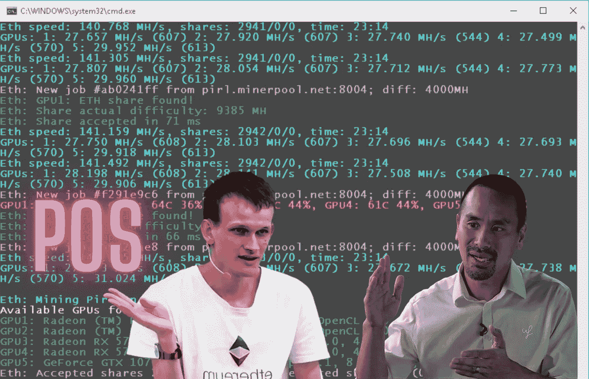

# Vitalik Buterin 对 Jimmy Songa 关于 POS 的检查表示怀疑

> 原文：<https://medium.com/coinmonks/vitalik-buterin-doubted-the-examination-of-jimmy-songa-about-pos-6f618b15043e?source=collection_archive---------2----------------------->

利害关系证明(PoS)加密算法没有提供必要的分散化级别，因为它不能解决“拜占庭将军问题”*。比特币的长期支持者吉米·宋(Jimmy Song)在他的推特上写道。

This preview will be included in the NFT collection called “[Uncle Fibonacci News](https://opensea.io/collection/uncle-fibonacci-news)”

拜占庭将军的问题是需要同步独立系统的逻辑困境，其中一个或多个通信提供商可能会受到威胁。

> 交易新手？试试[加密交易机器人](/coinmonks/crypto-trading-bot-c2ffce8acb2a)或者[复制交易](/coinmonks/top-10-crypto-copy-trading-platforms-for-beginners-d0c37c7d698c)

宋没有具体说明 PoS 作为一种算法的失败具体是什么，但他表示，那些不了解利害关系的人被剥夺了在这个话题上的话语权。他的声明几乎立即招致以太坊生态系统联合创始人维塔利克·布特林的批评。

他指出，任何不争论已经说过的话就用术语进行操作的批评家很可能是错误的。

在比特币区块链网络中，系统完整性检查基于工作证明算法，其中每笔交易都由矿工计算，矿工使用必要的属性计算哈希。

PoS 将如何在高级以太坊网络的例子上处理保持分散化的问题还有待观察。该生态系统预计将在年底前转移到 PoS，然而，开发人员仍然需要首先升级测试网，然后才能在 mainnet 上推出升级。

布特林自己也承认，网络最早可能在今年 8 月“迁移”到新算法。与此同时，升级到 PoS 机本身远不是区块链开发商为以太坊计划的唯一创新。

📰 ***订阅*** [***斐波那契***](/@unclefibonacci) ***我来保持最新***