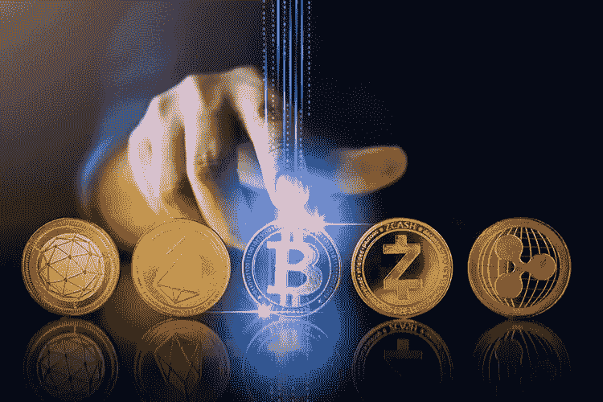

# 动荡的市场周和更新的比特币利率的高点

> 原文：<https://medium.com/coinmonks/volatile-markets-week-and-updating-the-high-of-the-bitcoin-rate-ac496a1c5510?source=collection_archive---------53----------------------->

上周末，主要加密货币的报价脱离了 9 月初的两到三个月低点，回到了 8 月中旬的水平。

价格上涨的部分原因是美国股市的复苏；大型投资者对比特币的兴趣；以及即将推出的新的以太坊高性价比挖掘算法。虚拟货币市场的前景仍然不确定，特别是在全球金融监管机构**预期大幅加息的背景下。**

**正如[***top forex . trade***](https://topforex.trade/)*专家所言，美元在前半周走强，对一篮子货币创下今年以来的新高。美元指数处于 110.78 点的水平。随后在 9 月 6 日，欧元/美元滑落至年初以来的低点 0.9863。在美元走强、股指下跌的背景下，BTC/USDT 对跌至 1.85 万美元；美元指数达到 108.36 点的新高。***

***同样在周四，欧洲央行将利率上调 75 个基点，至每年 1.25%。正是鲍威尔和欧洲央行的决定推动了美元、S&P500 指数和加密货币的修正。由于 9 月 9 日星期五，S & P500 指数上涨了 1.53%，纳斯达克指数上涨了 2.11%。***

***下一次美联储会议将于 9 月底举行，鲍威尔在此之前将不再发言，因此交易员和投资者正在等待美国 8 月份消费者价格指数的公布，该指数将于 9 月 13 日公布。***

***自上周初以来，BTC/USDT 组合已上涨 7.53%，至 2.15 万美元。如果从周低点 1.85 万美元算起，那么比特币已经涨价 15%。买家首先成功通过了 1.95 万美元的阻力，然后在几个小时之内，价格移动到了 2.05 万美元的阻力，这是买家在 8 月 29 日至 9 月 4 日的一周内无法通过的阻力。接下来，市场参与者将价格推高至 2.16 万美元。***

***比特币周末上涨，周一上午在亚洲交易中接近 22，000 美元。***

***对于买家来说，一个新的阻力区是 21900-22500 美元。只要价格低于 2.25 万美元，市场就仍在卖方的控制之下。***

***此外，加密货币市场势头良好的原因是比特币强劲买家的出现。市场参与者可能会对比特币最大的机构投资者 MicroStrategy 准备以至多 5 亿美元的价格收购 BTC 的消息做出反应。***

***加密货币市场的交易量增长也受到了全球更新前以太坊反弹的影响。美国监管机构显然优先考虑这种机制，因为它的功耗比工作证明(PoW)低得多。除了提高能源效率和结算速度，新协议还增加了权力下放的程度。如果比特币不依赖美国股市，那么它的价格肯定不会在 2 万美元的范围内，而是要高得多。***

******对主要加密货币的预期是多向的******

***在过去的 10 周里，相对于加密市场的其他部分，比特币继续走弱。在过去的 4 年里，它在总资本总额中的份额首次跌破 40%，这是在牛市最后阶段的背景下发生的，但现在疲软的原因可能是以太坊越来越受欢迎，而熊市趋势正在全面展开。***

***此外，更新以太坊生态系统的下一阶段定于下周中期——主网络预计将与一个测试分支合并，以便切换到新的 PoS 共识机制。这一事件可能会引起更大的兴趣，从而增加对代币的需求。***

***在这方面，人们不应指望比特币会大幅上涨。有可能继续下跌到先前确定的 19-21，000 美元的下限，但在局部趋势反转前夕出现大幅上涨的情况下有可能突破。***

***以太坊，反过来，可以进入一个积极的发展阶段。在合并两个网络的过程中，可以直接观察到一个方向和另一个方向的价格波动，但随着成功完成，在过去几年加密领域最重要事件之一的背景下，快速增长是非常可能的。***

# ***顶级外汇学院***

*   ***[外汇交易顶级 VPNs】](https://topforextrade.medium.com/top-vpns-for-forex-trading-comparison-of-high-speed-providers-for-safe-fx-market-exchange-at-the-b75f0bf7e740)***
*   ***[远期交易解释](https://topforextrade.medium.com/forwards-trading-explained-how-to-hedge-against-risks-and-make-a-profit-f04de922c5d6)***
*   ***[如何从外汇经纪人那里获得奖金](https://topforextrade.medium.com/how-to-get-a-forex-bonus-and-benefit-from-it-ce998e4d81e7)***
*   ***[有杠杆和保证金的外汇交易](https://topforextrade.medium.com/forex-trading-with-leverage-and-margin-explained-how-to-manage-risks-to-make-a-profit-316237b9349d)***
*   ***[加密货币初学者终极指南](https://topforextrade.medium.com/ultimate-beginners-guide-on-cryptocurrency-top-platforms-to-buy-and-trade-bitcoin-ethereum-xrp-5b64b3d8a55d)***
*   ***[外汇差价合约交易](https://topforextrade.medium.com/expert-review-of-forex-trading-of-cfds-what-is-it-and-how-to-trade-them-90d8e00669ea)***
*   ***[使用 VPN 和 VPS 进行外汇交易](https://topforextrade.medium.com/secure-forex-trading-with-vpn-and-vps-free-offers-of-top-fx-brokers-8c13a3ece0d3)***
*   ***[外汇期货交易](https://topforextrade.medium.com/forex-futures-trading-expert-guide-key-terms-and-how-to-make-a-profit-8f30fd902223)***
*   ***[外汇风险管理](https://topforextrade.medium.com/forex-risk-management-effective-strategies-for-safe-fx-trading-for-beginners-adab8eee597f)***

> ***交易新手？尝试[加密交易机器人](/coinmonks/crypto-trading-bot-c2ffce8acb2a)或[复制交易](/coinmonks/top-10-crypto-copy-trading-platforms-for-beginners-d0c37c7d698c)***