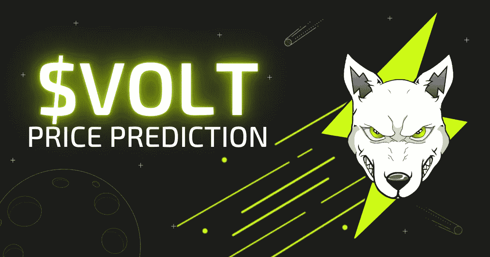

# Volt Inu(伏特)价格预测:2022–2040 年展望

> 原文：<https://medium.com/coinmonks/volt-inu-volt-price-prediction-2022-2040-perspective-55f63687c49f?source=collection_archive---------1----------------------->



迷因币不再是新鲜新闻了？我们恭敬地不同意！今年的亮点不仅在于市场低迷，还在于几个引人注目的秘密出现了。在 2022 年的 8 个月里，伏特 Inu 显著进化并扩大了它的群体。让我们看一下项目概述，看看我们是否可以预测 Volt Inu 的价格。

在 V1-V2 迁移后，从 2022 年 4 月下旬开始，Volt Inu (VOLT)到 2022 年 8 月损失了超过 76%。然而，自上市以来，它仍努力实现近 2000%的涨幅，这使得加密投资者将 VOLT 视为投资资产。在这篇文章中，我们汇编了分析，以衡量超通缩 VOLT crypto 的可能未来。


# V2 的伏特是多少？

Volt Inu 介绍自己是一种超级通货紧缩的加密货币，这意味着激进的燃烧机制被嵌入到 Volt 的协议中。投资利润用于回购&燃烧$伏特代币，ETH 和 BSC 交易需缴纳 2-4%的燃烧税。这是为了保持持续的价格增长和供应控制。

VOLT 是一个基于以太坊的 taken，现在在 34 个 cex 和不同的交易所交易，也有一个菲亚特网关。根据 [Volt Inu 白皮书](https://voltinu.in/Whitepaper_v1.pdf)，它“旨在投资多种资产类别，如 NFT、节点、替代硬币、staking&stable coins 养殖”。由于多边发展，Volt Inu 努力争取社区的关注，以提高 Volt Inu 的排名

# V2 移民

令牌的路线图里程碑之一是从 V1 到 V2 的迁移，这是今年 4 月自动进行的。新的智能合同渴望加速 Volt Inu 协议的增长、速度和效率，并为其持有者提供更多价值。

# P2E·瑞瑟

在迁移过程中，Volt Inu 还推出了一款基于浏览器的“玩赚”游戏。Volt Inu 2D 赛车提供免费比赛和选择或创建付费比赛项目的功能，为该公司的本地令牌带来了新的实用工具。该项目旨在开发 GameFi 领域以及所有其他投资领域。

```
[**Learn more about Volt Inu ($VOLT)**](https://swapzone.io/currencies/volt-inu-v2)
```


# 伏特技术分析和表征组学

虽然之前的表现不能保证未来的结果，但技术和历史的伏特加密货币分析可能有助于做出明智的决定。

在撰写本文时，(8 月 22 日)VOLT 在 [CoinMarketCap](https://coinmarketcap.com/currencies/volt-inu-v2/) 的所有加密资产中排名第 2781 位(在 [Meme Coins](https://coincodex.com/cryptocurrencies/sector/meme/) 领域排名第 74 位)，目前的交易价格比历史低点上涨了近 70%。根据[coin index](https://coincodex.com/crypto/volt-inu/)的估计，Volt Inu 价格预测情绪是悲观的，在熊市中交易总是更难，所以你可能希望要么只将$VOLT 视为长期投资，要么转向其他资产。

**名称**伏特 Inu **股票代码**$伏特**上市年份** 2021 **创始人**未定义**市值**55191749 美元**流通供应量**66049.14 亿伏特**总供应量**690 亿伏特**历史最高**0 美元


# 2022-2040 年 Volt Inu 价格预测

自 5 月份以来，22 伏 Inu 硬币似乎一直停留在低价值的柏拉图价格区间 0，000，001(7 月下旬的一次努力)至 0，000，007。然而，一些加密投资者对下一个迷因硬币的出现持两种态度，社区普遍认为 Volt Inu 硬币最近显示出很大的潜力，可能是一个投资的好机会。让我们看看在接下来的几年里，伏特硬币能否反弹至历史高点或更高。

# 2022 年价格预测

在撰写本文时，VOLT 的交易价格为 0.000000846 美元，预计今年年底的价格区间为**0.0000008 美元至**0.0000013 美元 [CryptoPredictions](https://cryptopredictions.com/volt-inu/) 。[coinargebot](https://coinarbitragebot.com/price-prediction/volt-inu.html)预测数字接近价值，并建议 Volt Inu coin 以 **$0.000001241** 结束今年的交易。

至于[价格预测](https://priceprediction.net/en/price-prediction/volt-inu-v2)的分析，$Volt Inu 能达到的平均交易价格只有 **$0.00000091** 。《华尔街日报》的分析显示，投资者对代币的未来更加怀疑，假设 V2 的 Volt 价格甚至可能下跌 87.09%，至 0.000000109 美元。变化将是 **-87.09%** 。

# 2023 年价格预测

如果从 2023 年开始，伏特硬币的平均价格为 0.0000009 美元，那么[华尔街投资者](https://walletinvestor.com/forecast/volt-inu-v2-prediction)估计这是一项糟糕的一年投资，预计只会获得**0.0000014**美元的价值。价格预测分析认为，到 2023 年底，Volt Inu 可能会达到最高水平**0.00000156 美元**，这将是一个轻微的 **+73%** 年增长。

# 2025 年价格预测

至于 3 年预测，据 CryptoPredictions 估计，$VOLT 将获得 **+155%** ，最高交易价格为 **$0.0000023** 。华尔街投资者认为，到今年年底，这一价格将在 0.000000102 美元至 0.000000305 美元之间。


# 2030 年价格预测

长期 Volt Inu 价格预测始终是一个未经证实的人工智能估计，所以不要忘记在做出任何投资决定之前总是 DYOR。 [DigitalCoinPrice](https://digitalcoinprice.com/forecast/volt-inu-v2) 进行 Volt Inu 2030 价格预测，建议$VOLT 值平均为 **$0.00000389** 。PricePrediction 对 2023 年的预测更加悲观，认为 Volt Inu 只会增长到 **$0.00002092** 。8 年的利润可能达到 352%。

# 2040 年价格预测

关于 2040 年 Volt Inu 价格预测的信息相当少:如果我们根据上述分析显示的平均增长率计算 2040 年 Volt 的预期价值，我们可以预计其价格为 **$0.00000713** 。然而，由于加密市场是高度不稳定和不可预测的，这一估计不能被认为是一个实际的预测，可能会与现实发生严重冲突。


# 常见问题

# 伏特在 V2 能走多高？

在撰写本文时，VOLT 的历史最高价为 0.000003513 美元，但由于其超通货紧缩的性质，可以很有把握地认为 Volt Inu 硬币的价值将随着时间的推移而上升。Volt Inu 增长的强度和范围取决于多种因素，如令牌的效用、项目采用情况以及由此产生的市值。例如，根据 CoinArbitrageBot 的分析，假设 VOLT 的市值达到与 ETH 当前市值相等的水平，其价格可能会飙升至 0.004356 美元。然而，鉴于目前的市场形势，这种情况发生的可能性极低。


# V2 伏特是一个好的投资吗？

我们并不建议这篇文章中的任何信息是投资建议，所以它总是由你来做尽职调查，并决定是否是一个好的投资 Volt Inu 令牌。尽管该项目的通货紧缩框架是针对由于流通供应量的减少而导致的持续上涨的价格下限，但加密市场的波动性以及相当低的$VOLT 市值无法让我们做出任何具体的积极预测。


# 在哪里以及如何购买 Volt Inu？

研究了 Volt lnu 的价格预测，并决定购买一些$VOLT？或者，也许你渴望将 100 美元的伏特换成其他资产？点击链接，从我们关于如何以及在哪里购买 Volt Inu 代币的分步[指南中了解更多信息。](https://swapzone.io/blog/how-and-where-to-buy-volt)


# 转换伏特数的常用线对:

[伏到 BTC](https://swapzone.io/exchange/volt/btc)
伏到 ETH
[伏到 LTC](https://swapzone.io/exchange/volt/ltc)
[伏到 BNB](https://swapzone.io/exchange/volt/bnb)
[伏到 BCH](https://swapzone.io/exchange/volt/bch)
[伏到 USDT](https://swapzone.io/exchange/volt/usdt)
[伏到θ](https://swapzone.io/exchange/volt/theta)
[伏到 XMR](https://swapzone.io/exchange/volt/xmr)
[伏到 TRX](https://swapzone.io/exchange/volt/trx)
[伏到 BSV](https://swapzone.io/exchange/volt/bsv)

> 交易新手？尝试[加密交易机器人](/coinmonks/crypto-trading-bot-c2ffce8acb2a)或[复制交易](/coinmonks/top-10-crypto-copy-trading-platforms-for-beginners-d0c37c7d698c)