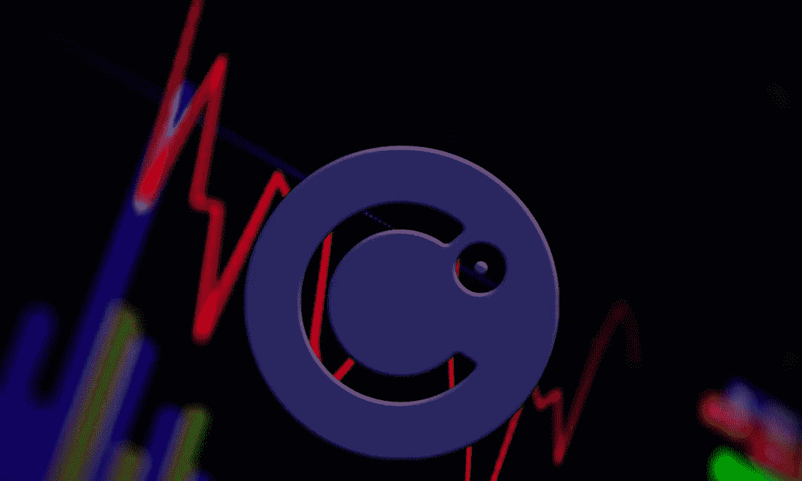
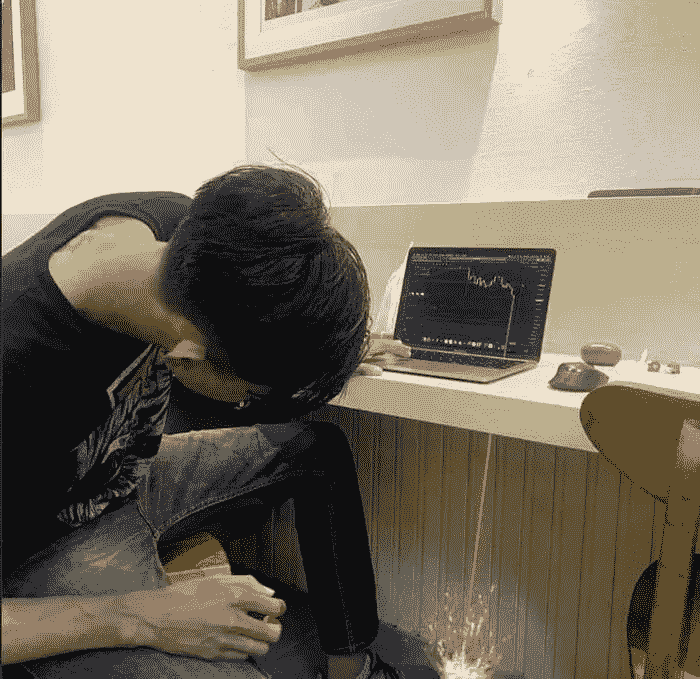

# Voyager 和 Celsius 申请破产；下一个是谁？

> 原文：<https://medium.com/coinmonks/voyager-and-celsius-file-for-bankruptcy-who-is-next-17bdedddb49?source=collection_archive---------30----------------------->

[Source](https://www.pymnts.com/cryptocurrency/2022/celsius-hires-restructuring-experts-ahead-of-possible-bankruptcy/)

在体育场冠名权和超级碗广告上投入了数百万美元之后，你可能会认为加密货币行业会享受到一些收益，不管这种收益有多短暂。我猜每个人都急于卖掉他们从那些随机赠品中得到的讨厌的虚拟硬币。不管怎样，当国际米兰和 FTX 联手提出这个问题时，我没有答案…我想我现在知道了。就像其他加密货币投资者一样；“我们在”，熊市。

由恶劣的全球经济条件引发，因数十亿美元的加密货币项目而恶化；我们回到了 2017 年的一些数字。一个比特币 19000 美元。我们友好而“有趣”的影响者说，我们不会再看到比特币低于 30，000 美元。我希望他们是错的；比特币似乎不准备在短期内重返 30，000 美元。从正确的意义上说，他们仍然是对的……尽管我相信他们不是这个意思。

[事情沿着](https://blog.blockmagnates.com/2022-bear-market-the-big-players-ruined-the-game-4a57d877db1f)线‘破裂’了；在一系列数百万美元的救助和快速抽油泵之后；感觉第一次惊吓只是擦伤，很容易活下来。Celsius 偿还了贷款，比特币的清算点降至 0 美元。不管他们从救助计划中获得了多少，这一举措都是合理的。但是还不够…

随着加密经纪项目-航海家，摄氏度已申请第 11 章破产。没有理由惊慌；第 11 章破产甚至没有听起来那么糟糕，除非你被这个项目欠了债。如果是的话，我也不知道会有多糟糕。每欠一美元就要一美分？合理，考虑到你的债务人已经公开宣称他们‘没有你的钱’。嘻哈主题的好莱坞电影知道如何最好地表达这些话。

与你可能期望的相反；宣布破产后，Voyager token 的价格从 0.15 美元涨到了 0.8 美元。如果你曾经想要一个真实的密码空间的非理性的测量，在那里，你有你的答案。在撰写本文时，它的交易价格低于 0.5 美元几美分。但如果你抓住了那个混蛋，然后考虑申请破产，好消息。

加密货币营销和运营战术向来简单；“尽可能奢侈”。这些策略从第一天起就奏效了，从拉兹洛·汉耶茨花 10，000 比特币买了两个“大”披萨，并做出这一历史性宣布的那一天开始。接下来的一切都是简单的大数字和引人注目的滑稽动作。包括流行的 1000X。就像一个绝望的注意力寻求者一样，秘密空间一直是一个诱人的游戏领域，就像给那些带着一包爆米花观看超级碗的家庭赠送数千美元一样诱人。

每个项目都玩同样的游戏；美国名人带走了超过他们净值的钱来推广 meme 币，这些币通常以滑稽的闹剧结尾。SouljaBoy 在 NFT 的涉猎仍在继续。著名的 LimeWire 将作为 NFT 市场卷土重来。你猜对了；广告视频也是一个被动的“Crank dat”广告。

财务和会计中的常规规则；大笔支出也会带来严重后果，尤其是当他们挥霍无度的时候。我们正在看这出戏。事情目前处于裁员和价格暴跌的阶段。本周揭示了下一个阶段——破产；航海家号和摄氏号领路。谁将加入联盟？不需要任何人来回答，但如果另一个相关的加密货币项目遵循这条路线，这不会是一个惊喜。完全放弃是一种更糟糕的情况，但是我们已经习惯了大大小小的项目以最有趣的方式说“再见”。

我希望看到一切回归正常，包括那些奢侈的消费。我很想看到流行明星制作一些“罕见的幕后”照片的 NFT，并在 USDT 获得报酬。同样的故事一遍又一遍。一轮充斥着荒唐支出的牛市，接着是一个模糊的熊市。就像加密货币一样，web3 职业同样不稳定。如果有什么教训的话，这就是了。

[跟进加密货币脚本](https://linktr.ee/cryptoscripts),通过全面的文章和重要提示了解加密领域。
[雇佣自由撰稿人](https://www.upwork.com/services/product/comprehensive-seo-optimized-contents-for-your-project-1514476886622093312?ref=project_share&tier=0)

> 交易新手？尝试[加密交易机器人](/coinmonks/crypto-trading-bot-c2ffce8acb2a)或[复制交易](/coinmonks/top-10-crypto-copy-trading-platforms-for-beginners-d0c37c7d698c)