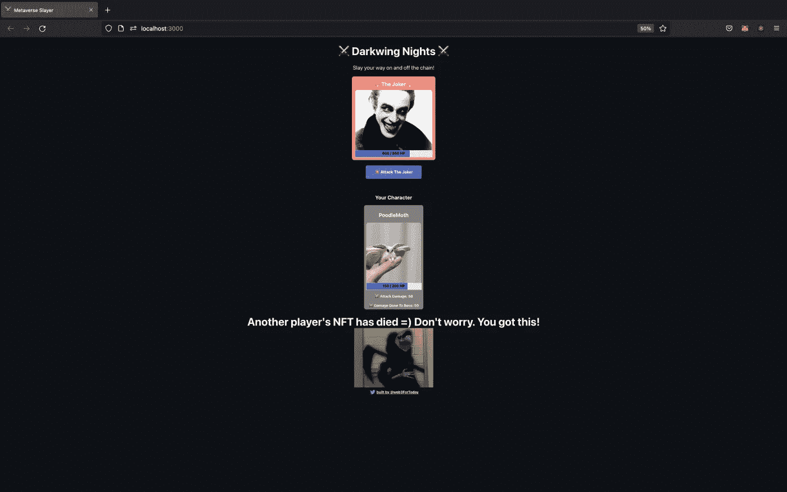

# VRN，这太随意了。嗯嗯。其实不是。

> 原文：<https://medium.com/coinmonks/vrn-thats-so-random-mmmm-actually-it-s-not-b404605cc0b5?source=collection_archive---------21----------------------->

我制作了这个非常酷的游戏，现在我正在添加一些额外的功能，使游戏更具互动性。这是一个迷你回合制的 NFT(不可替换的代币)游戏，你可以铸造一个你最喜欢的角色的 NFT 并与老板战斗。每个 NFT 都有相关的属性，比如生命值，攻击伤害，造成的伤害。当他们进入战斗时，NFT 的属性改变了，这意味着我们必须创建一个到以太坊区块链(确切地说是 Goerli Testnet)的事务来完成这个任务。为什么？每当您更改区块链的状态时，您都需要支付交易费，以便交易通过网络验证并添加到区块链中。幸运的是，我们在歌利测试网上，所以我们向歌利付费，你可以从这样的水龙头上免费获得:[https://goerlifaucet.com/](https://goerlifaucet.com/)或者:[https://faucets.chain.link/](https://faucets.chain.link/)

如果你对 web3 和它的精神气质感兴趣，试试 Goerli 的工作证明水龙头，在那里你可以做一些挖掘工作，真正获得你的 Goerli:【https://goerli-faucet.pk910.de/】T4 我真的很喜欢这个水龙头，因为你每天获得多少 goerlie 的唯一限制是你愿意挖掘多长时间。另外，这让我觉得自己像个网络流氓=)

我增加了多人游戏的功能，让游戏更流行。如果两个玩家同时玩游戏，他们将能够看到对方的 NFT，以及他们攻击时的属性变化。没有任何 UX/用户界面让用户知道他们的 NFT 已经死了，如果另一个用户的 NFT 已经死了，或者如果他们杀了老板。我添加了这三个来帮助用户导航。这款游戏在功能上感觉好多了，更像是我可以向朋友和潜在雇主炫耀的东西。因为每个角色和老板的攻击伤害和生命值都是固定的，所以游戏会有点单调。这场比赛没有机会因素。

PoodleMoth and DogSquirrelMan a match made in Heaven =)

At least it wasn’t us…

输入链环和 VRF。VRF 链(可验证的随机函数)是一个可证明的公平和可验证的数字生成器(RNG ),它使智能合约能够访问随机值，而不会损害安全性和可用性。Chainlink VRF 生成一个或多个随机值和如何确定这些值的加密证明，然后在任何消费应用程序可以使用该证明之前，在链上发布和验证该证明。该流程确保结果不会被任何单个实体篡改，例如 oracle 运营商、矿工、智能合同开发商。

什么是 Chainlink？混合智能合约的区块链甲骨文:[https://chain.link/](https://chain.link/)

请用英语说。区块链本质上是确定性的，这意味着事务每次执行时都会产生相同的结果，而不管事务是由谁在哪里执行的。这种简单性是区块链安全性和可靠性的关键，因为网络只需使用其分类帐中已存储的数据，就一组非常基本的二元(对/错)问题达成共识。这些问题包括:公钥持有人是否用他们相应的私钥签署了交易，公共地址是否有足够的资金来支付其交易，以及交易类型在特定智能合同内是否有效。可靠性智能契约(想想编码中的类)完全按照编写的那样执行，具有比传统系统高得多的确定性。

如果在 Solidity(用于实现智能合约的语言)中有一个本机随机数生成器，每个矿工都会为相同的代码执行产生随机数，每个人的执行结果都不同，这使得不可能达成共识。出于这个原因，区块链的性质决定了智能合约中不会有本地随机数生成器。

由于区块链的确定性，引入真实世界的数据(如价格信息)会带来巨大的问题，因为数据的价值会随着数据来源的不同而变化。鉴于区块链的这一特点，我们需要确定 oracle 返回的信息是可信的，因为事务是不可撤消的。例如，如果我在以太坊赌博 dapp(去中心化应用程序)上打赌乔·拜登将赢得 2020 年美国总统选举，我希望确保我信任这一信息的来源。不管你的政治观点如何，如果我们依赖一家新闻机构或 API 作为答案的来源，这将决定这场赌博的结果，这是有问题的。为什么？因为一旦外链信息(谁赢得了选举？)出现在链上时，智能合约将以确定的方式执行其逻辑。因此，如果我们所依赖的消息来源称唐纳德·特朗普赢了，那么相关的逻辑将立即启动，即押注唐纳德·特朗普的人将获得报酬。鉴于区块链的运作方式，这笔交易将无法撤销。

这个例子是有帮助的，因为有一段时间关于谁赢得选举存在不确定性。如果依靠甲骨文公司的服务来提供这些信息，我们将有更高的把握向正确的人支付报酬。为什么？又是怎么做到的？因为 Oracles 充当链上 API，所以您可以查询智能合约中的信息(从价格信息到天气报告)。不同的甲骨文有不同的方法来确保准确的数据，但大多数聚集来自多个可靠来源的数据，并有提供准确信息的财务激励。LINK 是 Chainlink 的原生令牌，也是我们为他们的 oracle 服务付费的方式。如果 Chainlink 开始提供不可靠或不诚实的信息，他们的令牌的价值将暴跌。链接令牌遵循 ERC-677 令牌标准，该标准与流行的 ERC-20 令牌向后兼容，并包含一些改进，使得使用 oracles 更便宜、更容易、更高效。如果你不理解，可以看看我以前的博客文章。

好了，回到链环，VRF(可验证的随机函数)，和一个稍微不同的赌博 dapp。如果我有一个简单的赌博 dapp，你可以玩轮盘赌(卡西欧游戏，你可以赌球会落在哪个数字上)，我需要在玩家每次“旋转轮盘”时使用一个随机数。因为区块链是任何人都可以查看的公共账本，所以包含您的随机数函数逻辑的智能合约将对全世界可见，因此有人将入侵您的游戏并总是获胜。进入 chain link VRF——因为随机数是来自一个链外的甲骨文实时我们的赌博 dapp 不能被黑客攻击。这是因为我们信任 Chainlink。我们为什么信任 Chainlink？首先，他们在经济上受到激励来提供准确的信息。想一想——我们用 LINK 支付他们的 Oracle 服务，现在的交易价格是 7.06 美元。如果链接先知提供坏的或恶意的信息，链接的价格将为零。此外，Chainlink 使用一些加密魔法来证明您请求的数字是真正随机的。简单地说，神谕是区块链和现实世界之间的桥梁。

好吧，我肯定有几个问题。首先，我们使用我们生成的随机数，让我游戏中的 NFT 角色有 20%的几率暴击。第二，是的，VRF 链对于一个没有任何赌注的游戏来说可能有点过分，也就是说，你不能赢得任何东西，更不用说任何有价值的东西了。因此，鉴于这种现实，我本可以使用更简单的方法，但我没有这样做，因为我想练习一下 VRF 链的实现。此外，如果我制作任何涉及真钱的游戏，我使用 Chainlink VRF 是非常重要的，因为正如你所记得的，区块链是一个任何人都可以阅读的公共账本。如果我使用一些聪明的哈希算法和随机函数，一些恶意的行为者可以读取我的代码，进行计算，并利用我的游戏来赚钱。

除了赌博应用和区块链游戏，Chainlink VRF 还有其他功能。Chainlink VRF 已被用于为 NFT 分配随机属性，为所有者提供适当的证据，证明他们的 NFT 资产是使用防篡改随机性创建的。VRF 链也可以用来确保公平时，做随机 NFT 下降到社区成员。此外，它还可用于随机分配职责和资源(为一个案件分配法官)以及为共识机制选择代表性样本。

我要在随机性上多花点时间。真正的随机性是不可能的(抱歉 Chainlink)。如果你问你的电脑要一个随机数，它会做一些事情，比如把你买电脑后每天下午 1:50 在键盘上按“F”的次数，加上斐济的温度，乘以电脑风扇的速度等等。你的计算机生成的数字在科学上被称为伪随机。为什么？因为它不是随机的…

你呢？想出一个随机数。我赌 100 美元，它肯定比这个小:

115792089237316195423570985008687907853269984665640564039457584007913129639935

如果你想知道这是 Solidity 能处理的最大数量，它看起来是这样的:2 * * 256–1

快速思考实验如果轮盘赌轮盘在赌场被打破了，你需要成为当晚的随机来源，你所要做的就是整晚在 1-36 之间选择一个数字(轮盘赌 0 和 00 中还有两个#但是让我们保持简单)。牌桌上有很多高赌注的赌徒，你不能偏爱某个数字或忽视某个数字。你能做到吗？

零机会。计算机可能能够以一种公平的方式静态随机分配 1-36(想想赌博机器),但它遵循一种算法，这种“随机性”只在赌徒对算法不知情的情况下起作用。赌博机器由监督和管理的中央机构(赌博委员会，Harrah's Casino)拥有、维护和操作。我们赌徒信任当局。这就是它的工作方式。

有了神谕和区块链，我们人民才相信法典！我们人民信任激励机制。

大卫·伊格尔曼写了一本不可思议的书《隐姓埋名:大脑的秘密生活》,他从意识和大脑的科学背景出发写了详细的内容。这本书的一个主要观点是，我们并不像我们认为的那样对自己的决策负责。有些实验要求你选择一个数字，在你“决定”选择哪个数字之前，你的大脑已经决定了这个数字。

那随机性从何而来？想想宇宙。我们太阳系中铁的重量，乘以此刻天空中飞机的数量，除以一个月大前死亡的小猫数量，乘以你刷牙的次数。哪个部分是随机的？比方说，我们确实可以访问所有这些数字，每次我们玩赌博游戏时，都会有一些东西喊出一堆废话，然后某个程序把这些数字加起来。这将是相当随机的，但我们会喜欢我们所说的“随机”的东西。此外，如果我们是无所不能的，并且能够访问曾经发生过的所有过去的事情(想想看，你可以记录永恒，而不是记录你最喜欢的节目),我们将会看到，由于物理决定性的力量和所有物质的起始位置，铁在我们的宇宙中的重量达到了目前的水平。那些活不过一个月的小猫其实也很容易被挑选出来。在这个博客的制作过程中没有猫受伤=)

世界是决定论的。我们像针一样精确地知道一个特定的星球在未来 207 年的位置。物质宇宙中的一切都遵循规律和模式。我们可能无法预测 1000 个弹珠如何碰撞和相互作用，但这并不意味着它们做任何随机的事情，而是我们的观察能力有限。我读过的最类似于随机性的东西是量子理论，并且(1)我不完全理解它(2)我认为在未来我们会意识到它不是随机的，但在这个时候超出了我们的理解。

因此，链环 VRF 给我们一个可验证的随机数为所有密集的目的。这意味着它不能被黑客或游戏。想到公平和公正的随机性，当你想到链环 VRF。

好极了。明白了！但是链环 VRF 是如何计算一个随机数的呢？VRF 的输入通常包括一个公钥/私钥对(我的公钥看起来像这个 0x 1 ce 750 e 83 b 91d 00 b 6 CCE 3 AE 6 febe 71420 feaa 5 ff，我的私钥不用于共享，但看起来很相似)和一个种子(想想从数字 224 到字符串 CatwalkerForLife 的任何东西)。

这些值被传递到 VRF，在那里私钥和种子被用来生成一个随机数。重要的是，证明的生成使得函数可验证，而隐藏私钥确保了数字不可预测。我使用的是 VRF 版本 2，不需要输入种子短语，所以我认为版本 2 使用的是在满足随机性要求时添加到区块链中的块哈希和块随机数。

这项服务可能看起来微不足道，但对于依赖不可预测结果的任务，如 NFTs、DeFi、区块链游戏或选择共识机制的代表性样本，拥有一个公平且可验证的随机性来源尤为重要。感谢阅读！如果你有任何问题，请在评论中发表。

> 交易新手？试试[加密交易机器人](/coinmonks/crypto-trading-bot-c2ffce8acb2a)或者[复制交易](/coinmonks/top-10-crypto-copy-trading-platforms-for-beginners-d0c37c7d698c)