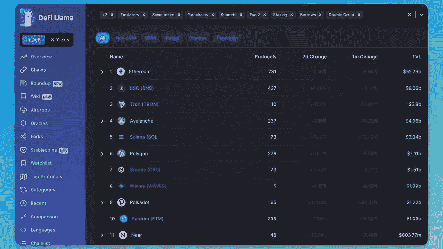

# Vtrading | 10 个必备的加密研究工具

> 原文：<https://medium.com/coinmonks/vtrading-10-must-have-cryptocurrency-research-tools-fd7f76e1bc21?source=collection_archive---------24----------------------->

DeFi 网站 TheDeFiEdge 的创始人 Edgy 最近分享了他日常使用的 10 个必备加密货币研究工具。

1.  **Uniwhale(分析仪表板)**

“我用它来跟踪不同第 1 层的网桥活动。我可以使用 UniWhale 来查看存款+取款，并对第 1 层趋势有更全面的了解。”

**2。沙丘分析(分析仪表板)**

“Dune 让您可以将不同的指标可视化为易于理解的图表。从 DeFi 使用到 dapp 专用仪表板，应有尽有。我在 GMX 投资，发现了一个可以帮助我看到重要指标的仪表盘。”

**3。加密恐慌(新闻聚合器)**

“这是我获得大部分加密新闻的地方(Twitter 之外)。把它想象成 Reddit 的加密新闻。新闻的数量可能是压倒性的。我按“重要”排序，以帮助从噪音中过滤信号。

**4。圣迪姆(加密情报)**

“大多数人看价格图表。就是这样。Sanbase 允许你把价格和其他行为结合起来。可以看到价格+开发活跃度+社会趋势。(以及许多其他指标)”

**5。南森(论连锁分析)**

“最好的特点是“聪明的钱”——这些档案已经证明了踢屁股的历史。(比如基金和先行者)用它来看看聪明的资金在买什么，并在 YouTubers 开始制作视频之前进入。”

**6。梅萨里(市场情报)**

“我会把梅萨里描述成一把瑞士军刀。

*   图表
*   价格数据
*   研究报告
*   社区筛选员

Crypto 中最超值的产品之一，每月 25 美元。"

**7。令牌终端(加密货币金融数据)**

“人们厌倦了通货膨胀代币和印钞。他们希望看到真正的收入产生。用 Token 终端看看哪个区块链和 dapps 在赚钱。”

**8。恐惧&贪婪指数(情绪指标)**

“你的 Twitter feed 很棘手。如果你跟随着一群多头，他们总是很乐观。我查看恐惧和贪婪指数，以便更好地了解市场的感受。”

**9。DeFiLlama (DeFi 分析)**

“我非常喜欢 Alt layer 1—DeFiLlama 帮助我通过总价值锁定指标对它们进行了比较。对我来说，DeFillama 最大的用途是帮助我在每个生态系统中找到隐藏的宝石。”

**10。DexScreener(实时价格图表)**

“我用它来设定我的投资组合的观察列表，并创建价格警报。想想一个大事件。一个有影响力的人推销一个项目，或者有一个漏洞。你可以用这个工具看到实时的买卖动作。”

以及 **Glassnode** 、**交易观点**、 **Coingecko** 、 **IntotheBlock** 等等。

大多数时候你不需要太多的工具。你只需要使用你手边的工具。研究是你像其他人一样获得优势的方式，看同样的内容，看同样的视频，并不会让你比其他人更好。力量来自艰苦的研究和思考。

> 交易新手？试试[加密交易机器人](/coinmonks/crypto-trading-bot-c2ffce8acb2a)或者[复制交易](/coinmonks/top-10-crypto-copy-trading-platforms-for-beginners-d0c37c7d698c)