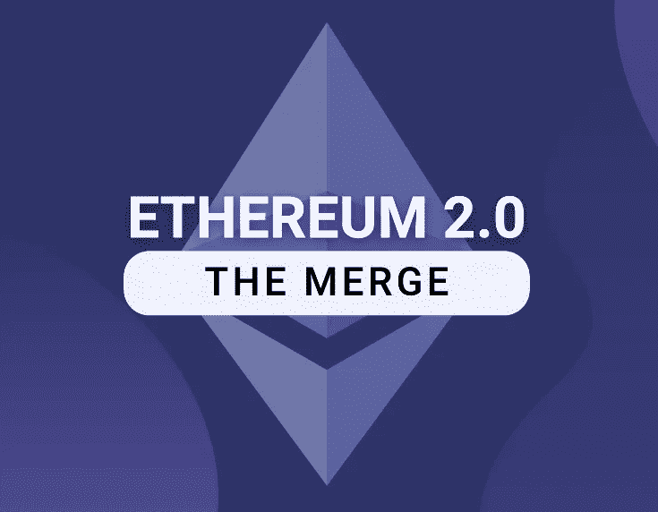

# 支持还是反对？以太坊大合并的两面

> 原文：<https://medium.com/coinmonks/vtrading-for-or-against-the-two-sides-of-ethereums-great-merger-16bb6d224cf2?source=collection_archive---------33----------------------->

几经推迟，以太坊合并计划预计在 2022 年第三季度/第四季度进行。然而，伴随着合并而来的是越来越强烈的要求硬分叉的呼声。

目前已经有一些交易所和项目方做出了自己的选择，对以太坊的硬分叉发表了意见。投资者还需要辨别这些是炒作还是信仰，是保护用户还是敲竹杠的借口。

# 支持者—稳定币

## 极限

8 月 9 日，USDT 的发行人 Tether 正式确认支持以太坊即将进行的合并升级，并切换到基于 PoS 共识机制的区块链。并表示会密切关注相关进展和准备情况，会按照官方的时间表支持 PoS 以太坊。泰瑟认为，向保护区的过渡不应被武器化，以免在生态系统内造成混乱和伤害。ETH 的平稳过渡对于 DeFi 生态系统及其平台(包括使用 Tether 的平台)的长期健康至关重要。

## 圆

8 月 9 日，Circle 宣布，在以太坊合并完成后，将只支持以太坊 PoS 链。预计 USDC 的网上功能或全自动发行和赎回服务将不会中断。

Circle 表示，其测试环境与 Goerli 以太坊测试网相连，并将在未来几天密切关注其与 Prater 的合并。虽然 Circle 没有推测以太坊 mainnet 合并后出现分叉的可能性，但 USDC 作为以太坊资产只能作为有效的“版本”存在。如前所述，Circle 唯一的计划是完全支持升级后的以太坊 PoS 链。

## Frax 金融公司

8 月 4 日，算法 stablecoin Frax Finance 的联合创始人萨姆·卡泽米安(Sam Kazemian)提议，在以太坊从 PoW 转向 PoS 后，只在 PoSETH 上支持 Frax 赎回，而不在任何 PoW 替代 fork (ETHPoW)上支持。

# 支持者——交换

## FTX

8 月 9 日，FTX 表示，在合并前没有暂停或结算 ETH 期货的计划，并将尽最大努力支持其后续交易。FTX 的以太坊期货和永续合约(ETH-0930、ETH-1230、ETH-PERP)将在合并后追踪以太坊网络的股权证明。

## Bitfinex

8 月 9 日，Bitfinex 发布公告，明确表示支持以太坊合并。Bitifnex 表示，在此次升级期间，它不打算暂停任何交易活动。此外，ETH/USDt、ETH/BTC 和 ETH/EURt 永久合约的交易将照常进行，并在实施后遵循 PoS 共识机制。

## 德里比特

加密衍生品交易所 Deribit 近日发布了关于以太坊合并硬分叉的政策公告，称所有工具的 Deribit 结算将在 ETH 基金会(即 PoS 或 ETH2)支持的链条上进行。如果分叉令牌的价值大于 ETH PoS 的 0.25%，并且新链稳定且正常运行，Deribit 将向用户提供这些分叉令牌。但是，如果有新令牌，新令牌也不会被视为保证金。

## OKX

8 月 8 日，OKX 首席执行官 Jay Hao 在社交媒体上表示，OKX 正在积极关注和支持以太坊的合并。这次网络升级可能会有以太坊的硬分叉，OKX 会根据需求评估推出硬分叉令牌。

# 支持者——钱包

## 德班克

8 月 9 日，一站式 DeFi wallet DeBank 在其官方推特上声明，硬分叉将给整个 Web3 生态系统带来巨大的灾难。因此，在过渡到以太坊的 PoS 合并期间，DeBank 和所有产品都不会支持任何分叉链，包括 Web3 用户平台 DeBankDeFi、非托管钱包 Rabby 和 Web3 开发者服务 DeBank Open API。

## 阿尔根特

8 月 8 日，智能合约钱包 Argent 官方表示，最近收到了一些关于合并后潜在 PoW fork 的问题。Argent 对以太坊合并感到非常兴奋，尤其是在能源消耗方面节省了 99%。Argent 表示，它没有计划支持任何叉子。

# 支持者——项目

## Aave

8 月 9 日，Aave 社区发布了一份技术分析，解释了为什么即将到来的以太坊 PoS 合并(The Merge)不会影响 Aave 的系统，为 Aave 社区提出的“新提案:只有合并后的 PoS 链”提供支持。从技术和运营角度来看，与流动性协议相关的智能合约在合并后不会受到影响，Aave 仅受到链上治理机制和 Aave 用户界面持续时间的轻微影响。分析还指出，由于缺乏甲骨文和相关的流动性问题，Aave 无法在任何 PoW 链上运行。Aave 只承认 PoS 链为主链。如果任何用户决定在任何 fork 上直接与 Aave 智能合约交互，这是他们的责任。

## 链环

8 月 8 日，甲骨文协议 Chainlink 在其官网发文称，在以太坊合并期间及之后，Chainlink 协议及其服务将继续在以太坊上运行，不支持以太坊网络的 fork，包括 PoW forks。，这与以太坊社区的决定是一致的。

对于围绕合并事件不确定其迁移策略的以太坊开发者和 DApp 团队，建议暂停智能合约操作，以避免不可预见的事件，并有助于保护用户。

## NFTScan

8 月 9 日，NFTScan 官方宣布，以太坊合并期间，NFTScan 浏览器和 OPEN API 服务将继续在以太坊上运行，不支持以太坊网络的 PoW fork。作为 Web3 数据基础设施，NFTScan 将与以太坊开发者社区保持一致，继续为开发者提供专业的 NFT API 服务，并为区块链用户提供便捷的 NFT 数据搜索和查询服务。

# 支持者——投资者

## DCG

8 月 8 日，DCG 首席执行官巴里·西尔伯特(Barry Silbert)在其社交网站上就以太坊叉子表示，“我们完全支持以太坊 PoS，不支持任何以太坊 PoW。”

# 反交易所

## Gate.io

Gate.io 是目前公开支持以太坊分叉的交易所之一。日前，Gate.io 发布公告称，8 月 9 日至成功升级 ETH2.0 期间，将开放 ETH 转 ETHS 或 ETHW 的功能，用户可以 1:1 的比例将 ETH 兑换成 ETHS 或 ETHW。其中，ETHS 代表新 PoS(股权证明)链的令牌；分叉的硬币“糖果”ETHW 代表了可能继续存在的 PoW(工作证明)链的令牌。

与此同时，Gate.io 宣布，“如果硬叉失败，ETHS 将按照 1:1 的比例自动转换到升级后的 ETH。同时，所有与 ETHS 和 ETHW 相关的交易市场都将被摘牌。”

## 比特外汇

8 月 8 日，BitForex 将以对用户资产负责的态度，全力支持以太坊潜在的硬分叉。如果硬分叉成功，BitForex 将支持以太坊持有者获得空投。

## MEXC

8 月 5 日，MEXC 发布公告称，将支持以太坊及其潜在硬分叉的升级。如果成功，升级后可以创建两个并行的区块链。升级完成后，MEXC 上的所有 ETH 持有人将以 1:1 的比例获得分叉资产。

## 波洛涅克斯

8 月 4 日，TRON 加密交易平台 Poloniex 宣布将支持 ETH 2.0 升级和潜在 fork，并将于 8 月 8 日推出两款潜在 fork 期货代币及相关交易市场。Poloniex 保留修改或更改本公告的权利(如提前将相关交易对退市)，以适应最新的市场趋势。

## 比特梅克斯

BitMEX 没有对以太坊分叉做出明确表态，但很快推出了 ETHPOW 期货产品。8 月 8 日，BitMEX 宣布将于 9 日推出 ETHPoW 期货合约 ETHPOWZ22，以 USDT (ERC-20)为保证金，最大杠杆为 2 倍。据悉，ETHPOWZ22 期货合约已经推出。

此外，在宝支持的分叉链 EthereumPow 的官网上，我们还发现了 Hiveon、Flexpool、2Miners、F2pool、Poolin 等矿池的存在。其中 2Miners 在今年 6 月的一篇公开文章中已经明确表示选择 PoS 而不是 PoW 是以太坊最大的错误。