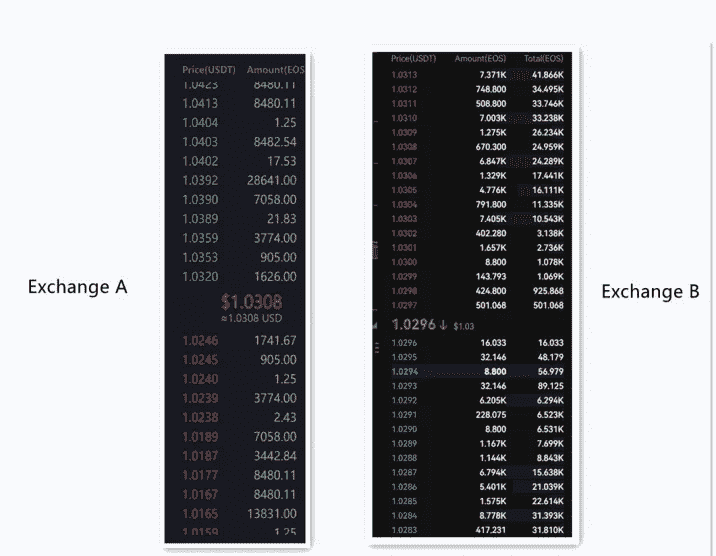
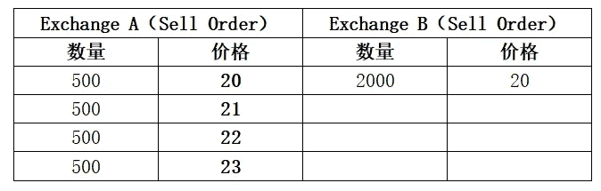

# Vtrading |什么是市场深度？如何衡量市场深度？

> 原文：<https://medium.com/coinmonks/vtrading-what-is-market-depth-how-to-measure-market-depth-5c46f7bf99cc?source=collection_archive---------32----------------------->

当我们选择加密货币交易所进行交易时，首先要考虑的是安全性和市场深度。一般来说，全球排名靠前的密码交易所都符合这两个特征，即安全性和市场深度。

安全性很容易理解，不用多说。那么什么是市场深度呢？如何衡量市场深度？大家一起讨论一下吧。

# **1。什么是市场深度？**

市场深度指的是市场承受大规模交易而货币价格不发生重大波动的能力。谈市场深度，总是指某种货币在某个交易所的市场深度。

我们需要从挂单量和差价这两个指标来了解市场深度。大量的挂单和相邻挂单之间较小的价格差异表明市场深度较好。

比如上图，左边是交易所 A，右边是交易所 B，显然 EOS 在 B 平台的市场深度是不错的。说明在交易所 B 中，EOS 委托挂单量大，相邻挂单价格差比较小，即挂单比较密集。所以在交易所 B 买的时候不会有大的拉升，卖的时候也不会有大的砸盘。易买易卖。

# **2。如何衡量市场深度？**

一般用两个指标来衡量平台的市场深度。一个是价差，一个是挂单量。

价差是指两个相邻订单之间的价格差距。价差越小，挂单价格越密集。这意味着实际的买卖价格更接近真实的市场价格。

挂单量是指反映市场承载能力的挂单数量。挂单量越大，市场深度越好，越能满足大单的交易需求。

> 交易新手？试试[密码交易机器人](/coinmonks/crypto-trading-bot-c2ffce8acb2a)或[复制交易](/coinmonks/top-10-crypto-copy-trading-platforms-for-beginners-d0c37c7d698c)

# **3。市场深度有什么用？**

交易加密货币时，尽量在市场深度好的平台交易。它有两个优点:交易时货币价格相对更稳定，交易成本也更低。

## 01 在交易过程中，货币价格相对更稳定

比如你想买 10000 只 EOS，如下图所示，比较在交易所 A 和交易所 b 完成交易后对 EOS 价格的影响。

在上图中，很明显交易所 B 的市场深度更好。

如果想在交易所 A 快速买入 10000 份 EOS，需要在卖出 1 价、卖出 2 价、卖出 3 价等价位买入。直到你买够 10000 台 EOS。由于市场深度不佳，交易完成后 EOS 价格被推高。

但如果在交易所 B 快速买入 300 只 EOS，只能用 2.8209 的卖出价完成交易(因为这个价位的挂单量是 303 只，大于买入量 300 只)。交易完成后，EOS 价格稳定，没有被推高。

## 02 降低交易成本

举个例子:下图是交易所 A 和交易所 b 的卖单市场深度，如果 Jack 想快速完成 2000 EOS 的交易，我们比较一下在两个交易所买入 2000 EOS 的交易成本。

要在交易所 A 交易:

杰克需要以 20 的价格买入 500，以 21 的价格买入 500，以此类推，根据交易深度继续买入。

Jack 的总费用是:20500+21500+22500+23500 = 43000(比 Exchange B 贵 3000)。

交易结束后，交易所 A 的 EOS 价格被推高至 23。

在交易所 B 交易:

杰克以 20 的价格直接购买 2000，杰克的总成本为:20*2000=40000。

交易完成后，交易所 B 的 EOS 价格仍为 20。所以在市场深度好的交易所交易，成本会更低。

总之，我们在进行交易的时候，尽量选择市场深度好的交易所，不仅可以快速完成交易，而且成本低，不会对市场造成太大的冲击。

Vtrading 是一个加密交易平台，为每位交易者提供硬币交易策略，与顶级交易所币安、OKEX 和火币网合作。为了让您的交易更顺利，Vtrading 随时为您服务。