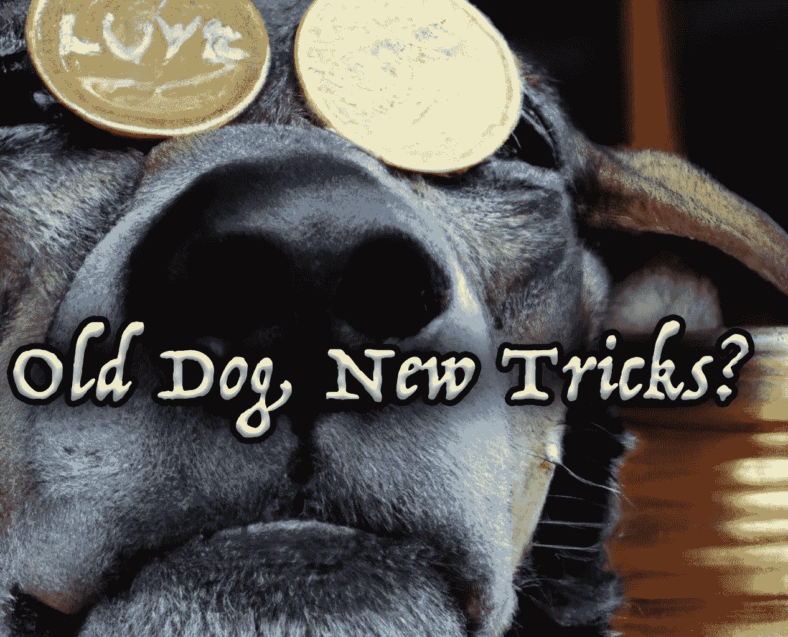

# 等等，比特币现在做 NFTs 了？

> 原文：<https://medium.com/coinmonks/wait-bitcoin-does-nfts-now-50adae6d7048?source=collection_archive---------13----------------------->

比特币通常被认为是 OG 密码，但以一种非功能性、无聊的方式。事实证明，比特币比大多数人知道的更有用，而且它就在我们的眼皮底下，已经有一段时间了。

交易对手是一种建立在比特币区块链之上的协议，旨在支持创建新的金融工具和分散式应用。这是第一个利用…