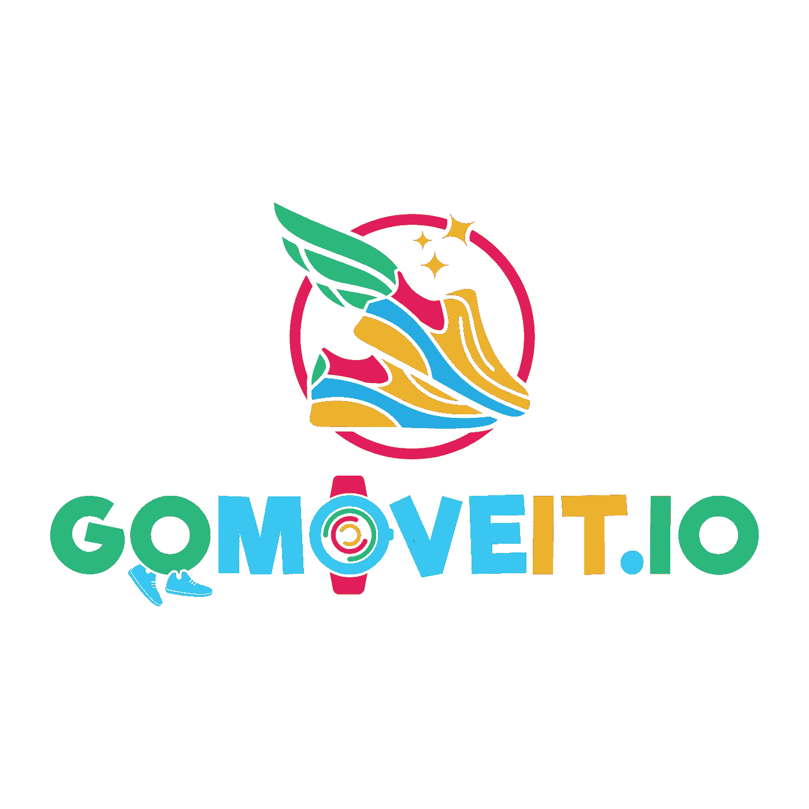

# 步行可以让你赚钱|去移动它|移动 2 赚取项目上的阿尔格兰德区块链

> 原文：<https://medium.com/coinmonks/walking-can-get-you-money-go-move-it-move-2-earn-project-on-algorand-blockchain-b68fbfc4f0b4?source=collection_archive---------26----------------------->

GoMoveIt Logo

千里之行，总要始于足下，只有永不止步的人，才会真正达到目的。

为了对一个项目的有效性有一个好的第一印象，至少花两个小时研究这个项目。阅读他们的白皮书、技术说明以及媒体报道等文档，以获得对该项目的不同看法。这些信息将帮助你对这个项目得出一个初步的结论。媒体报道可以让你很好地了解项目的意图。

如果你认为这个项目值得你花时间，花额外的时间调查这个团队的组成、象征经济学、长期愿景、项目阶段和它的投资者。

回到主题，如果步行让你获得金钱或比赛 t 恤和奖牌之外的奖励，那不是很棒吗？你可能已经在使用计步器应用程序来跟踪你的行走。你将无法辞掉你的日常工作，但为你的努力挣几块钱也不错。

这应该能帮你克服走路的借口。无论你是一个健身狂热者还是不喜欢多走路，如果你能得到一些奖励，你都会喜欢的。散步是我们生活中必不可少的一部分，对健康有很多好处。

它包含在我们的日常生活中，比如跑腿、运动、去朋友家，甚至从一个房间搬到另一个房间。目的是让你感觉更健康更好。不活跃的生活方式会增加患慢性病的风险，并削弱免疫系统。因此，让你的腿尽可能多地活动和走动是非常重要的。每一步的收益都是蛋糕上的樱桃。

今天，我们想向您介绍 GoMoveit，这是一款基于的应用程序，旨在为人们提供目标，并奖励他们实现目标。GoMoveit token 建造在阿尔格兰德区块链上，它本身将是负碳的，不会增加世界上的污染量。

进一步移动到你感兴趣的部分；你必须知道，这是一个长期目标，而不是短期解决方案，因此该团队表示，GoMoveit 项目是基于帮助用户实现目标所必需的长期愿景。因此，代币经济学不是一个快速致富的计划，而是更像一种投资，用户可以重复使用他们的部分收入来提高他们自己的回报。

这并不意味着用户将永远无法从步行中提取或兑现他们辛苦赚取的代币，而是简单地说，他们将更有动力首先达到他们的最大利润，然后获得更多奖励，确保代币价格的稳定和有机增长。最重要的是，避免泵和转储的情况，这通常意味着一个项目在几个季度内结束。

阿尔格兰德由麻省理工学院教授希尔维奥·米卡利于 2017 年创立。阿尔格兰德测试网于 2019 年 4 月向公众推出，主网于 2019 年 6 月推出。

阿尔格兰德是第一个碳负区块链，2022 年 4 月，它宣布将实施第一个智能合同，通过分配每笔交易费用的一部分来抵消排放，来抵消碳排放。2022 年 5 月，国际足联宣布阿尔格兰德成为其区块链官方合作伙伴。

它旨在解决“区块链三难问题”:即任何区块链系统最多只能拥有三个理想属性中的两个:去中心化、可伸缩性和安全性。

如何购买代币

代币将在 Tinyman 上提供，这是阿尔格兰德区块链的一个分散式交易所。该团队的目标是在更大的交易所上市，但每个交易所都有不同的要求。

你将如何获得奖励

当智能手表用户达到最低每日步数时，他们将获得奖励。如果一个人从每天 5000 步(第一级)开始，每天增加 100 步，那么他需要一个多月的时间才能达到第二级(每天 9000 步)。如果用户一天不能增加 100 步，他们仍然不会离目标太远，这将确保对失败的积极态度。

> 交易新手？试试[加密交易机器人](/coinmonks/crypto-trading-bot-c2ffce8acb2a)或者[复制交易](/coinmonks/top-10-crypto-copy-trading-platforms-for-beginners-d0c37c7d698c)

经验点

一个人越经常地达到他们每天的最低要求，经验点就越多，进步也就越大。拥有良好健康水平和追求更高回报的人可以从第一天开始或者在他们认为自己准备好迎接新挑战的任何时候这样做。另一方面，如果你觉得你的目标太难，回到以前的水平，从你所有的努力中休息一下。

活力

耐力是一个单位，每当你有一个休息日，没有达到你的水平所必需的最低步数，就会充电 1 点。当你第一次在应用程序中注册智能手表时，你将默认获得 100%的耐力，你可以保持的最大耐力是 100。耐力是保护代币价值的关键因素，是反倾销的主要措施。如果所有代币用户可以在任何给定时间简单地出售他们的代币，而没有任何因素来控制出售压力的大小，代币的价格将会一天天地下降，最终变得一文不值。耐力功能将抵消这一点，确保人们能够按照自己的意愿退出，但不能破坏代币经济。从应用程序中撤回赢得的代币需要耐力。

奖励

每个级别都将从特定的奖励池中获得奖励，该奖励池仅用于该特定级别。每个级别的最高奖励上限为 5，000 个代币，然后将在满足每日步骤要求的所有参与者之间分配。这确保了每个人都能得到公平的回报。

NFTs

将会有可供购买的 NFT 来帮助用户达到他们的目标，无论他们可能是什么。有些会提高收益，有些会降低对每日目标的要求。NFT 将在市场上发布，用户可以根据自己的意愿进行交易。

令牌组学

代币的总供应量将为 20 亿，其分配如下:

49%进入奖励池，这是每日奖励、赌注奖励、流动性池回报以及与用户奖励相关的一切的主要来源。

25%将是分配给基金会的代币，其锁定期为三年，在未来三年内每月授予一次。

7.65%将用于在线和线下推广项目，提高项目知名度和社区增长

5%给团队和顾问

13.5%将在社区项目支持、慈善、R&D、生态系统、法律和会计、私人销售和天使投资者之间分配

他们的网站上有一些我觉得至少很有趣的观点。除此之外，他们还推出了一款产品，Gomoveit crypto miner 智能手表，你可以从他们的官方网站订购。

这个小工具的专用视频在我们的频道上，你可以在这里观看。

我很高兴你继续关注我们，不要忘记你可以在 Twitter、抖音、Instagram、Medium 或 telegram 上找到我们，在那里你将总能收到原创和干净的内容。

谢谢你看完这篇文章，直到下一次，管好你的钱！

**|** [**网站**](https://www.b-successful.com/)**|**[**YouTube**](https://www.youtube.com/channel/UCWrfC_w5wVnrOr8jy0ICoDw)**|**[**推特**](https://twitter.com/BSuccessful_)**|**[**insta gram**](https://www.instagram.com/bsuccessful.crypto/)**|**[**电报**](https://t.me/+NQbP3V_iaKQwMDYy) **|** [**脸书**](https://www.facebook.com/Bsuccesful/?_rdc=2&_rdr)

> 加入 Coinmonks [电报频道](https://t.me/coincodecap)和 [Youtube 频道](https://www.youtube.com/c/coinmonks/videos)了解加密交易和投资

# 另外，阅读

*   [比诺莫评论](https://coincodecap.com/binomo-review) | [斯多葛派 vs 3Commas vs TradeSanta](https://coincodecap.com/stoic-vs-3commas-vs-tradesanta)
*   [Capital.com 评论](https://coincodecap.com/capital-com-review) | [香港的加密借贷平台](https://coincodecap.com/crypto-lending-hong-kong)
*   如何在 Uniswap 上交换加密？ | [A-Ads 评论](https://coincodecap.com/a-ads-review)
*   [WazirX vs CoinDCX vs bit bns](/coinmonks/wazirx-vs-coindcx-vs-bitbns-149f4f19a2f1)|[block fi vs coin loan vs Nexo](/coinmonks/blockfi-vs-coinloan-vs-nexo-cb624635230d)
*   [本地比特币评论](/coinmonks/localbitcoins-review-6cc001c6ed56) | [加密货币储蓄账户](https://coincodecap.com/cryptocurrency-savings-accounts)