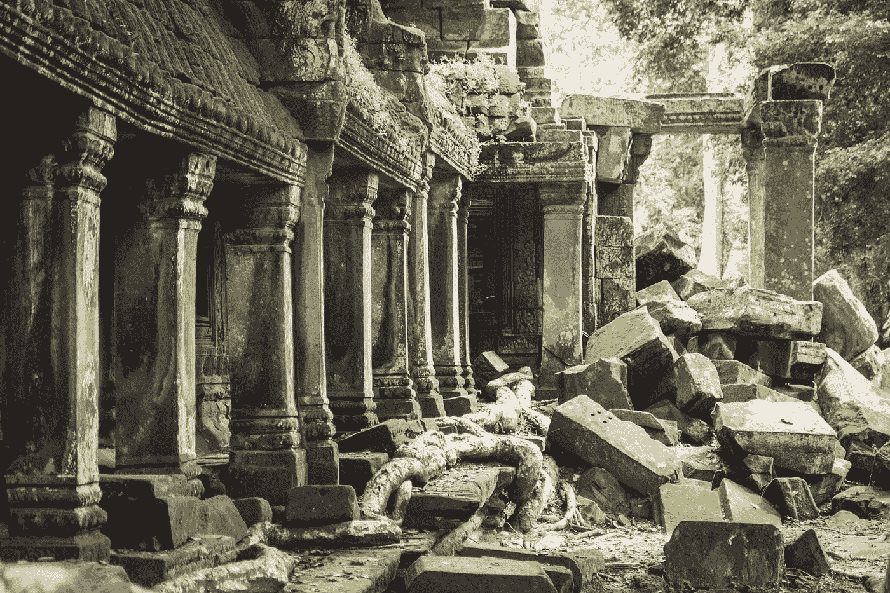
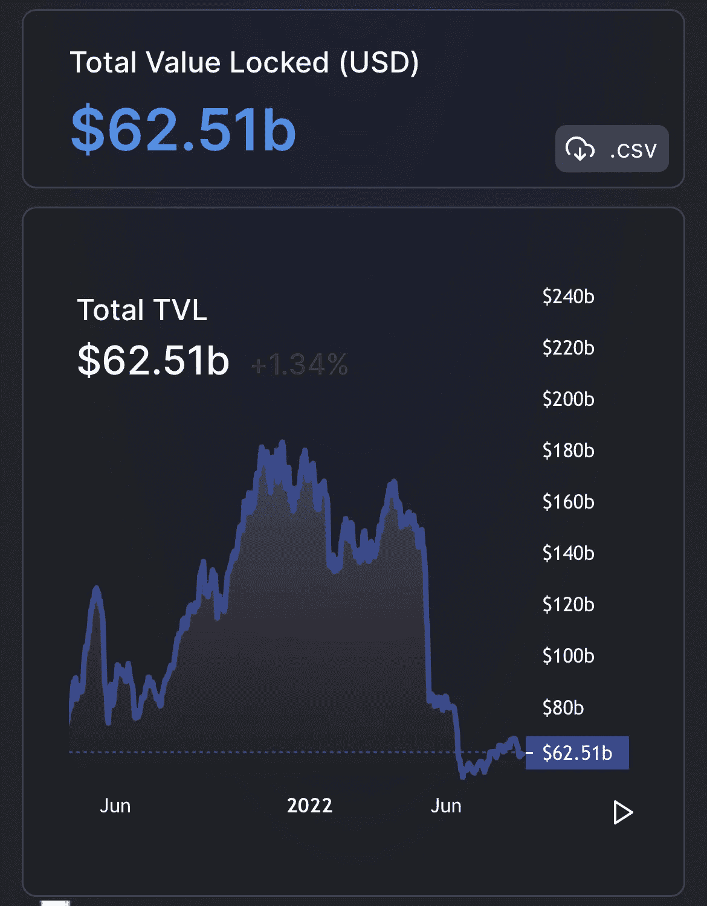
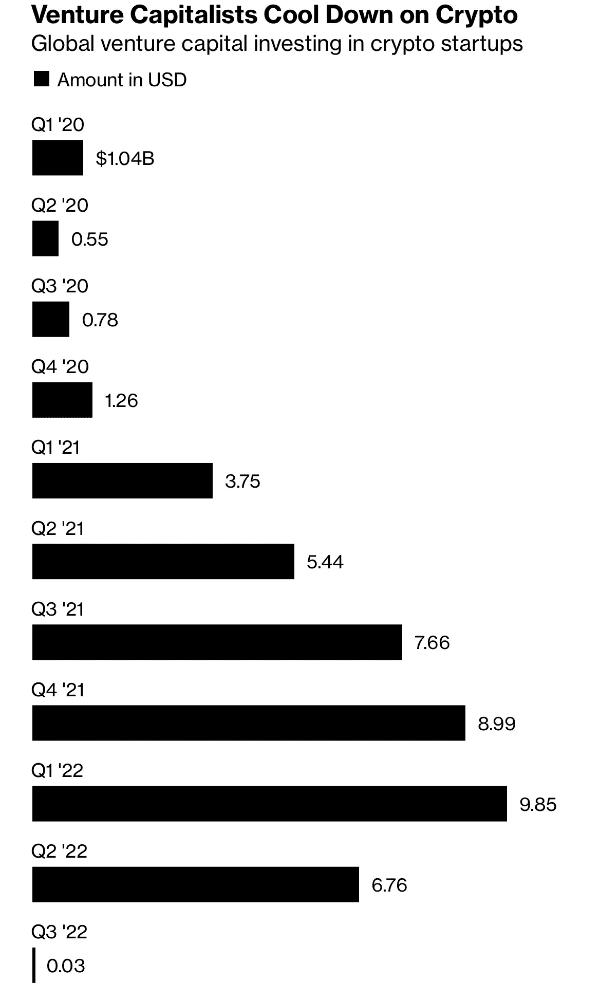

# 行走在地震后的废墟上

> 原文：<https://medium.com/coinmonks/walking-the-ruins-of-crypto-after-the-earthquake-48ca75a4c8ed?source=collection_archive---------32----------------------->

Photo by [Raph Howald](https://unsplash.com/@raphhowald?utm_source=unsplash&utm_medium=referral&utm_content=creditCopyText) on [Unsplash](https://unsplash.com/s/photos/ruins?utm_source=unsplash&utm_medium=referral&utm_content=creditCopyText)

地震后的情况报告如何？嗯，不好看。Anchor 的惨败推翻了 Defi 2.0，这是一个自私的杠杆计划。要明确的是，做一个德根没有错，但是当德根交易成为系统的主要引擎时，对德根的每一个人都变得致命。

事情是这样的。在 4 个月的时间里，DeFi TVL 从 1400 亿美元下降到 630 亿美元，DeFi DEX 的交易额从 5 月 22 日的 1400 亿美元下降到 400 亿美元。曲线。金融，DeFi 流动性战争的风向标，有 59 亿美元的 TVL，大约是它在崩溃前的 25%。就连 NFT 的日成交量也从 2.8 亿美元跌至 800 万美元。

defillama 25Aug22

发展活动安静了很多，但并没有死亡。2021 年和 2022 年初的风投狂潮让公司资金充足，能够维持几个月的可怕流动性。你会听到很多人认为“当前的加密冬天将淘汰快速致富的奸商，为增值的长期项目留出空间”。这绝对是真理。代币仍可用作客户获取的激励手段，尽管其价值比 4 个月前低了约 80%。巨大的上升潜力。但是，公平地说，与此同时，势头已经丧失。

PitchBook, Bloomberg, Jul22

反对势头的阵营是监管者。最近的崩盘给了他们充足的弹药来对抗消费者保护的困境。此外，监管机构已经为取缔不符合 KYC/反洗钱协议准备了很长时间。这可能只是给他们一个机会。还有稳定货币的存在问题，以及美国政府是否应该在其后院发展一种全球货币替代物，即使它目前盯住美元。

最近对 Tornado Cash(一种支持匿名交易和有罪不罚的协议)的打击，让我们对这个问题有了很多想法。此外，有趣的是，看到了对 USDT 和 USDC 的副作用，它们站在锤子(美国的制裁)和艰难的地方(加密顽固分子对自由的渴望)之间。

在玫瑰色的阵营中，BTC 和爱思玛克思一次又一次地为新的开始担保。前者更加坚信，一个廉洁且完全独立的协议将继续巩固 BTC 作为跨境持有、转移和储存价值的另类资产的优势。后者将全部赌注押在与股权证明 ETH 的成功合并上，从而导致(I)符合 ESG 的更绿色流程，(ii)更低的净发行额，以及(iii)锁定 ETH 并限制其流通的更高激励。在需求稳定的假设下，ETH maxis 认为价格会上涨。问题是，DeFi 需求正在减弱，流动性降低不会自动导致价格上涨。

最后，圣杯仍然是对 DeFi 的真实用例的采用。会吗，不会吗？好吧，有很多举措，从将真实世界的资产(RWA)令牌化(如在 Securitize.io 的情况下)，到在 SPV 中使用 RWA 作为抵押品，第一笔损失由承销商承担，高级损失由加密贷款机构承担(如在 MakerDAO 的情况下)。现实世界的信贷正通过 Goldfinch 和 Maple 进军加密领域，并在最近推动了更高的交易量，更不用说补偿其非流动性的更高回报了。

在这一探索中，crypto 将为 TradFi 带来启示，减少中间人，降低成本，提高透明度，积极的风险管理和更高的收益率。实际上，我们在所有这些方面几乎都落后了。

在比特币基地交易需要支付 1.5%的交易费，否则买卖价格会非常高，更不用说 MEV 了，MEV 是领先的另一种说法。管理费也高。中间人很多，因为协议组成已经成为规范。公平地说，crypto 和 TradFi 有相同的中介:发起者/经纪人、承销商/安排者，他们自然会从中分一杯羹。

透明性是为那些可以阅读无穷无尽的代码页的人准备的。让我们面对现实吧，只有 A 和 B 的交易是透明的，而没有 A 和 B 在后台做什么。不要让我开始谈论 Dao 的管理，他们的民主抱负严重不足。Dao 通常由少数关键利益相关者运营，当他们认为合适时，治理就会被取消(例如，Tribe、Solana、Maker……)。

计算能力、透明度和有效市场的结合本应催生出精致的风险管理。最近的加密崩溃证明，事实上每个人和他的妹妹都在裸泳，并在 xls 电子表格上运行风险监控。

就更高的收益率而言……嗯，除非你在 cryptos 每次触底时都进行定向操作，否则没有多少收益率可言。Convex 3 pool 的收益率为 1%，更高风险的 convex MIM + 3Crv 的收益率为 9.3%，而 2 年期美国国债的收益率为 3.37%，亚洲高收益率为 8.11%。多元化充其量只是一个理由，而不是更好的风险调整后的表现。

简而言之，DeFi 距离有效挑战 TradFi 还有很长的路要走，但巨大的机会依然存在。

-协议合成在金融衍生品中有很大用处。

-抵押品清算中的合同指令已被证明比银行的程序性流程高效得多。

- Web3(所有权和自由)与 Pooling(建立自己的风险资产风格)相结合，是使投资组合多样化并使其为特定目的服务的伟大工具。因此，它们是资产管理的未来，为所有人带来了投资民主化的机会。

尽管目前存在缺点，DeFi 的未来是光明的。只是在它上面更加努力地工作。

**关于—**

*360 Advisory LLC 是一家总部位于波士顿的 RIA 公司，管理投资，包括加密*

👉[上午 9 点至 30 点](https://twitter.com/930AM2)🐰🕳

**来源—**

👉龙卷风现金传奇[https://thedefiant.io/the-great-tornado-cash-debate](https://thedefiant.io/the-great-tornado-cash-debate)

👉合并是否言过其实？[https://newsletter.banklesshq.com/p/is-the-merge-overhyped](https://newsletter.banklesshq.com/p/is-the-merge-overhyped)

> 交易新手？尝试[加密交易机器人](/coinmonks/crypto-trading-bot-c2ffce8acb2a)或[复制交易](/coinmonks/top-10-crypto-copy-trading-platforms-for-beginners-d0c37c7d698c)