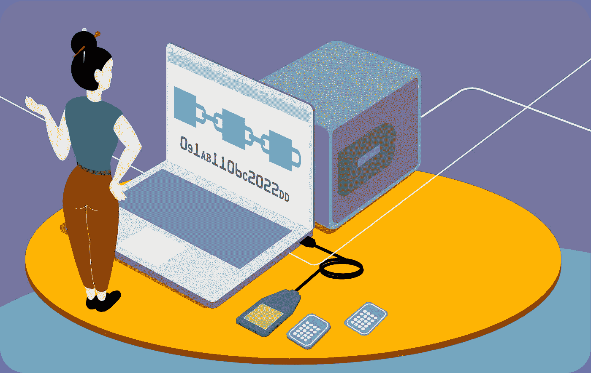
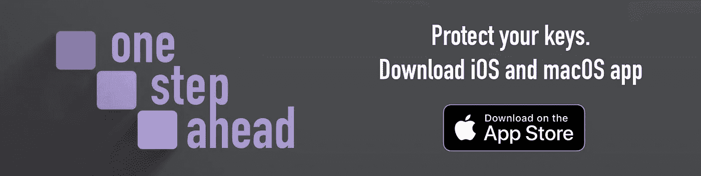
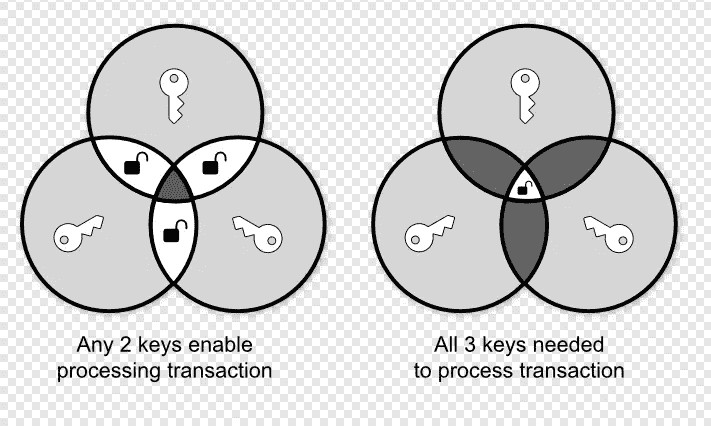

# 钱包安全及其死角

> 原文：<https://medium.com/coinmonks/wallet-security-and-its-corners-e7cda1e3284b?source=collection_archive---------37----------------------->

1.  安全不是必然的
2.  金属小器具
3.  密码
4.  多重签名
5.  纸
6.  更大的
7.  单点故障

***我们努力为一般用户提供钱包安全教育；提供想法和最佳解决方案来减轻可能的损害。***

***几十年来，网络安全是我们必须了解的东西，而最佳实践如今被视为理所当然。我们学会了如何处理我们的密码，用复杂的组合创建它们，并定期检查它们。
区块链技术将安全提升到了一个不同的高度。到目前为止，我们从几十年的在线经验中学到的东西可能对理解如何保护你的区块链资产非常有帮助，但不会准确地给你一个如何做的明确答案。随着区块链技术的出现，我们不得不从头开始重新思考安全性。***

***保护数字资产的方法有很多种，我们将重点介绍一些方法，并看看它们的优缺点。这里无意表达这里列出的方法是否对你有好处。有些可能非常适合你，有些可能不适合，你应该根据你的情况来评估什么对你有好处。***

One Step Ahea app for iOS and macOS

# 1.安全不是必然的。

我们的核心信念是，你永远不应该把安全当成确定性，遵循这种观点永远会让你走在潜在问题的前面。

**为什么这对您至关重要？**

技术，无论是机械的还是信息的，都是短暂的，其安全性要求也是如此。安全性是技术的一部分，只有满足底层应用程序的需求并达到预期的效果，安全性才会存在。今天看起来对保护您的数字资产非常有用的东西，明天可能就变得多余了。安全，简单来说， ***就是争取时间*** 。

# 2.金属小器具

金属装置是保护按键的首选；的确，它们是一个不错的选择。使用金属板或其他类型的金属小工具被宣传为每个人都应该选择的顶级安全方法。

耐用性通常是卖点。虽然耐用性很重要，但它可能不是最重要的保护因素。

**与其他类型的风险相比，耐用性有多重要，**例如，因被盗而丢失钥匙？

与火灾或其他自然原因造成的钥匙损坏相比，盗窃是一种极其常见的丢失资产的方式(不要破坏这些原因的重要性)。小偷可以通过用智能手机拍照来破坏你的钥匙。

如果您的存储没有额外的保护，防止这种情况会很有挑战性。尽管您无法阻止获取您的密钥，但您的重点应该是使访问您的资产变得尽可能复杂和明显。一种方法是混淆密钥，例如，通过分割它们，使得仅获得暴露的部分是没有意义的。

为什么高熔点没那么重要？

建筑物燃烧时的平均温度在 800 摄氏度(1500 华氏度)到 1100 摄氏度(2000 华氏度)之间。如此高的温度足以使铝、锌或锡等一些普通金属变形。由最耐用的物质制成的物理存储通常被认为是更好保护的关键。

事实上，不锈钢是存储设备最常见的材料(最常见的是 304，熔点为 1400–1450°C(2552–2642°F ),应该足够耐用，能够在建筑物发生火灾时幸存下来，并防止其中包含的信息被破坏。

事实上，高熔点可能没有人们想象的那么重要。如果发生火灾，你可能是最后一个检查废墟寻找金属板的人。如果金属板包含完整的种子短语，你最好幸运，无论是谁检查遗骸都不会在你之前找到它们。

很难想象金属仓库在什么时候会暴露在非常高的温度下，但又能立即接触到它。这么说并不意味着关键存储的耐久性无关紧要，但是使用熔点高于 800°C(1500°F)的材料并不能提高事故发生后恢复的几率。

# 3.密码

除了使用金属保护，许多人建议使用密码短语。这是一个非常聪明的方法来加倍你的安全。密码短语是为了防止你的数字资产在密钥泄露时丢失。如果您不熟悉这个解决方案，它是附加到您的种子上的一组额外的单词。它通常作为一种伪装的机制来转移潜在窃贼对主要资产的注意力。您设置了一个带有密码的主钱包和一个没有密码的带有少量数字资产的主钱包来误导攻击者。

密码短语功能很棒，但是有一些在讨论中经常被忽略的严重警告。

误用它至少会造成问题，最多会造成灾难。
一个经常被忽视的事实是，即使你是一个注重技术和安全的人，也很容易犯代价高昂的错误。
提供不正确的短语永远不会突出显示错误的条目，它很可能会返回一个空钱包，这可能是一次令人伤脑筋的经历。

理解密码短语的关键在于**它不是一个密码**并且**不应该被当作一个密码**来处理。两者之间的关键区别在于密码短语无法恢复！

保护你的钥匙已经是一项复杂的工作。不太注意密码通常会导致安全性差。请始终将它视为您钥匙中不可或缺的一部分，并以同样的尊重对待它。不要将密码放在种子短语附近。如果你不理解就不要使用它。如果你决定使用它，了解它的好处和坏处。
使用密码需要高度的责任感。

*在这里，我们的说法可能颇有争议；我们不会推动它的大规模应用。其中的特殊原因是，大量采用密码短语可能会导致误用，结果，许多人可能会成为永远无法使用钱包的受害者。您应该只在对其局限性有深刻理解的情况下，通过良好的安全策略来使用它。*

# 4.多重签名

Multisig(多重签名的缩写)是您可以使用的另一种方法。这个概念很简单——需要一个以上的参与者来进行交易；因此，这一程序在很大程度上依赖于各方之间的信任。

每个利益相关者都有自己的私钥，没有私钥，交易就无法进行。使用多重签名，您可以设置阈值标准—例如，您可以强制要求三分之二的利益相关者授权电子钱包中的交易。
另一种方式是没有门槛，要求严格的参与者。这有一个明显的弱点——单点故障。所有各方都必须意识到这一点，并有一个良好的后备计划。

Multi-signatures with and without threshold

在哪里使用多重签名不明智？
也许在你需要严重依赖其他参与者的情况下，尤其是如果他们不像你一样有丰富的安全知识。特别是，如果您不确定其他方是否可以管理密钥，请尽量避免没有阈值的多重签名。与您的合作伙伴一起使用 multisig 设置也会有问题。请记住，你们都需要以最守纪律的方式保管好自己的钥匙，以防万一你们中的一个人不在了，而限制了资金的使用。

**用在哪里才有意义？带门限的多重签名非常适合于多数人投票决定的组织。**

# 5.纸

早在加密货币还是一种爱好的时候，存储密钥的方法之一就是将它们打印在纸上。尽管许多人不推荐，我们认为这种方法不是没有意义的，仍然具有强大的实用性。

最大的好处是纸是存放钥匙的一种廉价方式。
当然，纸张是一种非常精致的材料。它可能会很快损坏和丢失，它的打印不耐用，并且它没有专用小工具那么重要。此外，很容易打印太多并把它们放在不安全的地方。

我们理解您应该避免基于成本做出安全决策。最终，在试图为您的资产获得最大保护时，您为系统支付的价格不应成为主要的决定因素。它可能会发挥重要作用，通常是基于你想要保护的硬币的价值。我们想强调的是，我们使用纸张的理由并不是因为它便宜。尽管如此，我们仍然认为有机会指导您采用我们的主要原则，即不将安全性视为确定性，而是作为一种临时解决方案，您的工作是持续地维护您的设置。

使用金属小工具时的一个主要难题是，如果你的钥匙被泄露，但密码仍然可以保护它们，你该怎么办？
您是否应该重新评估您的战略，并将您的资产转移到一个新的钱包中，在那里您可以获得新的种子短语？你有信心使用同一个钱包并且密码足以保护你的硬币吗？最终，您的安全设置的结构可能会被破坏。

*如果你想学习如何用纸质备份来保护你的钥匙，请阅读下面的故事，其中我们强调了许多你应该注意的要点。*

 [## 逐步地

### 如果你认为以最好的方式保护你的加密货币的恢复密钥，我们已经创建了…

medium.com](/@onestepahead/step-by-step-34c0dfe76771)  [## 用正确的方法去做

### 毫无疑问，保护您的恢复密钥是您首先需要学习和理解的事情之一…

medium.com](/coinmonks/do-it-the-right-way-1f2af941d7b0) 

# 6.更大的

还有更多的工具和方法值得探索。大部分都不是行业标准；然而，他们可能有突出的特点，你应该考虑。

其中值得一提的是沙米尔的秘密共享(由以色列密码学家阿迪·萨莫尔发明)。SSS (Shamir 的秘密共享)是一种将您的秘密数据和加密分割成多个块的方法，同时提供了一种将这些块重建为原始数据的灵活机制。SSS 并没有考虑到区块链的技术。然而，这项技术可以大大加强对您的资产的安全访问。

你保护数字硬币的策略也取决于你选择的钱包。一些钱包有内置的额外安全层，可以帮助您更好地管理您的钥匙。例如，Trezor 钱包提供了内置的 Shamir 秘密共享选项。

# 7.单点故障

如果您决定提出自己的安全方法或使用提供独特解决方案的设备，请问自己一个问题——我的设计/方法是否足以抵御单点故障？我是唯一的失败点吗？

你有家人吗？有人继承你的资产吗？你确定他们能在关键时刻接触到他们吗？他们是否接受了足够的资产回收技术培训？这些是你在制定好计划之前应该问的问题。

如果你亲近的人想在某个关键时刻访问你的数字钱包，确保你的设置足够简单易懂，无需寻求帮助。

你的拼图越复杂，如果你不能辅助，就越难把它们拼在一起。好的保护应该具有定制的所有优点，并且容易将各个部分组合在一起。

你不应该听信那些声称密码短语或多重签名是普遍最佳解决方案的人，你应该采纳他们。所有这些技术和解决方案都很棒，但是你有能力采用它们而不搬起石头砸自己的脚吗？对于与区块链相关的安全措施，你不能越过底线，说你应该这样使用它。你的方法应该考虑你的背景，所以计划它如何适合你。最后，挑战它。

资源:

 [## 聚合、阈值、多重签名和多重签名

### 简要的调查和比较

medium.com](/iovlabs-innovation-stories/aggregate-threshold-multisig-and-multisignatures-c45ffc0aecef) 

**下载我们领先一步的应用程序，帮助您保护您的钥匙:**

 [## 领先一步

### “领先一步”应用程序允许您在某种程度上保护您的机密信息，因此没有任何单一事件会导致…

apps.apple.com](https://apps.apple.com/de/app/one-step-ahead/id1592642367?l=en) 

关注我们:

Follow on Twitter

 [## 领先一步

### u/OneStepAheadApp:领先一步应用的创始人

www.reddit.com](https://www.reddit.com/user/OneStepAheadApp) 

我们的网站:

 [## 脱机安全管理器

### 以独特的方式保护您的机密信息，因此没有任何单一事件会导致无法访问您的数据…

onestepahead.info](https://onestepahead.info) 

> 交易新手？试试[加密交易机器人](/coinmonks/crypto-trading-bot-c2ffce8acb2a)或者[复制交易](/coinmonks/top-10-crypto-copy-trading-platforms-for-beginners-d0c37c7d698c)