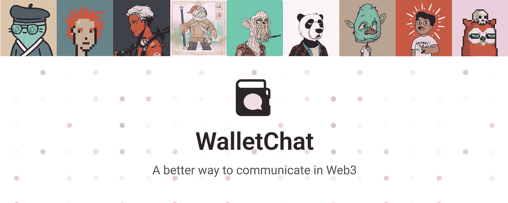
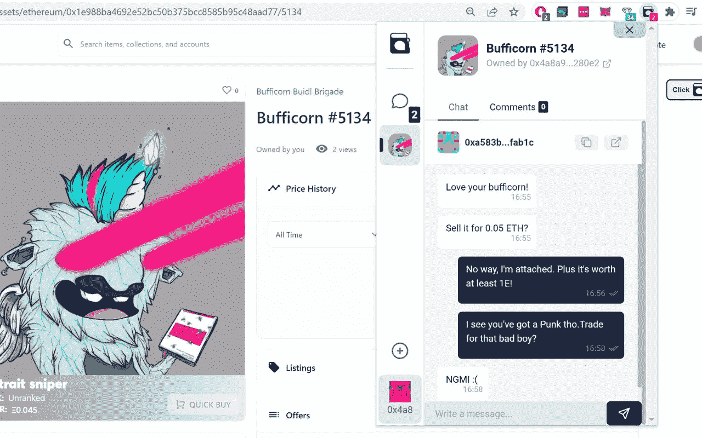
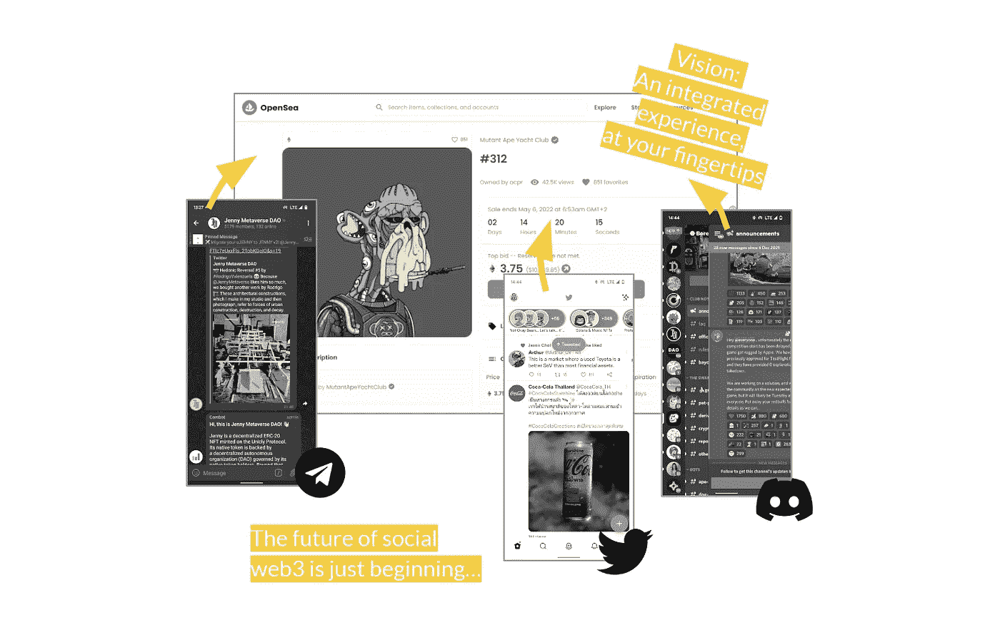

# walletcat——web 3 通信的未来？

> 原文：<https://medium.com/coinmonks/walletchat-the-future-of-web3-communication-b53f7109935?source=collection_archive---------5----------------------->

> 我们目前在网络上使用信息的方式被打破了。我在 WhatsApp、Telegram、Instagram、Twitter、Discord 和无数其他消息应用程序上都有单独的帐户。无论何时我切换应用程序，不仅这些应用程序不能相互交流，而且我的聊天记录和联系人都是孤立的，不可转移的。

一旦我们在钱包之间建立了开放的通信标准，Web3 就可以解决所有这些问题。但是，让我们从最基本的构建模块开始，让我们想象一个现成且易于使用的产品——一个简单的钱包对钱包聊天应用程序。

这个概念非常简单——你用你的(Metamask)钱包登录，你就可以用他们的钱包地址或 ENS 立即给任何其他钱包所有者发消息。不需要第三方标识符，一切都链接回你的钱包——在 web3 中，这正成为每个人的一个真正的身份来源。

你为什么要在乎？

好问题，很高兴你问了。

1.也许你正在 Opensea 上浏览一个 NFT，你想让**联系它的主人讨论一笔交易**，但是没有办法追踪他们。你怎么联系？WalletChat 只使用他们的钱包地址。

WalletChat browser extension UI (beta)

2.也许你只是想**验证某人是某个钱包**的主人。目前，最好的方法是让他们签署一条消息，这不是一个很好的用户体验，容易出现无数的欺诈行为。让许多人沮丧的是，只要你想加入服务器内的所有者控制的聊天，Discord 就会让你这样做，有时签署一条消息会让骗子控制你的 NFTs，这需要付出很大的代价。在 WalletChat，社区管理员可以简单地向所有 NFT 持有者发送一个访问代码，就在他们的钱包里。不需要签署合同。

3.也许你是一个社区管理员**运行奖励赠品**，就像我们在[咸鲨鱼](https://www.saltysharks.io/)的合作伙伴一样。让每个人在链上完成一个动作，跳到不和谐的地方，并把他们的钱包地址放在一个共享的频道里，这不是一个好的工作流程。而是直接在 WalletChat 内部与管理员钱包通信？

4.也许你是一个电报组里正在运行的小刀。它有点工作，但你有麻烦令牌门控你的组，没有复杂的解决办法。也许你是个比较大的刀，一直在想**不和谐和快照**没有联系是多么的讨厌，这两者是由两套不同的身份提供动力的。如果您可以用钱包登录这些聊天空间，用户体验会简化多少，还会释放多少功能？

5.也许你只是想匿名给某人发消息，而没有任何你的电子邮件、电话号码或其他 web 2.0 标识符的链接？

> 交易新手？试试[加密交易机器人](/coinmonks/crypto-trading-bot-c2ffce8acb2a)或者[复制交易](/coinmonks/top-10-crypto-copy-trading-platforms-for-beginners-d0c37c7d698c)

**好吧，我们再退一步**

在 WalletChat，我们相信基于 web3 的本地通信工具将最终取代 Telegram、Twitter 和 Discord。然而，我们必须从小处着手。

在其当前的测试版中，通过钱包登录、直接消息、社区聊天和方便的浏览器扩展，可以轻松加入您在 Opensea 上浏览的项目的讨论室，或直接向您正在查看的 NFT 的所有者发送消息，我们已经为这种未来的开始形成提供了最初的成分。

我们没有水晶球，也不能确定这些用例中的哪一个(或者一个完全不同的？)将首先起飞，而这正是我们需要你们帮助的地方。你能做些什么来帮助我们实现这一目标？

我们现在需要你

请对本文发表评论，分享您的想法。你同意我们在这里概述的用例吗？你有更好的主意吗？在你自己的网络 3 生活中，你觉得这些问题中哪一个是最紧迫的？跳进[我们的不和](https://discord.com/invite/walletchat)直接告诉我们。此外，请查看我们的[网络应用](https://walletchat.fun/)(仍处于测试阶段！)，吊儿郎当，告诉我们为什么是垃圾(还是牛逼！[😜](https://emojipedia.org/winking-face-with-tongue/))

> Web3 消息正在敲你的门。现在就和 WalletChat 一起加入革命吧！

> 加入 Coinmonks [电报频道](https://t.me/coincodecap)和 [Youtube 频道](https://www.youtube.com/c/coinmonks/videos)了解加密交易和投资

# 另外，阅读

*   [币安 vs FTX](https://coincodecap.com/binance-vs-ftx) | [最佳(索尔)索拉纳钱包](https://coincodecap.com/solana-wallets)
*   [如何在 Uniswap 上交换加密？](https://coincodecap.com/swap-crypto-on-uniswap) | [A-Ads 评论](https://coincodecap.com/a-ads-review)
*   [加密货币储蓄账户](/coinmonks/cryptocurrency-savings-accounts-be3bc0feffbf) | [YoBit 审核](/coinmonks/yobit-review-175464162c62)
*   [Botsfolio vs nap bots vs Mudrex](/coinmonks/botsfolio-vs-napbots-vs-mudrex-c81344970c02)|[gate . io 交流回顾](/coinmonks/gate-io-exchange-review-61bf87b7078f)
*   [CoinFLEX 评论](https://coincodecap.com/coinflex-review) | [AEX 交易所评论](https://coincodecap.com/aex-exchange-review) | [UPbit 评论](https://coincodecap.com/upbit-review)